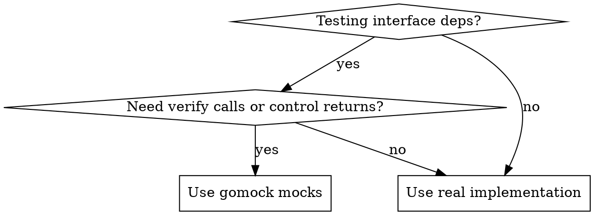
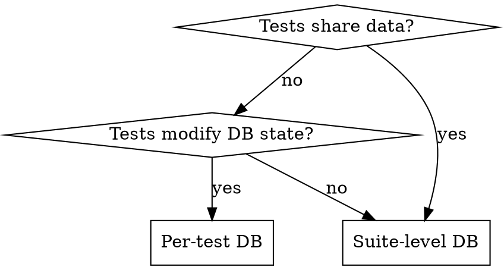

# Writing Unit Tests in Assisted-Service

## Overview

Unit tests in assisted-service use Ginkgo/Gomega BDD framework with gomock for mocking. **Core principle: Every gomock controller MUST call `ctrl.Finish()` in `AfterEach` to verify mock expectations.**

Without `ctrl.Finish()`, tests pass even when mocks aren't called correctly - silent failures that hide bugs. Tests run against real PostgreSQL (suite or per-test) with automatic cleanup.

## Quick Reference

| Scenario | Pattern |
|----------|---------|
| Testing with mocks | Create controller in `BeforeEach`, call `ctrl.Finish()` in `AfterEach` |
| Testing without mocks | Use `It()` blocks directly or table-driven tests |
| Database per test | `PrepareTestDB()` in `BeforeEach`, `DeleteTestDB()` in `AfterEach` |
| Database for suite | `InitializeDBTest()` in `BeforeSuite`, `TerminateDBTest()` in `AfterSuite` |
| Event verification | `eventstest.NewEventMatcher` with matchers |
| OCP version in tests | Use hardcoded strings or `common.TestDefaultConfig` — do not use `TestVersion()` |

## When to Use Patterns





## Scope

**Covers:** Non-subsystem tests in `internal/` and `pkg/` with gomock, Ginkgo/Gomega, database, events.

**Does NOT cover:** Subsystem tests (`subsystem/`), E2E, external service integration, performance tests. Subsystem tests use different patterns, including `common.TestVersion()` for OCP versions.

**Test files:** `*_test.go` (same package). Suites: `*_suite_test.go`.

## Critical: Gomock Controllers MUST Call Finish()

**Every `Describe`/`Context` creating a gomock controller needs `ctrl.Finish()` in `AfterEach`. No exceptions.**

Without `ctrl.Finish()`:
- `.Times(N)` - Expected call count NOT checked
- `.MaxTimes(0)` - Unexpected calls NOT caught
- `.Do()` / `.DoAndReturn()` - Mock behavior runs without verification

```go
BeforeEach(func() {
    ctrl = gomock.NewController(GinkgoT())
    mockHandler = eventsapi.NewMockHandler(ctrl)
})

AfterEach(func() {
    ctrl.Finish()  // REQUIRED - verifies all EXPECT() constraints
})
```

**Why this matters:** Missing `ctrl.Finish()` causes silent test failures - tests pass even when mocks aren't called correctly. Real bugs found in commit `338133e05 MGMT-23548`.

**Letter = Spirit:** Following the pattern exactly IS following the spirit. This isn't ritual - it's how gomock verification works.

## Database Setup Patterns

**Suite-level** (shared DB, read-only tests):
```go
BeforeSuite(func() { common.InitializeDBTest() })
AfterSuite(func() { common.TerminateDBTest() })
```

**Per-test** (isolated DB, tests modify state):
```go
BeforeEach(func() { db, dbName = common.PrepareTestDB() })
AfterEach(func() { common.DeleteTestDB(db, dbName) })
```

## Event Testing

Use `eventstest.NewEventMatcher` with specific matchers:

```go
mockEvents.EXPECT().SendHostEvent(gomock.Any(), eventstest.NewEventMatcher(
    eventstest.WithNameMatcher(eventgen.HostStatusUpdatedEventName),
    eventstest.WithHostIdMatcher(host.ID.String())))
```

**Matchers:** `WithNameMatcher`, `WithHostIdMatcher`, `WithClusterIdMatcher`, `WithInfraEnvIdMatcher`, `WithSeverityMatcher`

## Table-Driven Tests

**DescribeTable** (simple cases):
```go
DescribeTable("FunctionName",
    func(input string, valid bool) { /* test logic */ },
    Entry("descriptive case 1", "value1", true),
    Entry("descriptive case 2", "value2", false))
```

**Struct array** (complex scenarios):
```go
tests := []struct{name, input string; valid bool}{
    {name: "case 1", input: "val1", valid: true}}
for _, t := range tests { It(t.name, func() { /* ... */ }) }
```

## Test Structure

Ginkgo hierarchy: `Describe("Component")` → `Context("when X")` → `It("should Y")`

**Isolation:** No shared state between `It` blocks. Use `BeforeEach` for setup.

**Gomock matchers:** `.Times(N)`, `.MaxTimes(0)`, `.AnyTimes()`, `gomock.Any()`

## OCP Versions: Use Hardcoded Strings, Not TestVersion()

**Do not use `common.TestVersion()` in non-subsystem tests.** `TestVersion()` resolves versions dynamically from data files and is designed for subsystem tests (`subsystem/`), which run against the real service. Non-subsystem tests mock version data and should use hardcoded version strings directly.

**Correct patterns:**
```go
OpenshiftVersion: swag.String("4.14"),
```

Or use the package-level defaults from `internal/common/test_configuration.go`:
```go
OpenshiftVersion: swag.String(common.OpenShiftVersion),
ReleaseVersion:   common.ReleaseVersion,
ReleaseImageUrl:  common.ReleaseImageURL,
```

See [docs/dev/test-versions.md](/docs/dev/test-versions.md) for the `TestVersion()` API used in subsystem tests.

## Red Flags - Stop and Fix

These thoughts mean STOP - fix the issue:

- "Tests are passing, mocks must be working" → Add `ctrl.Finish()` in `AfterEach`
- "Too complex to set up properly" → Follow patterns, don't skip structure
- "Minimum viable test to satisfy review" → Tests must verify behavior, not theater
- "I'll add cleanup/verification later" → Do it now, tests will merge broken
- Code has `gomock.NewController` but no `ctrl.Finish()` → Silent failures
- Using `common.TestVersion()` outside `subsystem/` → Wrong pattern; use hardcoded strings or `common.TestDefaultConfig`

**If you're rationalizing shortcuts due to time pressure, the test will be broken. No exceptions.**

## Common Mistakes

| Mistake | Symptom | Fix |
|---------|---------|-----|
| Missing `ctrl.Finish()` | Tests pass when mocks not called | Add `ctrl.Finish()` in `AfterEach` |
| Shared variables between tests | Flaky tests, race conditions | Move initialization to `BeforeEach` |
| Missing `GinkgoT()` | Controller doesn't report failures | Use `gomock.NewController(GinkgoT())` |
| Generic Entry names | "test 1", "test 2" in output | Descriptive: "valid IPv4 CIDR" |
| Wrong DB pattern | Pollution between tests | Suite-level for reads, per-test for writes |
| No event matchers | Generic `gomock.Any()` for events | Use `eventstest.NewEventMatcher` with specific matchers |
| Using `TestVersion()` | Wrong abstraction for non-subsystem tests | Use hardcoded strings or `common.TestDefaultConfig` |

## Before Submitting

**Check every test file:**
- [ ] Every `gomock.NewController` has `ctrl.Finish()` in `AfterEach`
- [ ] No shared state (all setup in `BeforeEach`)
- [ ] Descriptive names ("valid IPv4 CIDR" not "test 1")
- [ ] Database cleanup if using `PrepareTestDB()`
- [ ] No `TestVersion()` usage — use hardcoded strings or `common.TestDefaultConfig`
- [ ] Tests pass: `go test -v ./path/to/package`

**Red flags:** Missing `ctrl.Finish()` → silent failures. Shared variables → flaky tests.
