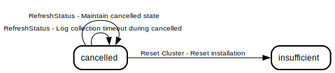
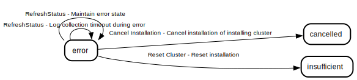
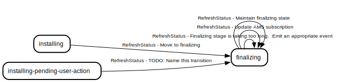
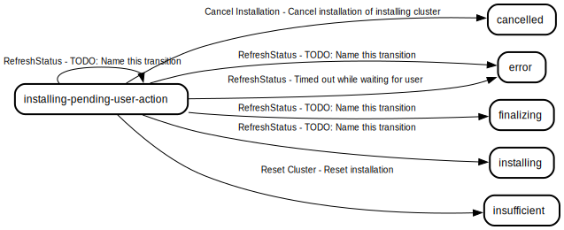
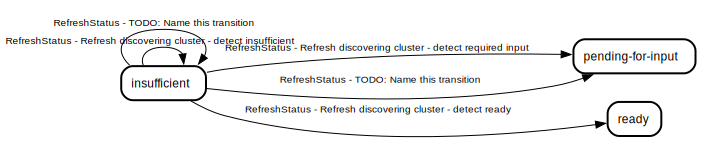
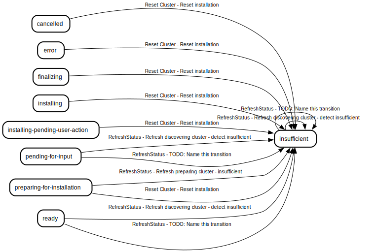
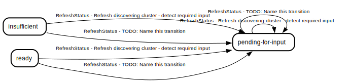
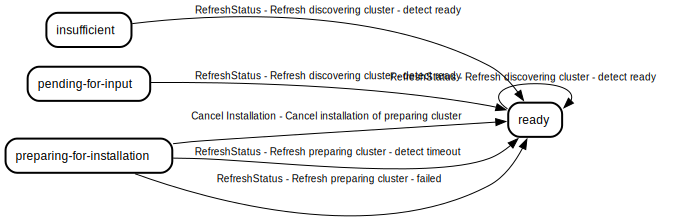
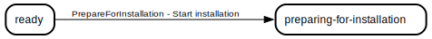

# Cluster state machine

The cluster state machine helps the service track the installation lifecycle of a cluster

## Table of Contents

### States

- [AddingHosts](#addinghosts)
- [Cancelled](#cancelled)
- [Error](#error)
- [Finalizing](#finalizing)
- [Initial](#initial)
- [Installed](#installed)
- [Installing](#installing)
- [Installing, Pending User Action](#installing-pending-user-action)
- [Insufficient](#insufficient)
- [Pending For Input](#pending-for-input)
- [Preparing For Installation](#preparing-for-installation)
- [Ready](#ready)

### Transition Types

Transition types are the events that can cause a state transition

- [Cancel Installation](#cancel-installation)
- [PrepareForInstallation](#prepareforinstallation)
- [RefreshStatus](#refreshstatus)
- [Reset Cluster](#reset-cluster)

### Transition Rules

Transition rules are the rules that define the required source states and conditions needed to move to a particular destination state when a particular transition type happens

- [Cancel installation of installing cluster](#cancel-installation-of-installing-cluster)
- [Cancel installation of preparing cluster](#cancel-installation-of-preparing-cluster)
- [Start installation](#start-installation)
- [Refresh discovering cluster - detect required input](#refresh-discovering-cluster---detect-required-input)
- [Refresh discovering cluster - detect insufficient](#refresh-discovering-cluster---detect-insufficient)
- [TODO: Name this transition](#todo-name-this-transition)
- [TODO: Name this transition](#todo-name-this-transition)
- [Refresh discovering cluster - detect ready](#refresh-discovering-cluster---detect-ready)
- [Refresh preparing cluster - detect timeout](#refresh-preparing-cluster---detect-timeout)
- [Refresh preparing cluster - done preparing](#refresh-preparing-cluster---done-preparing)
- [Refresh preparing cluster - insufficient](#refresh-preparing-cluster---insufficient)
- [Refresh preparing cluster - failed](#refresh-preparing-cluster---failed)
- [TODO: Name this transition](#todo-name-this-transition)
- [TODO: Name this transition](#todo-name-this-transition)
- [Timed out while waiting for user](#timed-out-while-waiting-for-user)
- [Timed out while finalizing](#timed-out-while-finalizing)
- [TODO: Name this transition](#todo-name-this-transition)
- [TODO: Name this transition](#todo-name-this-transition)
- [TODO: Name this transition](#todo-name-this-transition)
- [Move to finalizing](#move-to-finalizing)
- [Stay in installing](#stay-in-installing)
- [Update AMS subscription](#update-ams-subscription)
- [Finalizing complete](#finalizing-complete)
- [Installation error](#installation-error)
- [Log collection timeout during error](#log-collection-timeout-during-error)
- [Log collection timeout during cancelled](#log-collection-timeout-during-cancelled)
- [Maintain preparing-for-installation state](#maintain-preparing-for-installation-state)
- [Maintain finalizing state](#maintain-finalizing-state)
- [Maintain installed state](#maintain-installed-state)
- [Maintain error state](#maintain-error-state)
- [Maintain cancelled state](#maintain-cancelled-state)
- [Maintain adding-hosts state](#maintain-adding-hosts-state)
- [Reset installation](#reset-installation)

## States

### AddingHosts

The cluster is fully installed and is ready to accept new hosts. Installed clusters usually transition to this state automatically when installation is complete, depending on the configuration of the service. This is the initial state for imported clusters, as they are already installed

#### Transition types where this is the source state

- [RefreshStatus](#refreshstatus)

#### Transition types where this is the destination state

- [RefreshStatus](#refreshstatus)

#### Transition rules where this is the source state

- [Maintain adding-hosts state](#maintain-adding-hosts-state)

#### Transition rules where this is the destination state

- [Maintain adding-hosts state](#maintain-adding-hosts-state)

### Cancelled

The cluster installation was cancelled by the user. Cluster must be reset to be able to install again

#### Transition types where this is the source state

- [RefreshStatus](#refreshstatus)
- [Reset Cluster](#reset-cluster)

#### Transition types where this is the destination state

- [Cancel Installation](#cancel-installation)
- [RefreshStatus](#refreshstatus)

#### Transition rules where this is the source state

- [Log collection timeout during cancelled](#log-collection-timeout-during-cancelled)
- [Maintain cancelled state](#maintain-cancelled-state)
- [Reset installation](#reset-installation)

#### Transition rules where this is the destination state

- [Cancel installation of installing cluster](#cancel-installation-of-installing-cluster)
- [Log collection timeout during cancelled](#log-collection-timeout-during-cancelled)
- [Maintain cancelled state](#maintain-cancelled-state)

### Error

The cluster has encountered an error during installation and cannot proceed. Usually due to a timeout

#### Transition types where this is the source state

- [Cancel Installation](#cancel-installation)
- [RefreshStatus](#refreshstatus)
- [Reset Cluster](#reset-cluster)

#### Transition types where this is the destination state

- [RefreshStatus](#refreshstatus)

#### Transition rules where this is the source state

- [Cancel installation of installing cluster](#cancel-installation-of-installing-cluster)
- [Log collection timeout during error](#log-collection-timeout-during-error)
- [Maintain error state](#maintain-error-state)
- [Reset installation](#reset-installation)

#### Transition rules where this is the destination state

- [Installation error](#installation-error)
- [Log collection timeout during error](#log-collection-timeout-during-error)
- [Maintain error state](#maintain-error-state)
- [TODO: Name this transition](#todo-name-this-transition)
- [Timed out while finalizing](#timed-out-while-finalizing)
- [Timed out while waiting for user](#timed-out-while-waiting-for-user)

### Finalizing

The cluster has sufficient ready control-plane and worker nodes, but OCP is still finalizing the installation

#### Transition types where this is the source state

- [Cancel Installation](#cancel-installation)
- [RefreshStatus](#refreshstatus)
- [Reset Cluster](#reset-cluster)

#### Transition types where this is the destination state

- [RefreshStatus](#refreshstatus)

#### Transition rules where this is the source state

- [Cancel installation of installing cluster](#cancel-installation-of-installing-cluster)
- [Finalizing complete](#finalizing-complete)
- [Maintain finalizing state](#maintain-finalizing-state)
- [Reset installation](#reset-installation)
- [TODO: Name this transition](#todo-name-this-transition)
- [Timed out while finalizing](#timed-out-while-finalizing)
- [Update AMS subscription](#update-ams-subscription)

#### Transition rules where this is the destination state

- [Maintain finalizing state](#maintain-finalizing-state)
- [Move to finalizing](#move-to-finalizing)
- [TODO: Name this transition](#todo-name-this-transition)
- [Update AMS subscription](#update-ams-subscription)

### Initial

The initial state of the state machine. This is a synthetic state that is not actually part of the state machine. It appears in documentation when transition rules hold a single source state that is an empty string

#### Transition types where this is the source state

#### Transition types where this is the destination state

#### Transition rules where this is the source state

#### Transition rules where this is the destination state

### Installed

The cluster installation is considered complete, all operators are healthy and the cluster is ready to use

#### Transition types where this is the source state

- [RefreshStatus](#refreshstatus)

#### Transition types where this is the destination state

- [RefreshStatus](#refreshstatus)

#### Transition rules where this is the source state

- [Maintain installed state](#maintain-installed-state)

#### Transition rules where this is the destination state

- [Finalizing complete](#finalizing-complete)
- [Maintain installed state](#maintain-installed-state)

### Installing

The cluster installation is in progress

#### Transition types where this is the source state

- [Cancel Installation](#cancel-installation)
- [RefreshStatus](#refreshstatus)
- [Reset Cluster](#reset-cluster)

#### Transition types where this is the destination state

- [RefreshStatus](#refreshstatus)

#### Transition rules where this is the source state

- [Cancel installation of installing cluster](#cancel-installation-of-installing-cluster)
- [Installation error](#installation-error)
- [Move to finalizing](#move-to-finalizing)
- [Reset installation](#reset-installation)
- [Stay in installing](#stay-in-installing)
- [TODO: Name this transition](#todo-name-this-transition)

#### Transition rules where this is the destination state

- [Refresh preparing cluster - done preparing](#refresh-preparing-cluster---done-preparing)
- [Stay in installing](#stay-in-installing)
- [TODO: Name this transition](#todo-name-this-transition)

### Installing, Pending User Action

Installation is in progress, but is blocked and cannot continue until the user takes action

#### Transition types where this is the source state

- [Cancel Installation](#cancel-installation)
- [RefreshStatus](#refreshstatus)
- [Reset Cluster](#reset-cluster)

#### Transition types where this is the destination state

- [RefreshStatus](#refreshstatus)

#### Transition rules where this is the source state

- [Cancel installation of installing cluster](#cancel-installation-of-installing-cluster)
- [Reset installation](#reset-installation)
- [TODO: Name this transition](#todo-name-this-transition)
- [Timed out while waiting for user](#timed-out-while-waiting-for-user)

#### Transition rules where this is the destination state

- [TODO: Name this transition](#todo-name-this-transition)

### Insufficient

This is the initial state for regular, non-imported clusters

#### Transition types where this is the source state

- [RefreshStatus](#refreshstatus)

#### Transition types where this is the destination state

- [RefreshStatus](#refreshstatus)
- [Reset Cluster](#reset-cluster)

#### Transition rules where this is the source state

- [Refresh discovering cluster - detect insufficient](#refresh-discovering-cluster---detect-insufficient)
- [Refresh discovering cluster - detect ready](#refresh-discovering-cluster---detect-ready)
- [Refresh discovering cluster - detect required input](#refresh-discovering-cluster---detect-required-input)
- [TODO: Name this transition](#todo-name-this-transition)

#### Transition rules where this is the destination state

- [Refresh discovering cluster - detect insufficient](#refresh-discovering-cluster---detect-insufficient)
- [Refresh preparing cluster - insufficient](#refresh-preparing-cluster---insufficient)
- [Reset installation](#reset-installation)
- [TODO: Name this transition](#todo-name-this-transition)

### Pending For Input

The cluster is not ready for installation because it needs more information from the user

#### Transition types where this is the source state

- [RefreshStatus](#refreshstatus)

#### Transition types where this is the destination state

- [RefreshStatus](#refreshstatus)

#### Transition rules where this is the source state

- [Refresh discovering cluster - detect insufficient](#refresh-discovering-cluster---detect-insufficient)
- [Refresh discovering cluster - detect ready](#refresh-discovering-cluster---detect-ready)
- [Refresh discovering cluster - detect required input](#refresh-discovering-cluster---detect-required-input)
- [TODO: Name this transition](#todo-name-this-transition)

#### Transition rules where this is the destination state

- [Refresh discovering cluster - detect required input](#refresh-discovering-cluster---detect-required-input)
- [TODO: Name this transition](#todo-name-this-transition)

### Preparing For Installation

A transient state between Ready and Installing, cluster hosts are performing pre-installation validations

#### Transition types where this is the source state

- [Cancel Installation](#cancel-installation)
- [RefreshStatus](#refreshstatus)
- [Reset Cluster](#reset-cluster)

#### Transition types where this is the destination state

- [PrepareForInstallation](#prepareforinstallation)
- [RefreshStatus](#refreshstatus)

#### Transition rules where this is the source state

- [Cancel installation of preparing cluster](#cancel-installation-of-preparing-cluster)
- [Maintain preparing-for-installation state](#maintain-preparing-for-installation-state)
- [Refresh preparing cluster - detect timeout](#refresh-preparing-cluster---detect-timeout)
- [Refresh preparing cluster - done preparing](#refresh-preparing-cluster---done-preparing)
- [Refresh preparing cluster - failed](#refresh-preparing-cluster---failed)
- [Refresh preparing cluster - insufficient](#refresh-preparing-cluster---insufficient)
- [Reset installation](#reset-installation)

#### Transition rules where this is the destination state

- [Maintain preparing-for-installation state](#maintain-preparing-for-installation-state)
- [Start installation](#start-installation)

### Ready

The cluster is ready to begin installation

#### Transition types where this is the source state

- [PrepareForInstallation](#prepareforinstallation)
- [RefreshStatus](#refreshstatus)

#### Transition types where this is the destination state

- [Cancel Installation](#cancel-installation)
- [RefreshStatus](#refreshstatus)

#### Transition rules where this is the source state

- [Refresh discovering cluster - detect insufficient](#refresh-discovering-cluster---detect-insufficient)
- [Refresh discovering cluster - detect ready](#refresh-discovering-cluster---detect-ready)
- [Refresh discovering cluster - detect required input](#refresh-discovering-cluster---detect-required-input)
- [Start installation](#start-installation)
- [TODO: Name this transition](#todo-name-this-transition)

#### Transition rules where this is the destination state

- [Cancel installation of preparing cluster](#cancel-installation-of-preparing-cluster)
- [Refresh discovering cluster - detect ready](#refresh-discovering-cluster---detect-ready)
- [Refresh preparing cluster - detect timeout](#refresh-preparing-cluster---detect-timeout)
- [Refresh preparing cluster - failed](#refresh-preparing-cluster---failed)

## Transition Types

Transition types are the events that can cause a state transition

### Cancel Installation

Triggered when the user cancels the installation

#### Source states where this transition type applies

- [Error](#error)
- [Finalizing](#finalizing)
- [Installing](#installing)
- [Installing, Pending User Action](#installing-pending-user-action)
- [Preparing For Installation](#preparing-for-installation)

#### Destination states where this transition type applies

- [Cancelled](#cancelled)
- [Ready](#ready)

#### Transition rules using this transition type

- [Cancel installation of installing cluster](#cancel-installation-of-installing-cluster)
- [Cancel installation of preparing cluster](#cancel-installation-of-preparing-cluster)

### PrepareForInstallation

Triggered when the user starts the installation

#### Source states where this transition type applies

- [Ready](#ready)

#### Destination states where this transition type applies

- [Preparing For Installation](#preparing-for-installation)

#### Transition rules using this transition type

- [Start installation](#start-installation)

### RefreshStatus

Triggered on some clusters periodically by the background cluster monitor goroutine that runs on the leader instance of the Assisted Service. Responsible for driving transitions between states that require re-evaluation of all the validation results and potential timeout conditions

#### Source states where this transition type applies

- [AddingHosts](#addinghosts)
- [Cancelled](#cancelled)
- [Error](#error)
- [Finalizing](#finalizing)
- [Installed](#installed)
- [Installing](#installing)
- [Installing, Pending User Action](#installing-pending-user-action)
- [Insufficient](#insufficient)
- [Pending For Input](#pending-for-input)
- [Preparing For Installation](#preparing-for-installation)
- [Ready](#ready)

#### Destination states where this transition type applies

- [AddingHosts](#addinghosts)
- [Cancelled](#cancelled)
- [Error](#error)
- [Finalizing](#finalizing)
- [Installed](#installed)
- [Installing](#installing)
- [Installing, Pending User Action](#installing-pending-user-action)
- [Insufficient](#insufficient)
- [Pending For Input](#pending-for-input)
- [Preparing For Installation](#preparing-for-installation)
- [Ready](#ready)

#### Transition rules using this transition type

- [Finalizing complete](#finalizing-complete)
- [Installation error](#installation-error)
- [Log collection timeout during cancelled](#log-collection-timeout-during-cancelled)
- [Log collection timeout during error](#log-collection-timeout-during-error)
- [Maintain adding-hosts state](#maintain-adding-hosts-state)
- [Maintain cancelled state](#maintain-cancelled-state)
- [Maintain error state](#maintain-error-state)
- [Maintain finalizing state](#maintain-finalizing-state)
- [Maintain installed state](#maintain-installed-state)
- [Maintain preparing-for-installation state](#maintain-preparing-for-installation-state)
- [Move to finalizing](#move-to-finalizing)
- [Refresh discovering cluster - detect insufficient](#refresh-discovering-cluster---detect-insufficient)
- [Refresh discovering cluster - detect ready](#refresh-discovering-cluster---detect-ready)
- [Refresh discovering cluster - detect required input](#refresh-discovering-cluster---detect-required-input)
- [Refresh preparing cluster - detect timeout](#refresh-preparing-cluster---detect-timeout)
- [Refresh preparing cluster - done preparing](#refresh-preparing-cluster---done-preparing)
- [Refresh preparing cluster - failed](#refresh-preparing-cluster---failed)
- [Refresh preparing cluster - insufficient](#refresh-preparing-cluster---insufficient)
- [Stay in installing](#stay-in-installing)
- [TODO: Name this transition](#todo-name-this-transition)
- [Timed out while finalizing](#timed-out-while-finalizing)
- [Timed out while waiting for user](#timed-out-while-waiting-for-user)
- [Update AMS subscription](#update-ams-subscription)

### Reset Cluster

Triggered when the user resets the cluster

#### Source states where this transition type applies

- [Cancelled](#cancelled)
- [Error](#error)
- [Finalizing](#finalizing)
- [Installing](#installing)
- [Installing, Pending User Action](#installing-pending-user-action)
- [Preparing For Installation](#preparing-for-installation)

#### Destination states where this transition type applies

- [Insufficient](#insufficient)

#### Transition rules using this transition type

- [Reset installation](#reset-installation)

## Transition Rules

Transition rules are the rules that define the required source states and conditions needed to move to a particular destination state when a particular transition type happens

### Cancel installation of installing cluster

Move cluster to the cancelled state when user cancels installation

#### Source states

- [Installing](#installing)
- [Installing, Pending User Action](#installing-pending-user-action)
- [Error](#error)
- [Finalizing](#finalizing)

#### Destination state

[Cancelled](#cancelled)

### Cancel installation of preparing cluster

Cancelling a cluster during preperation simply cancels the preperation and moves it back to the ready, rather than putting the cluster in the cancelled state

#### Source states

- [Preparing For Installation](#preparing-for-installation)

#### Destination state

[Ready](#ready)

### Start installation

Begins preparing the cluster for installation

#### Source states

- [Ready](#ready)

#### Destination state

[Preparing For Installation](#preparing-for-installation)

### Refresh discovering cluster - detect required input

In order for this transition to be fired at least one of the validations in requiredInputFieldsExistNonDhcp must fail. This transition handles the case that there is missing input that has to be provided from a user or other external means

#### Source states

- [Pending For Input](#pending-for-input)
- [Ready](#ready)
- [Insufficient](#insufficient)

#### Destination state

[Pending For Input](#pending-for-input)

### Refresh discovering cluster - detect insufficient

In order for this transition to be fired at least one of the validations in isSufficientForInstallNonDhcp must fail. This transition handles the case that one of the required validations that are required in order for the cluster to be in ready state has failed

#### Source states

- [Pending For Input](#pending-for-input)
- [Ready](#ready)
- [Insufficient](#insufficient)

#### Destination state

[Insufficient](#insufficient)

### TODO: Name this transition

In order for this transition to be fired at least one of the validation IsMachineCidrDefined must fail. This transition handles the case that there is missing input that has to be provided from a user or other external means

#### Source states

- [Pending For Input](#pending-for-input)
- [Ready](#ready)
- [Insufficient](#insufficient)

#### Destination state

[Pending For Input](#pending-for-input)

### TODO: Name this transition

In order for this transition to be fired at least one of the validations in isSufficientForInstallDhcp must fail. This transition handles the case that one of the required validations that are required in order for the host to be in known state (ready for installation) has failed

#### Source states

- [Pending For Input](#pending-for-input)
- [Ready](#ready)
- [Insufficient](#insufficient)

#### Destination state

[Insufficient](#insufficient)

### Refresh discovering cluster - detect ready

This transition is fired when all validations pass

#### Source states

- [Pending For Input](#pending-for-input)
- [Ready](#ready)
- [Insufficient](#insufficient)

#### Destination state

[Ready](#ready)

### Refresh preparing cluster - detect timeout

This transition is fired when the preparing installation reach the timeout

#### Source states

- [Preparing For Installation](#preparing-for-installation)

#### Destination state

[Ready](#ready)

### Refresh preparing cluster - done preparing

This transition is fired when cluster installation preperation is complete and all hosts within the cluster have also finished preparing

#### Source states

- [Preparing For Installation](#preparing-for-installation)

#### Destination state

[Installing](#installing)

### Refresh preparing cluster - insufficient

TODO: Document this transition

#### Source states

- [Preparing For Installation](#preparing-for-installation)

#### Destination state

[Insufficient](#insufficient)

### Refresh preparing cluster - failed

TODO: Document this transition

#### Source states

- [Preparing For Installation](#preparing-for-installation)

#### Destination state

[Ready](#ready)

### TODO: Name this transition

TODO: Document this transition

#### Source states

- [Installing, Pending User Action](#installing-pending-user-action)

#### Destination state

[Error](#error)

### TODO: Name this transition

TODO: Document this transition

#### Source states

- [Installing, Pending User Action](#installing-pending-user-action)

#### Destination state

[Installing, Pending User Action](#installing-pending-user-action)

### Timed out while waiting for user

User was asked to take action and did not do so in time, give up and display appropriate error

#### Source states

- [Installing, Pending User Action](#installing-pending-user-action)

#### Destination state

[Error](#error)

### Timed out while finalizing

Cluster finalization took too long, display appropriate error

#### Source states

- [Finalizing](#finalizing)

#### Destination state

[Error](#error)

### TODO: Name this transition

TODO: Document this transition

#### Source states

- [Installing, Pending User Action](#installing-pending-user-action)

#### Destination state

[Installing](#installing)

### TODO: Name this transition

TODO: Document this transition

#### Source states

- [Installing, Pending User Action](#installing-pending-user-action)

#### Destination state

[Finalizing](#finalizing)

### TODO: Name this transition

TODO: Document this transition

#### Source states

- [Installing](#installing)
- [Finalizing](#finalizing)

#### Destination state

[Installing, Pending User Action](#installing-pending-user-action)

### Move to finalizing

This transition is fired when the cluster is in installing and should move to finalizing

#### Source states

- [Installing](#installing)

#### Destination state

[Finalizing](#finalizing)

### Stay in installing

Installing cluster should stay in installing

#### Source states

- [Installing](#installing)

#### Destination state

[Installing](#installing)

### Update AMS subscription

Update AMS subscription with console URL

#### Source states

- [Finalizing](#finalizing)

#### Destination state

[Finalizing](#finalizing)

### Finalizing complete

The cluster has completed finalizing

#### Source states

- [Finalizing](#finalizing)

#### Destination state

[Installed](#installed)

### Installation error

This transition is fired when the cluster is in installing and should move to error

#### Source states

- [Installing](#installing)

#### Destination state

[Error](#error)

### Log collection timeout during error

Stay in error state and update logs progress to timeout

#### Source states

- [Error](#error)

#### Destination state

[Error](#error)

### Log collection timeout during cancelled

Stay in cancelled state and update logs progress to timeout

#### Source states

- [Cancelled](#cancelled)

#### Destination state

[Cancelled](#cancelled)

### Maintain preparing-for-installation state

Stay in preparing-for-installation state

#### Source states

- [Preparing For Installation](#preparing-for-installation)

#### Destination state

[Preparing For Installation](#preparing-for-installation)

### Maintain finalizing state

Stay in finalizing state

#### Source states

- [Finalizing](#finalizing)

#### Destination state

[Finalizing](#finalizing)

### Maintain installed state

Stay in installed state

#### Source states

- [Installed](#installed)

#### Destination state

[Installed](#installed)

### Maintain error state

Stay in error state

#### Source states

- [Error](#error)

#### Destination state

[Error](#error)

### Maintain cancelled state

Stay in cancelled state

#### Source states

- [Cancelled](#cancelled)

#### Destination state

[Cancelled](#cancelled)

### Maintain adding-hosts state

Stay in adding-hosts state

#### Source states

- [AddingHosts](#addinghosts)

#### Destination state

[AddingHosts](#addinghosts)

### Reset installation

Reset the cluster, allowing it to be installed again

#### Source states

- [Preparing For Installation](#preparing-for-installation)
- [Installing](#installing)
- [Installing, Pending User Action](#installing-pending-user-action)
- [Error](#error)
- [Cancelled](#cancelled)
- [Finalizing](#finalizing)

#### Destination state

[Insufficient](#insufficient)
