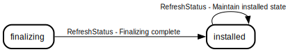
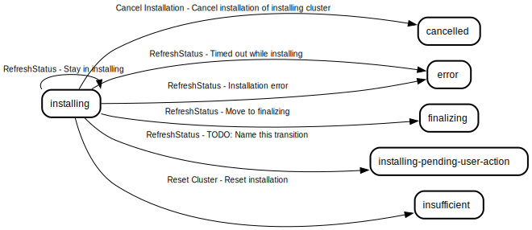
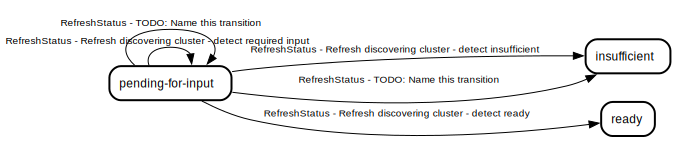
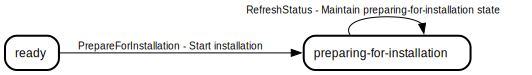
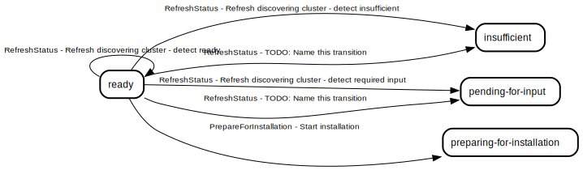
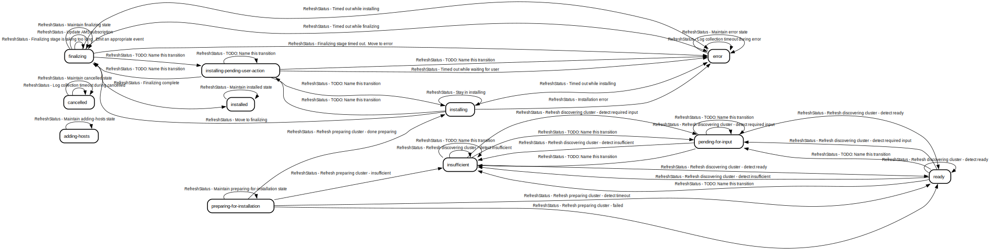
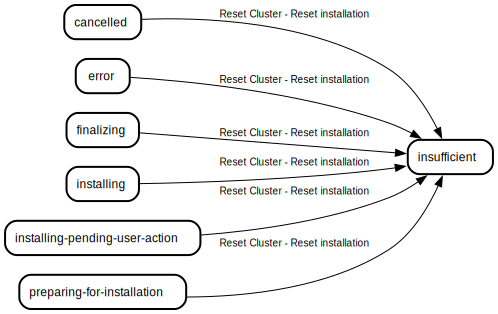

# Cluster state machine
The cluster state machine helps the service track the installation lifecycle of a cluster

## Table of Contents

### States
* [AddingHosts](#addinghosts)
* [Cancelled](#cancelled)
* [Error](#error)
* [Finalizing](#finalizing)
* [Initial](#initial)
* [Installed](#installed)
* [Installing](#installing)
* [Installing, Pending User Action](#installing-pending-user-action)
* [Insufficient](#insufficient)
* [Pending For Input](#pending-for-input)
* [Preparing For Installation](#preparing-for-installation)
* [Ready](#ready)

### Transition Types
Transition types are the events that can cause a state transition

* [Cancel Installation](#cancel-installation)
* [PrepareForInstallation](#prepareforinstallation)
* [RefreshStatus](#refreshstatus)
* [Reset Cluster](#reset-cluster)

### Transition Rules
Transition rules are the rules that define the required source states and conditions needed to move to a particular destination state when a particular transition type happens

* [Cancel installation of installing cluster](#cancel-installation-of-installing-cluster)
* [Cancel installation of preparing cluster](#cancel-installation-of-preparing-cluster)
* [Start installation](#start-installation)
* [Refresh discovering cluster - detect required input](#refresh-discovering-cluster---detect-required-input)
* [Refresh discovering cluster - detect insufficient](#refresh-discovering-cluster---detect-insufficient)
* [TODO: Name this transition](#todo-name-this-transition)
* [TODO: Name this transition](#todo-name-this-transition)
* [Refresh discovering cluster - detect ready](#refresh-discovering-cluster---detect-ready)
* [Refresh preparing cluster - detect timeout](#refresh-preparing-cluster---detect-timeout)
* [Refresh preparing cluster - done preparing](#refresh-preparing-cluster---done-preparing)
* [Refresh preparing cluster - insufficient](#refresh-preparing-cluster---insufficient)
* [Refresh preparing cluster - failed](#refresh-preparing-cluster---failed)
* [TODO: Name this transition](#todo-name-this-transition)
* [Timed out while waiting for user](#timed-out-while-waiting-for-user)
* [Timed out while installing](#timed-out-while-installing)
* [Timed out while finalizing](#timed-out-while-finalizing)
* [Finalizing stage timed out.  Move to error](#finalizing-stage-timed-out--move-to-error)
* [Finalizing stage is taking too long.  Emit an appropriate event](#finalizing-stage-is-taking-too-long--emit-an-appropriate-event)
* [TODO: Name this transition](#todo-name-this-transition)
* [TODO: Name this transition](#todo-name-this-transition)
* [TODO: Name this transition](#todo-name-this-transition)
* [TODO: Name this transition](#todo-name-this-transition)
* [Move to finalizing](#move-to-finalizing)
* [Stay in installing](#stay-in-installing)
* [Update AMS subscription](#update-ams-subscription)
* [Finalizing complete](#finalizing-complete)
* [Installation error](#installation-error)
* [Log collection timeout during error](#log-collection-timeout-during-error)
* [Log collection timeout during cancelled](#log-collection-timeout-during-cancelled)
* [Maintain preparing-for-installation state](#maintain-preparing-for-installation-state)
* [Maintain finalizing state](#maintain-finalizing-state)
* [Maintain installed state](#maintain-installed-state)
* [Maintain error state](#maintain-error-state)
* [Maintain cancelled state](#maintain-cancelled-state)
* [Maintain adding-hosts state](#maintain-adding-hosts-state)
* [Reset installation](#reset-installation)

## States
### AddingHosts
The cluster is fully installed and is ready to accept new hosts. Installed clusters usually transition to this state automatically when installation is complete, depending on the configuration of the service. This is the initial state for imported clusters, as they are already installed

#### Transition types where this is the source state
* [Transition Type RefreshStatus](#transition-type-refreshstatus)

#### Transition types where this is the destination state
* [Transition Type RefreshStatus](#transition-type-refreshstatus)

#### Transition rules where this is the source state

* [Transition Rule Maintain adding-hosts state](#transition-rule-maintain-adding-hosts-state)

#### Transition rules where this is the destination state

* [Transition Rule Maintain adding-hosts state](#transition-rule-maintain-adding-hosts-state)

### Cancelled
The cluster installation was cancelled by the user. Cluster must be reset to be able to install again

#### Transition types where this is the source state
* [Transition Type RefreshStatus](#transition-type-refreshstatus)
* [Transition Type Reset Cluster](#transition-type-reset-cluster)

#### Transition types where this is the destination state
* [Transition Type Cancel Installation](#transition-type-cancel-installation)
* [Transition Type RefreshStatus](#transition-type-refreshstatus)

#### Transition rules where this is the source state

* [Transition Rule Log collection timeout during cancelled](#transition-rule-log-collection-timeout-during-cancelled)
* [Transition Rule Maintain cancelled state](#transition-rule-maintain-cancelled-state)
* [Transition Rule Reset installation](#transition-rule-reset-installation)

#### Transition rules where this is the destination state

* [Transition Rule Cancel installation of installing cluster](#transition-rule-cancel-installation-of-installing-cluster)
* [Transition Rule Log collection timeout during cancelled](#transition-rule-log-collection-timeout-during-cancelled)
* [Transition Rule Maintain cancelled state](#transition-rule-maintain-cancelled-state)

### Error
The cluster has encountered an error during installation and cannot proceed. Usually due to a timeout

#### Transition types where this is the source state
* [Transition Type Cancel Installation](#transition-type-cancel-installation)
* [Transition Type RefreshStatus](#transition-type-refreshstatus)
* [Transition Type Reset Cluster](#transition-type-reset-cluster)

#### Transition types where this is the destination state
* [Transition Type RefreshStatus](#transition-type-refreshstatus)

#### Transition rules where this is the source state

* [Transition Rule Cancel installation of installing cluster](#transition-rule-cancel-installation-of-installing-cluster)
* [Transition Rule Log collection timeout during error](#transition-rule-log-collection-timeout-during-error)
* [Transition Rule Maintain error state](#transition-rule-maintain-error-state)
* [Transition Rule Reset installation](#transition-rule-reset-installation)

#### Transition rules where this is the destination state

* [Transition Rule Finalizing stage timed out.  Move to error](#transition-rule-finalizing-stage-timed-out--move-to-error)
* [Transition Rule Installation error](#transition-rule-installation-error)
* [Transition Rule Log collection timeout during error](#transition-rule-log-collection-timeout-during-error)
* [Transition Rule Maintain error state](#transition-rule-maintain-error-state)
* [Transition Rule TODO: Name this transition](#transition-rule-todo-name-this-transition)
* [Transition Rule Timed out while finalizing](#transition-rule-timed-out-while-finalizing)
* [Transition Rule Timed out while installing](#transition-rule-timed-out-while-installing)
* [Transition Rule Timed out while waiting for user](#transition-rule-timed-out-while-waiting-for-user)

### Finalizing
The cluster has sufficient ready control-plane and worker nodes, but OCP is still finalizing the installation

#### Transition types where this is the source state
* [Transition Type Cancel Installation](#transition-type-cancel-installation)
* [Transition Type RefreshStatus](#transition-type-refreshstatus)
* [Transition Type Reset Cluster](#transition-type-reset-cluster)

#### Transition types where this is the destination state
* [Transition Type RefreshStatus](#transition-type-refreshstatus)

#### Transition rules where this is the source state

* [Transition Rule Cancel installation of installing cluster](#transition-rule-cancel-installation-of-installing-cluster)
* [Transition Rule Finalizing complete](#transition-rule-finalizing-complete)
* [Transition Rule Finalizing stage is taking too long.  Emit an appropriate event](#transition-rule-finalizing-stage-is-taking-too-long--emit-an-appropriate-event)
* [Transition Rule Finalizing stage timed out.  Move to error](#transition-rule-finalizing-stage-timed-out--move-to-error)
* [Transition Rule Maintain finalizing state](#transition-rule-maintain-finalizing-state)
* [Transition Rule Reset installation](#transition-rule-reset-installation)
* [Transition Rule TODO: Name this transition](#transition-rule-todo-name-this-transition)
* [Transition Rule Timed out while finalizing](#transition-rule-timed-out-while-finalizing)
* [Transition Rule Timed out while installing](#transition-rule-timed-out-while-installing)
* [Transition Rule Update AMS subscription](#transition-rule-update-ams-subscription)

#### Transition rules where this is the destination state

* [Transition Rule Finalizing stage is taking too long.  Emit an appropriate event](#transition-rule-finalizing-stage-is-taking-too-long--emit-an-appropriate-event)
* [Transition Rule Maintain finalizing state](#transition-rule-maintain-finalizing-state)
* [Transition Rule Move to finalizing](#transition-rule-move-to-finalizing)
* [Transition Rule TODO: Name this transition](#transition-rule-todo-name-this-transition)
* [Transition Rule Update AMS subscription](#transition-rule-update-ams-subscription)

### Initial
The initial state of the state machine. This is a synthetic state that is not actually part of the state machine. It appears in documentation when transition rules hold a single source state that is an empty string

#### Transition types where this is the source state

#### Transition types where this is the destination state

#### Transition rules where this is the source state

#### Transition rules where this is the destination state

### Installed
The cluster installation is considered complete, all operators are healthy and the cluster is ready to use

#### Transition types where this is the source state
* [Transition Type RefreshStatus](#transition-type-refreshstatus)

#### Transition types where this is the destination state
* [Transition Type RefreshStatus](#transition-type-refreshstatus)

#### Transition rules where this is the source state

* [Transition Rule Maintain installed state](#transition-rule-maintain-installed-state)

#### Transition rules where this is the destination state

* [Transition Rule Finalizing complete](#transition-rule-finalizing-complete)
* [Transition Rule Maintain installed state](#transition-rule-maintain-installed-state)

### Installing
The cluster installation is in progress

#### Transition types where this is the source state
* [Transition Type Cancel Installation](#transition-type-cancel-installation)
* [Transition Type RefreshStatus](#transition-type-refreshstatus)
* [Transition Type Reset Cluster](#transition-type-reset-cluster)

#### Transition types where this is the destination state
* [Transition Type RefreshStatus](#transition-type-refreshstatus)

#### Transition rules where this is the source state

* [Transition Rule Cancel installation of installing cluster](#transition-rule-cancel-installation-of-installing-cluster)
* [Transition Rule Installation error](#transition-rule-installation-error)
* [Transition Rule Move to finalizing](#transition-rule-move-to-finalizing)
* [Transition Rule Reset installation](#transition-rule-reset-installation)
* [Transition Rule Stay in installing](#transition-rule-stay-in-installing)
* [Transition Rule TODO: Name this transition](#transition-rule-todo-name-this-transition)
* [Transition Rule Timed out while installing](#transition-rule-timed-out-while-installing)

#### Transition rules where this is the destination state

* [Transition Rule Refresh preparing cluster - done preparing](#transition-rule-refresh-preparing-cluster---done-preparing)
* [Transition Rule Stay in installing](#transition-rule-stay-in-installing)
* [Transition Rule TODO: Name this transition](#transition-rule-todo-name-this-transition)

### Installing, Pending User Action
Installation is in progress, but is blocked and cannot continue until the user takes action

#### Transition types where this is the source state
* [Transition Type Cancel Installation](#transition-type-cancel-installation)
* [Transition Type RefreshStatus](#transition-type-refreshstatus)
* [Transition Type Reset Cluster](#transition-type-reset-cluster)

#### Transition types where this is the destination state
* [Transition Type RefreshStatus](#transition-type-refreshstatus)

#### Transition rules where this is the source state

* [Transition Rule Cancel installation of installing cluster](#transition-rule-cancel-installation-of-installing-cluster)
* [Transition Rule Reset installation](#transition-rule-reset-installation)
* [Transition Rule TODO: Name this transition](#transition-rule-todo-name-this-transition)
* [Transition Rule Timed out while waiting for user](#transition-rule-timed-out-while-waiting-for-user)

#### Transition rules where this is the destination state

* [Transition Rule TODO: Name this transition](#transition-rule-todo-name-this-transition)

### Insufficient
This is the initial state for regular, non-imported clusters

#### Transition types where this is the source state
* [Transition Type RefreshStatus](#transition-type-refreshstatus)

#### Transition types where this is the destination state
* [Transition Type RefreshStatus](#transition-type-refreshstatus)
* [Transition Type Reset Cluster](#transition-type-reset-cluster)

#### Transition rules where this is the source state

* [Transition Rule Refresh discovering cluster - detect insufficient](#transition-rule-refresh-discovering-cluster---detect-insufficient)
* [Transition Rule Refresh discovering cluster - detect ready](#transition-rule-refresh-discovering-cluster---detect-ready)
* [Transition Rule Refresh discovering cluster - detect required input](#transition-rule-refresh-discovering-cluster---detect-required-input)
* [Transition Rule TODO: Name this transition](#transition-rule-todo-name-this-transition)

#### Transition rules where this is the destination state

* [Transition Rule Refresh discovering cluster - detect insufficient](#transition-rule-refresh-discovering-cluster---detect-insufficient)
* [Transition Rule Refresh preparing cluster - insufficient](#transition-rule-refresh-preparing-cluster---insufficient)
* [Transition Rule Reset installation](#transition-rule-reset-installation)
* [Transition Rule TODO: Name this transition](#transition-rule-todo-name-this-transition)

### Pending For Input
The cluster is not ready for installation because it needs more information from the user

#### Transition types where this is the source state
* [Transition Type RefreshStatus](#transition-type-refreshstatus)

#### Transition types where this is the destination state
* [Transition Type RefreshStatus](#transition-type-refreshstatus)

#### Transition rules where this is the source state

* [Transition Rule Refresh discovering cluster - detect insufficient](#transition-rule-refresh-discovering-cluster---detect-insufficient)
* [Transition Rule Refresh discovering cluster - detect ready](#transition-rule-refresh-discovering-cluster---detect-ready)
* [Transition Rule Refresh discovering cluster - detect required input](#transition-rule-refresh-discovering-cluster---detect-required-input)
* [Transition Rule TODO: Name this transition](#transition-rule-todo-name-this-transition)

#### Transition rules where this is the destination state

* [Transition Rule Refresh discovering cluster - detect required input](#transition-rule-refresh-discovering-cluster---detect-required-input)
* [Transition Rule TODO: Name this transition](#transition-rule-todo-name-this-transition)

### Preparing For Installation
A transient state between Ready and Installing, cluster hosts are performing pre-installation validations

#### Transition types where this is the source state
* [Transition Type Cancel Installation](#transition-type-cancel-installation)
* [Transition Type RefreshStatus](#transition-type-refreshstatus)
* [Transition Type Reset Cluster](#transition-type-reset-cluster)

#### Transition types where this is the destination state
* [Transition Type PrepareForInstallation](#transition-type-prepareforinstallation)
* [Transition Type RefreshStatus](#transition-type-refreshstatus)

#### Transition rules where this is the source state

* [Transition Rule Cancel installation of preparing cluster](#transition-rule-cancel-installation-of-preparing-cluster)
* [Transition Rule Maintain preparing-for-installation state](#transition-rule-maintain-preparing-for-installation-state)
* [Transition Rule Refresh preparing cluster - detect timeout](#transition-rule-refresh-preparing-cluster---detect-timeout)
* [Transition Rule Refresh preparing cluster - done preparing](#transition-rule-refresh-preparing-cluster---done-preparing)
* [Transition Rule Refresh preparing cluster - failed](#transition-rule-refresh-preparing-cluster---failed)
* [Transition Rule Refresh preparing cluster - insufficient](#transition-rule-refresh-preparing-cluster---insufficient)
* [Transition Rule Reset installation](#transition-rule-reset-installation)

#### Transition rules where this is the destination state

* [Transition Rule Maintain preparing-for-installation state](#transition-rule-maintain-preparing-for-installation-state)
* [Transition Rule Start installation](#transition-rule-start-installation)

### Ready
The cluster is ready to begin installation

#### Transition types where this is the source state
* [Transition Type PrepareForInstallation](#transition-type-prepareforinstallation)
* [Transition Type RefreshStatus](#transition-type-refreshstatus)

#### Transition types where this is the destination state
* [Transition Type Cancel Installation](#transition-type-cancel-installation)
* [Transition Type RefreshStatus](#transition-type-refreshstatus)

#### Transition rules where this is the source state

* [Transition Rule Refresh discovering cluster - detect insufficient](#transition-rule-refresh-discovering-cluster---detect-insufficient)
* [Transition Rule Refresh discovering cluster - detect ready](#transition-rule-refresh-discovering-cluster---detect-ready)
* [Transition Rule Refresh discovering cluster - detect required input](#transition-rule-refresh-discovering-cluster---detect-required-input)
* [Transition Rule Start installation](#transition-rule-start-installation)
* [Transition Rule TODO: Name this transition](#transition-rule-todo-name-this-transition)

#### Transition rules where this is the destination state

* [Transition Rule Cancel installation of preparing cluster](#transition-rule-cancel-installation-of-preparing-cluster)
* [Transition Rule Refresh discovering cluster - detect ready](#transition-rule-refresh-discovering-cluster---detect-ready)
* [Transition Rule Refresh preparing cluster - detect timeout](#transition-rule-refresh-preparing-cluster---detect-timeout)
* [Transition Rule Refresh preparing cluster - failed](#transition-rule-refresh-preparing-cluster---failed)

## Transition Types
Transition types are the events that can cause a state transition

### Transition Type Cancel Installation
Triggered when the user cancels the installation

#### Source states where this transition type applies
* [Error](#error)
* [Finalizing](#finalizing)
* [Installing](#installing)
* [Installing, Pending User Action](#installing-pending-user-action)
* [Preparing For Installation](#preparing-for-installation)

#### Destination states where this transition type applies
* [Cancelled](#cancelled)
* [Ready](#ready)
#### Transition rules using this transition type

* [Transition Rule Cancel installation of installing cluster](#transition-rule-cancel-installation-of-installing-cluster)
* [Transition Rule Cancel installation of preparing cluster](#transition-rule-cancel-installation-of-preparing-cluster)
### Transition Type PrepareForInstallation
Triggered when the user starts the installation

#### Source states where this transition type applies
* [Ready](#ready)

#### Destination states where this transition type applies
* [Preparing For Installation](#preparing-for-installation)
#### Transition rules using this transition type

* [Transition Rule Start installation](#transition-rule-start-installation)
### Transition Type RefreshStatus
Triggered on some clusters periodically by the background cluster monitor goroutine that runs on the leader instance of the Assisted Service. Responsible for driving transitions between states that require re-evaluation of all the validation results and potential timeout conditions

#### Source states where this transition type applies
* [AddingHosts](#addinghosts)
* [Cancelled](#cancelled)
* [Error](#error)
* [Finalizing](#finalizing)
* [Installed](#installed)
* [Installing](#installing)
* [Installing, Pending User Action](#installing-pending-user-action)
* [Insufficient](#insufficient)
* [Pending For Input](#pending-for-input)
* [Preparing For Installation](#preparing-for-installation)
* [Ready](#ready)

#### Destination states where this transition type applies
* [AddingHosts](#addinghosts)
* [Cancelled](#cancelled)
* [Error](#error)
* [Finalizing](#finalizing)
* [Installed](#installed)
* [Installing](#installing)
* [Installing, Pending User Action](#installing-pending-user-action)
* [Insufficient](#insufficient)
* [Pending For Input](#pending-for-input)
* [Preparing For Installation](#preparing-for-installation)
* [Ready](#ready)
#### Transition rules using this transition type

* [Transition Rule Finalizing complete](#transition-rule-finalizing-complete)
* [Transition Rule Finalizing stage is taking too long.  Emit an appropriate event](#transition-rule-finalizing-stage-is-taking-too-long--emit-an-appropriate-event)
* [Transition Rule Finalizing stage timed out.  Move to error](#transition-rule-finalizing-stage-timed-out--move-to-error)
* [Transition Rule Installation error](#transition-rule-installation-error)
* [Transition Rule Log collection timeout during cancelled](#transition-rule-log-collection-timeout-during-cancelled)
* [Transition Rule Log collection timeout during error](#transition-rule-log-collection-timeout-during-error)
* [Transition Rule Maintain adding-hosts state](#transition-rule-maintain-adding-hosts-state)
* [Transition Rule Maintain cancelled state](#transition-rule-maintain-cancelled-state)
* [Transition Rule Maintain error state](#transition-rule-maintain-error-state)
* [Transition Rule Maintain finalizing state](#transition-rule-maintain-finalizing-state)
* [Transition Rule Maintain installed state](#transition-rule-maintain-installed-state)
* [Transition Rule Maintain preparing-for-installation state](#transition-rule-maintain-preparing-for-installation-state)
* [Transition Rule Move to finalizing](#transition-rule-move-to-finalizing)
* [Transition Rule Refresh discovering cluster - detect insufficient](#transition-rule-refresh-discovering-cluster---detect-insufficient)
* [Transition Rule Refresh discovering cluster - detect ready](#transition-rule-refresh-discovering-cluster---detect-ready)
* [Transition Rule Refresh discovering cluster - detect required input](#transition-rule-refresh-discovering-cluster---detect-required-input)
* [Transition Rule Refresh preparing cluster - detect timeout](#transition-rule-refresh-preparing-cluster---detect-timeout)
* [Transition Rule Refresh preparing cluster - done preparing](#transition-rule-refresh-preparing-cluster---done-preparing)
* [Transition Rule Refresh preparing cluster - failed](#transition-rule-refresh-preparing-cluster---failed)
* [Transition Rule Refresh preparing cluster - insufficient](#transition-rule-refresh-preparing-cluster---insufficient)
* [Transition Rule Stay in installing](#transition-rule-stay-in-installing)
* [Transition Rule TODO: Name this transition](#transition-rule-todo-name-this-transition)
* [Transition Rule Timed out while finalizing](#transition-rule-timed-out-while-finalizing)
* [Transition Rule Timed out while installing](#transition-rule-timed-out-while-installing)
* [Transition Rule Timed out while waiting for user](#transition-rule-timed-out-while-waiting-for-user)
* [Transition Rule Update AMS subscription](#transition-rule-update-ams-subscription)
### Transition Type Reset Cluster
Triggered when the user resets the cluster

#### Source states where this transition type applies
* [Cancelled](#cancelled)
* [Error](#error)
* [Finalizing](#finalizing)
* [Installing](#installing)
* [Installing, Pending User Action](#installing-pending-user-action)
* [Preparing For Installation](#preparing-for-installation)

#### Destination states where this transition type applies
* [Insufficient](#insufficient)
#### Transition rules using this transition type

* [Transition Rule Reset installation](#transition-rule-reset-installation)

## Transition Rules
Transition rules are the rules that define the required source states and conditions needed to move to a particular destination state when a particular transition type happens

### Transition Rule Cancel installation of installing cluster
Move cluster to the cancelled state when user cancels installation

#### Source states
* [Installing](#installing)
* [Installing, Pending User Action](#installing-pending-user-action)
* [Error](#error)
* [Finalizing](#finalizing)

#### Destination state
[Cancelled](#cancelled)

### Transition Rule Cancel installation of preparing cluster
Cancelling a cluster during preparation simply cancels the preparation and moves it back to the ready, rather than putting the cluster in the cancelled state

#### Source states
* [Preparing For Installation](#preparing-for-installation)

#### Destination state
[Ready](#ready)

### Transition Rule Start installation
Begins preparing the cluster for installation

#### Source states
* [Ready](#ready)

#### Destination state
[Preparing For Installation](#preparing-for-installation)

### Transition Rule Refresh discovering cluster - detect required input
In order for this transition to be fired at least one of the validations in requiredInputFieldsExistNonDhcp must fail. This transition handles the case that there is missing input that has to be provided from a user or other external means

#### Source states
* [Pending For Input](#pending-for-input)
* [Ready](#ready)
* [Insufficient](#insufficient)

#### Destination state
[Pending For Input](#pending-for-input)

### Transition Rule Refresh discovering cluster - detect insufficient
In order for this transition to be fired at least one of the validations in isSufficientForInstallNonDhcp must fail. This transition handles the case that one of the required validations that are required in order for the cluster to be in ready state has failed

#### Source states
* [Pending For Input](#pending-for-input)
* [Ready](#ready)
* [Insufficient](#insufficient)

#### Destination state
[Insufficient](#insufficient)

### Transition Rule TODO: Name this transition
In order for this transition to be fired at least one of the validation IsMachineCidrDefined must fail. This transition handles the case that there is missing input that has to be provided from a user or other external means

#### Source states
* [Pending For Input](#pending-for-input)
* [Ready](#ready)
* [Insufficient](#insufficient)

#### Destination state
[Pending For Input](#pending-for-input)

### Transition Rule TODO: Name this transition
In order for this transition to be fired at least one of the validations in isSufficientForInstallDhcp must fail. This transition handles the case that one of the required validations that are required in order for the host to be in known state (ready for installation) has failed

#### Source states
* [Pending For Input](#pending-for-input)
* [Ready](#ready)
* [Insufficient](#insufficient)

#### Destination state
[Insufficient](#insufficient)

### Transition Rule Refresh discovering cluster - detect ready
This transition is fired when all validations pass

#### Source states
* [Pending For Input](#pending-for-input)
* [Ready](#ready)
* [Insufficient](#insufficient)

#### Destination state
[Ready](#ready)

### Transition Rule Refresh preparing cluster - detect timeout
This transition is fired when the preparing installation reach the timeout

#### Source states
* [Preparing For Installation](#preparing-for-installation)

#### Destination state
[Ready](#ready)

### Transition Rule Refresh preparing cluster - done preparing
This transition is fired when cluster installation preperation is complete and all hosts within the cluster have also finished preparing

#### Source states
* [Preparing For Installation](#preparing-for-installation)

#### Destination state
[Installing](#installing)

### Transition Rule Refresh preparing cluster - insufficient
TODO: Document this transition

#### Source states
* [Preparing For Installation](#preparing-for-installation)

#### Destination state
[Insufficient](#insufficient)

### Transition Rule Refresh preparing cluster - failed
TODO: Document this transition

#### Source states
* [Preparing For Installation](#preparing-for-installation)

#### Destination state
[Ready](#ready)

### Transition Rule TODO: Name this transition
TODO: Document this transition

#### Source states
* [Installing, Pending User Action](#installing-pending-user-action)

#### Destination state
[Error](#error)

### Transition Rule Timed out while waiting for user
User was asked to take action and did not do so in time, give up and display appropriate error

#### Source states
* [Installing, Pending User Action](#installing-pending-user-action)

#### Destination state
[Error](#error)

### Transition Rule Timed out while installing
Cluster installation is taking too long, give up and display appropriate error

#### Source states
* [Installing](#installing)
* [Finalizing](#finalizing)

#### Destination state
[Error](#error)

### Transition Rule Timed out while finalizing
Cluster finalization took too long, display appropriate error

#### Source states
* [Finalizing](#finalizing)

#### Destination state
[Error](#error)

### Transition Rule Finalizing stage timed out.  Move to error
Cluster finalization stage took too long, display appropriate error

#### Source states
* [Finalizing](#finalizing)

#### Destination state
[Error](#error)

### Transition Rule Finalizing stage is taking too long.  Emit an appropriate event
Cluster finalization stage is taking too long, emit a warning event and continue installation

#### Source states
* [Finalizing](#finalizing)

#### Destination state
[Finalizing](#finalizing)

### Transition Rule TODO: Name this transition
TODO: Document this transition

#### Source states
* [Installing, Pending User Action](#installing-pending-user-action)

#### Destination state
[Installing, Pending User Action](#installing-pending-user-action)

### Transition Rule TODO: Name this transition
TODO: Document this transition

#### Source states
* [Installing, Pending User Action](#installing-pending-user-action)

#### Destination state
[Installing](#installing)

### Transition Rule TODO: Name this transition
TODO: Document this transition

#### Source states
* [Installing, Pending User Action](#installing-pending-user-action)

#### Destination state
[Finalizing](#finalizing)

### Transition Rule TODO: Name this transition
TODO: Document this transition

#### Source states
* [Installing](#installing)
* [Finalizing](#finalizing)

#### Destination state
[Installing, Pending User Action](#installing-pending-user-action)

### Transition Rule Move to finalizing
This transition is fired when the cluster is in installing and should move to finalizing

#### Source states
* [Installing](#installing)

#### Destination state
[Finalizing](#finalizing)

### Transition Rule Stay in installing
Installing cluster should stay in installing

#### Source states
* [Installing](#installing)

#### Destination state
[Installing](#installing)

### Transition Rule Update AMS subscription
Update AMS subscription with console URL

#### Source states
* [Finalizing](#finalizing)

#### Destination state
[Finalizing](#finalizing)

### Transition Rule Finalizing complete
The cluster has completed finalizing

#### Source states
* [Finalizing](#finalizing)

#### Destination state
[Installed](#installed)

### Transition Rule Installation error
This transition is fired when the cluster is in installing and should move to error

#### Source states
* [Installing](#installing)

#### Destination state
[Error](#error)

### Transition Rule Log collection timeout during error
Stay in error state and update logs progress to timeout

#### Source states
* [Error](#error)

#### Destination state
[Error](#error)

### Transition Rule Log collection timeout during cancelled
Stay in cancelled state and update logs progress to timeout

#### Source states
* [Cancelled](#cancelled)

#### Destination state
[Cancelled](#cancelled)

### Transition Rule Maintain preparing-for-installation state
Stay in preparing-for-installation state

#### Source states
* [Preparing For Installation](#preparing-for-installation)

#### Destination state
[Preparing For Installation](#preparing-for-installation)

### Transition Rule Maintain finalizing state
Stay in finalizing state

#### Source states
* [Finalizing](#finalizing)

#### Destination state
[Finalizing](#finalizing)

### Transition Rule Maintain installed state
Stay in installed state

#### Source states
* [Installed](#installed)

#### Destination state
[Installed](#installed)

### Transition Rule Maintain error state
Stay in error state

#### Source states
* [Error](#error)

#### Destination state
[Error](#error)

### Transition Rule Maintain cancelled state
Stay in cancelled state

#### Source states
* [Cancelled](#cancelled)

#### Destination state
[Cancelled](#cancelled)

### Transition Rule Maintain adding-hosts state
Stay in adding-hosts state

#### Source states
* [AddingHosts](#addinghosts)

#### Destination state
[AddingHosts](#addinghosts)

### Transition Rule Reset installation
Reset the cluster, allowing it to be installed again

#### Source states
* [Preparing For Installation](#preparing-for-installation)
* [Installing](#installing)
* [Installing, Pending User Action](#installing-pending-user-action)
* [Error](#error)
* [Cancelled](#cancelled)
* [Finalizing](#finalizing)

#### Destination state
[Insufficient](#insufficient)

