# Host state machine
The host state machine helps the service orchestrate the host lifecycle of hosts that are already bound to a cluster

## Table of Contents

### States
* [Added to Existing Cluster](#added-to-existing-cluster)
* [Binding](#binding)
* [Cancelled](#cancelled)
* [Disabled](#disabled)
* [Disconnected](#disconnected)
* [Discovering](#discovering)
* [Error](#error)
* [Initial](#initial)
* [Installed](#installed)
* [Installing](#installing)
* [Installing in Progress](#installing-in-progress)
* [Installing, Pending User Action](#installing-pending-user-action)
* [Insufficient](#insufficient)
* [Known](#known)
* [Pending for Input](#pending-for-input)
* [Preparing Failed](#preparing-failed)
* [Preparing for Installation](#preparing-for-installation)
* [Preparing Successful](#preparing-successful)
* [Reclaiming](#reclaiming)
* [Reclaiming, Rebooting](#reclaiming-rebooting)
* [Resetting](#resetting)
* [Resetting, Pending User Action](#resetting-pending-user-action)
* [Unbinding](#unbinding)
* [Unbinding, Pending User Action](#unbinding-pending-user-action)

### Transition Types
Transition types are the events that can cause a state transition

* [Bind Host](#bind-host)
* [Cancel Installation](#cancel-installation)
* [Installation Failed](#installation-failed)
* [Install Host](#install-host)
* [Media Disconnect](#media-disconnect)
* [Rebooting for Reclaim](#rebooting-for-reclaim)
* [Reclaim Host](#reclaim-host)
* [Reclaim Failed](#reclaim-failed)
* [Refresh](#refresh)
* [Register Host](#register-host)
* [Resetting, Pending User Action](#resetting-pending-user-action)
* [Unbind Host](#unbind-host)

### Transition Rules
Transition rules are the rules that define the required source states and conditions needed to move to a particular destination state when a particular transition type happens

* [Installation canceled while host is installing](#installation-canceled-while-host-is-installing)
* [Cancel while preparing](#cancel-while-preparing)
* [Cancel while known](#cancel-while-known)
* [Installation failed while host is installing](#installation-failed-while-host-is-installing)
* [Install known host](#install-known-host)
* [Move to disconnected when virtual media disconnects pre-installation](#move-to-disconnected-when-virtual-media-disconnects-pre-installation)
* [Move to error when virtual media disconnects post-installation](#move-to-error-when-virtual-media-disconnects-post-installation)
* [Rebooting for reclaim reclaiming host](#rebooting-for-reclaim-reclaiming-host)
* [Reclaim successful host](#reclaim-successful-host)
* [Reclaim pre-installation](#reclaim-pre-installation)
* [Reclaim failed host](#reclaim-failed-host)
* [Reclaim failure for reclaiming host](#reclaim-failure-for-reclaiming-host)
* [Refresh reclaiming host](#refresh-reclaiming-host)
* [Refresh known host in preparing cluster](#refresh-known-host-in-preparing-cluster)
* [Refresh successfully preparing host](#refresh-successfully-preparing-host)
* [Stay in preparing successful](#stay-in-preparing-successful)
* [Move successfully prepared host to installing](#move-successfully-prepared-host-to-installing)
* [Move preparing host to known when cluster stops preparing](#move-preparing-host-to-known-when-cluster-stops-preparing)
* [Preparing failed disk speed host move to insufficient](#preparing-failed-disk-speed-host-move-to-insufficient)
* [Preparing failed image pull host move to preparing failed](#preparing-failed-image-pull-host-move-to-preparing-failed)
* [Stay in preparing for installation](#stay-in-preparing-for-installation)
* [Failed preparing to known when cluster is no longer preparing](#failed-preparing-to-known-when-cluster-is-no-longer-preparing)
* [Successful preparing to known when cluster is no longer preparing](#successful-preparing-to-known-when-cluster-is-no-longer-preparing)
* [Move host to disconnected when connected times out](#move-host-to-disconnected-when-connected-times-out)
* [Move host to error when cluster is in error](#move-host-to-error-when-cluster-is-in-error)
* [Move host to error when installation times out](#move-host-to-error-when-installation-times-out)
* [Move installing host to error when connection times out](#move-installing-host-to-error-when-connection-times-out)
* [Move preparing host to disconnected when connection times out](#move-preparing-host-to-disconnected-when-connection-times-out)
* [Move installing host to error when connection times out](#move-installing-host-to-error-when-connection-times-out)
* [Ignore timeout if host is in particular installation in progress stages](#ignore-timeout-if-host-is-in-particular-installation-in-progress-stages)
* [Move to error on timeout if host is in particular installation in progress stages](#move-to-error-on-timeout-if-host-is-in-particular-installation-in-progress-stages)
* [Tell user about boot order wen reboot takes too long](#tell-user-about-boot-order-wen-reboot-takes-too-long)
* [Refresh during installing state without cluster error should stay in installing state](#refresh-during-installing-state-without-cluster-error-should-stay-in-installing-state)
* [Refresh during installing-in-progress state without cluster error should stay in installing-in-progress state](#refresh-during-installing-in-progress-state-without-cluster-error-should-stay-in-installing-in-progress-state)
* [Refresh during installed state without cluster error should stay in installed state](#refresh-during-installed-state-without-cluster-error-should-stay-in-installed-state)
* [Refresh during installing-pending-user-action state without cluster error should stay in installing-pending-user-action state](#refresh-during-installing-pending-user-action-state-without-cluster-error-should-stay-in-installing-pending-user-action-state)
* [Refresh during resetting-pending-user-action state without cluster error should stay in resetting-pending-user-action state](#refresh-during-resetting-pending-user-action-state-without-cluster-error-should-stay-in-resetting-pending-user-action-state)
* [Host reconnected without inventory](#host-reconnected-without-inventory)
* [Host has insufficient hardware](#host-has-insufficient-hardware)
* [Host pending input](#host-pending-input)
* [Host not ready](#host-not-ready)
* [Host ready](#host-ready)
* [Host stay ready](#host-stay-ready)
* [Log collection timed out during error should stay in error](#log-collection-timed-out-during-error-should-stay-in-error)
* [Log collection timed out during cancelled should stay in cancelled](#log-collection-timed-out-during-cancelled-should-stay-in-cancelled)
* [Refresh during error should stay in error](#refresh-during-error-should-stay-in-error)
* [Refresh during cancelled should stay in cancelled](#refresh-during-cancelled-should-stay-in-cancelled)
* [Refresh during resetting should stay in resetting](#refresh-during-resetting-should-stay-in-resetting)
* [Day 2 hosts should stay in added state](#day-2-hosts-should-stay-in-added-state)
* [Refresh without timeout during reclaiming should stay in reclaiming](#refresh-without-timeout-during-reclaiming-should-stay-in-reclaiming)
* [Refresh without timeout during reclaiming-rebooting should stay in reclaiming-rebooting](#refresh-without-timeout-during-reclaiming-rebooting-should-stay-in-reclaiming-rebooting)
* [Initial registration](#initial-registration)
* [Re-registration](#re-registration)
* [Ignore register while rebooting host in resetting](#ignore-register-while-rebooting-host-in-resetting)
* [Register non-rebooting host in resetting](#register-non-rebooting-host-in-resetting)
* [Wrong boot order detection](#wrong-boot-order-detection)
* [Register during installation](#register-during-installation)
* [Register during error](#register-during-error)
* [Reset pending user action all states](#reset-pending-user-action-all-states)
* [Unbind pre-installation](#unbind-pre-installation)
* [Unbind during or after installation](#unbind-during-or-after-installation)

## States
### Added to Existing Cluster
This is the final, successful state day-2 hosts reach when the Assisted Installer has done everything it can to help them join the target cluster

#### Transition types where this is the source state
* [Reclaim Host](#reclaim-host)
* [Refresh](#refresh)
* [Register Host](#register-host)
* [Resetting, Pending User Action](#resetting-pending-user-action)
* [Unbind Host](#unbind-host)

#### Transition types where this is the destination state
* [Refresh](#refresh)

#### Transition rules where this is the source state

* [Day 2 hosts should stay in added state](#day-2-hosts-should-stay-in-added-state)
* [Reclaim successful host](#reclaim-successful-host)
* [Reset pending user action all states](#reset-pending-user-action-all-states)
* [Unbind during or after installation](#unbind-during-or-after-installation)
* [Wrong boot order detection](#wrong-boot-order-detection)

#### Transition rules where this is the destination state

* [Day 2 hosts should stay in added state](#day-2-hosts-should-stay-in-added-state)

### Binding
TODO: Describe this state

#### Transition types where this is the source state
* [Media Disconnect](#media-disconnect)
* [Register Host](#register-host)

#### Transition types where this is the destination state

#### Transition rules where this is the source state
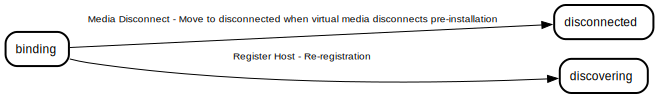

* [Move to disconnected when virtual media disconnects pre-installation](#move-to-disconnected-when-virtual-media-disconnects-pre-installation)
* [Re-registration](#re-registration)

#### Transition rules where this is the destination state

### Cancelled
TODO: Describe this state

#### Transition types where this is the source state
* [Reclaim Host](#reclaim-host)
* [Refresh](#refresh)
* [Resetting, Pending User Action](#resetting-pending-user-action)
* [Unbind Host](#unbind-host)

#### Transition types where this is the destination state
* [Cancel Installation](#cancel-installation)
* [Refresh](#refresh)

#### Transition rules where this is the source state

* [Log collection timed out during cancelled should stay in cancelled](#log-collection-timed-out-during-cancelled-should-stay-in-cancelled)
* [Reclaim failed host](#reclaim-failed-host)
* [Refresh during cancelled should stay in cancelled](#refresh-during-cancelled-should-stay-in-cancelled)
* [Reset pending user action all states](#reset-pending-user-action-all-states)
* [Unbind during or after installation](#unbind-during-or-after-installation)

#### Transition rules where this is the destination state

* [Installation canceled while host is installing](#installation-canceled-while-host-is-installing)
* [Log collection timed out during cancelled should stay in cancelled](#log-collection-timed-out-during-cancelled-should-stay-in-cancelled)
* [Refresh during cancelled should stay in cancelled](#refresh-during-cancelled-should-stay-in-cancelled)

### Disabled
TODO: Describe this state. This seems like an obsolete state that is no longer being used

#### Transition types where this is the source state

#### Transition types where this is the destination state

#### Transition rules where this is the source state

#### Transition rules where this is the destination state

### Disconnected
Hosts reach this state when the agent stops communicating with the service for a period of time. This can happen if the host is rebooted, if the agent is stopped for some reason, or if the host lost connectivity. Hosts can also reach this state if the agent that runs them detects and reports that the virtual media serving the live ISO doesn't seem to be responding

#### Transition types where this is the source state
* [Media Disconnect](#media-disconnect)
* [Reclaim Host](#reclaim-host)
* [Refresh](#refresh)
* [Register Host](#register-host)
* [Unbind Host](#unbind-host)

#### Transition types where this is the destination state
* [Media Disconnect](#media-disconnect)
* [Refresh](#refresh)

#### Transition rules where this is the source state
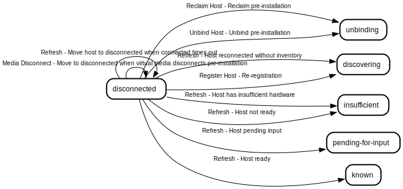

* [Host has insufficient hardware](#host-has-insufficient-hardware)
* [Host not ready](#host-not-ready)
* [Host pending input](#host-pending-input)
* [Host ready](#host-ready)
* [Host reconnected without inventory](#host-reconnected-without-inventory)
* [Move host to disconnected when connected times out](#move-host-to-disconnected-when-connected-times-out)
* [Move to disconnected when virtual media disconnects pre-installation](#move-to-disconnected-when-virtual-media-disconnects-pre-installation)
* [Re-registration](#re-registration)
* [Reclaim pre-installation](#reclaim-pre-installation)
* [Unbind pre-installation](#unbind-pre-installation)

#### Transition rules where this is the destination state

* [Move host to disconnected when connected times out](#move-host-to-disconnected-when-connected-times-out)
* [Move preparing host to disconnected when connection times out](#move-preparing-host-to-disconnected-when-connection-times-out)
* [Move to disconnected when virtual media disconnects pre-installation](#move-to-disconnected-when-virtual-media-disconnects-pre-installation)

### Discovering
This is the first state that the host is in after it has been registered. We usually don't know much about the host at this point, unless it reached this state through other circumstances

#### Transition types where this is the source state
* [Media Disconnect](#media-disconnect)
* [Reclaim Host](#reclaim-host)
* [Refresh](#refresh)
* [Register Host](#register-host)
* [Resetting, Pending User Action](#resetting-pending-user-action)
* [Unbind Host](#unbind-host)

#### Transition types where this is the destination state
* [Refresh](#refresh)
* [Register Host](#register-host)

#### Transition rules where this is the source state

* [Host has insufficient hardware](#host-has-insufficient-hardware)
* [Host not ready](#host-not-ready)
* [Host pending input](#host-pending-input)
* [Host ready](#host-ready)
* [Host reconnected without inventory](#host-reconnected-without-inventory)
* [Move host to disconnected when connected times out](#move-host-to-disconnected-when-connected-times-out)
* [Move to disconnected when virtual media disconnects pre-installation](#move-to-disconnected-when-virtual-media-disconnects-pre-installation)
* [Re-registration](#re-registration)
* [Reclaim pre-installation](#reclaim-pre-installation)
* [Reset pending user action all states](#reset-pending-user-action-all-states)
* [Unbind pre-installation](#unbind-pre-installation)

#### Transition rules where this is the destination state

* [Host reconnected without inventory](#host-reconnected-without-inventory)
* [Initial registration](#initial-registration)
* [Re-registration](#re-registration)
* [Register non-rebooting host in resetting](#register-non-rebooting-host-in-resetting)

### Error
Hosts can reach this state in many ways when something goes wrong and there's nothing the service or the user can do to remedy the situation. For example, when the cluster state machine goes into error, all hosts within the cluster will also go into error. The only way to get a host out of this state is by resetting the cluster installation. It is possible that a cluster installation would be considered successful even when some of the hosts reach this state, for example when the host that reached this state is a worker and there are other workers that are sufficient for healthy cluster operation

#### Transition types where this is the source state
* [Cancel Installation](#cancel-installation)
* [Media Disconnect](#media-disconnect)
* [Reclaim Host](#reclaim-host)
* [Refresh](#refresh)
* [Register Host](#register-host)
* [Resetting, Pending User Action](#resetting-pending-user-action)
* [Unbind Host](#unbind-host)

#### Transition types where this is the destination state
* [Installation Failed](#installation-failed)
* [Media Disconnect](#media-disconnect)
* [Refresh](#refresh)
* [Register Host](#register-host)

#### Transition rules where this is the source state
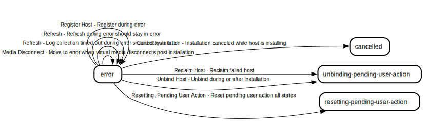

* [Installation canceled while host is installing](#installation-canceled-while-host-is-installing)
* [Log collection timed out during error should stay in error](#log-collection-timed-out-during-error-should-stay-in-error)
* [Move to error when virtual media disconnects post-installation](#move-to-error-when-virtual-media-disconnects-post-installation)
* [Reclaim failed host](#reclaim-failed-host)
* [Refresh during error should stay in error](#refresh-during-error-should-stay-in-error)
* [Register during error](#register-during-error)
* [Reset pending user action all states](#reset-pending-user-action-all-states)
* [Unbind during or after installation](#unbind-during-or-after-installation)

#### Transition rules where this is the destination state

* [Installation failed while host is installing](#installation-failed-while-host-is-installing)
* [Log collection timed out during error should stay in error](#log-collection-timed-out-during-error-should-stay-in-error)
* [Move host to error when cluster is in error](#move-host-to-error-when-cluster-is-in-error)
* [Move host to error when installation times out](#move-host-to-error-when-installation-times-out)
* [Move installing host to error when connection times out](#move-installing-host-to-error-when-connection-times-out)
* [Move to error on timeout if host is in particular installation in progress stages](#move-to-error-on-timeout-if-host-is-in-particular-installation-in-progress-stages)
* [Move to error when virtual media disconnects post-installation](#move-to-error-when-virtual-media-disconnects-post-installation)
* [Refresh during error should stay in error](#refresh-during-error-should-stay-in-error)
* [Register during error](#register-during-error)
* [Register during installation](#register-during-installation)

### Initial
The initial state of the state machine. This is a synthetic state that is not actually part of the state machine. It appears in documentation when transition rules hold a single source state that is an empty string

#### Transition types where this is the source state
* [Register Host](#register-host)

#### Transition types where this is the destination state

#### Transition rules where this is the source state

* [Initial registration](#initial-registration)

#### Transition rules where this is the destination state

### Installed
Hosts reach this state after they have been successfully installed. This state does not indicate that the cluster has successfully finished installing and initializing, only that this particular host seems to have successfuly joined and become an active member of the cluster

#### Transition types where this is the source state
* [Cancel Installation](#cancel-installation)
* [Reclaim Host](#reclaim-host)
* [Refresh](#refresh)
* [Resetting, Pending User Action](#resetting-pending-user-action)
* [Unbind Host](#unbind-host)

#### Transition types where this is the destination state
* [Refresh](#refresh)

#### Transition rules where this is the source state

* [Installation canceled while host is installing](#installation-canceled-while-host-is-installing)
* [Move host to error when cluster is in error](#move-host-to-error-when-cluster-is-in-error)
* [Reclaim successful host](#reclaim-successful-host)
* [Refresh during installed state without cluster error should stay in installed state](#refresh-during-installed-state-without-cluster-error-should-stay-in-installed-state)
* [Reset pending user action all states](#reset-pending-user-action-all-states)
* [Unbind during or after installation](#unbind-during-or-after-installation)

#### Transition rules where this is the destination state
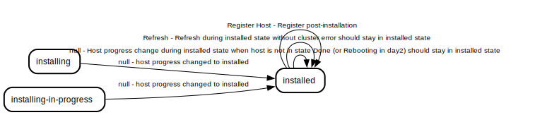

* [Refresh during installed state without cluster error should stay in installed state](#refresh-during-installed-state-without-cluster-error-should-stay-in-installed-state)

### Installing
The host installation has just begun. Hosts usually quickly move from this state to the 'Installing in Progress' state once they begin executing the install step

#### Transition types where this is the source state
* [Cancel Installation](#cancel-installation)
* [Installation Failed](#installation-failed)
* [Media Disconnect](#media-disconnect)
* [Refresh](#refresh)
* [Register Host](#register-host)
* [Resetting, Pending User Action](#resetting-pending-user-action)

#### Transition types where this is the destination state
* [Install Host](#install-host)
* [Refresh](#refresh)

#### Transition rules where this is the source state

* [Installation canceled while host is installing](#installation-canceled-while-host-is-installing)
* [Installation failed while host is installing](#installation-failed-while-host-is-installing)
* [Move host to error when cluster is in error](#move-host-to-error-when-cluster-is-in-error)
* [Move host to error when installation times out](#move-host-to-error-when-installation-times-out)
* [Move installing host to error when connection times out](#move-installing-host-to-error-when-connection-times-out)
* [Move to error when virtual media disconnects post-installation](#move-to-error-when-virtual-media-disconnects-post-installation)
* [Refresh during installing state without cluster error should stay in installing state](#refresh-during-installing-state-without-cluster-error-should-stay-in-installing-state)
* [Register during installation](#register-during-installation)
* [Reset pending user action all states](#reset-pending-user-action-all-states)

#### Transition rules where this is the destination state

* [Install known host](#install-known-host)
* [Move successfully prepared host to installing](#move-successfully-prepared-host-to-installing)
* [Refresh during installing state without cluster error should stay in installing state](#refresh-during-installing-state-without-cluster-error-should-stay-in-installing-state)

### Installing in Progress
Hosts stay in this state for a long time while they're being installed. The actual host installation progress is tracked via the host's progress stages, percentage and messages rather than moving the hosts to different states

#### Transition types where this is the source state
* [Cancel Installation](#cancel-installation)
* [Installation Failed](#installation-failed)
* [Media Disconnect](#media-disconnect)
* [Refresh](#refresh)
* [Register Host](#register-host)
* [Resetting, Pending User Action](#resetting-pending-user-action)

#### Transition types where this is the destination state
* [Refresh](#refresh)

#### Transition rules where this is the source state

* [Ignore timeout if host is in particular installation in progress stages](#ignore-timeout-if-host-is-in-particular-installation-in-progress-stages)
* [Installation canceled while host is installing](#installation-canceled-while-host-is-installing)
* [Installation failed while host is installing](#installation-failed-while-host-is-installing)
* [Move host to error when cluster is in error](#move-host-to-error-when-cluster-is-in-error)
* [Move installing host to error when connection times out](#move-installing-host-to-error-when-connection-times-out)
* [Move to error on timeout if host is in particular installation in progress stages](#move-to-error-on-timeout-if-host-is-in-particular-installation-in-progress-stages)
* [Move to error when virtual media disconnects post-installation](#move-to-error-when-virtual-media-disconnects-post-installation)
* [Refresh during installing-in-progress state without cluster error should stay in installing-in-progress state](#refresh-during-installing-in-progress-state-without-cluster-error-should-stay-in-installing-in-progress-state)
* [Register during installation](#register-during-installation)
* [Reset pending user action all states](#reset-pending-user-action-all-states)
* [Tell user about boot order wen reboot takes too long](#tell-user-about-boot-order-wen-reboot-takes-too-long)
* [Wrong boot order detection](#wrong-boot-order-detection)

#### Transition rules where this is the destination state

* [Ignore timeout if host is in particular installation in progress stages](#ignore-timeout-if-host-is-in-particular-installation-in-progress-stages)
* [Refresh during installing-in-progress state without cluster error should stay in installing-in-progress state](#refresh-during-installing-in-progress-state-without-cluster-error-should-stay-in-installing-in-progress-state)

### Installing, Pending User Action
Hosts in this state are waiting for the user to perform some action before the installation can continue. For example, when the host boots into the discovery ISO after it has been rebooted by the Assisted Installer - the user must manually reboot the host into the installation disk

#### Transition types where this is the source state
* [Cancel Installation](#cancel-installation)
* [Refresh](#refresh)
* [Register Host](#register-host)
* [Resetting, Pending User Action](#resetting-pending-user-action)

#### Transition types where this is the destination state
* [Refresh](#refresh)
* [Register Host](#register-host)

#### Transition rules where this is the source state

* [Installation canceled while host is installing](#installation-canceled-while-host-is-installing)
* [Move host to error when cluster is in error](#move-host-to-error-when-cluster-is-in-error)
* [Refresh during installing-pending-user-action state without cluster error should stay in installing-pending-user-action state](#refresh-during-installing-pending-user-action-state-without-cluster-error-should-stay-in-installing-pending-user-action-state)
* [Reset pending user action all states](#reset-pending-user-action-all-states)
* [Wrong boot order detection](#wrong-boot-order-detection)

#### Transition rules where this is the destination state
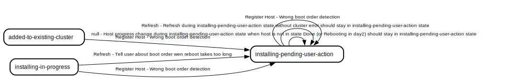

* [Refresh during installing-pending-user-action state without cluster error should stay in installing-pending-user-action state](#refresh-during-installing-pending-user-action-state-without-cluster-error-should-stay-in-installing-pending-user-action-state)
* [Tell user about boot order wen reboot takes too long](#tell-user-about-boot-order-wen-reboot-takes-too-long)
* [Wrong boot order detection](#wrong-boot-order-detection)

### Insufficient
Hosts in this state do not meet all the requirements required for installation to start. In other words, hosts for which some of the validations which we deem required for installation have a negative status

#### Transition types where this is the source state
* [Media Disconnect](#media-disconnect)
* [Reclaim Host](#reclaim-host)
* [Refresh](#refresh)
* [Register Host](#register-host)
* [Unbind Host](#unbind-host)

#### Transition types where this is the destination state
* [Refresh](#refresh)

#### Transition rules where this is the source state
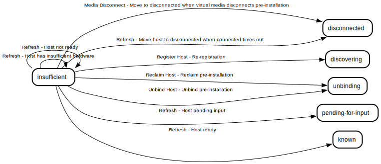

* [Host has insufficient hardware](#host-has-insufficient-hardware)
* [Host not ready](#host-not-ready)
* [Host pending input](#host-pending-input)
* [Host ready](#host-ready)
* [Move host to disconnected when connected times out](#move-host-to-disconnected-when-connected-times-out)
* [Move to disconnected when virtual media disconnects pre-installation](#move-to-disconnected-when-virtual-media-disconnects-pre-installation)
* [Re-registration](#re-registration)
* [Reclaim pre-installation](#reclaim-pre-installation)
* [Unbind pre-installation](#unbind-pre-installation)

#### Transition rules where this is the destination state

* [Host has insufficient hardware](#host-has-insufficient-hardware)
* [Host not ready](#host-not-ready)
* [Preparing failed disk speed host move to insufficient](#preparing-failed-disk-speed-host-move-to-insufficient)

### Known
Hosts in this state meet all the requirements and are ready for installation to start. All hosts must reach this state before cluster installation can begin

#### Transition types where this is the source state
* [Cancel Installation](#cancel-installation)
* [Install Host](#install-host)
* [Media Disconnect](#media-disconnect)
* [Reclaim Host](#reclaim-host)
* [Refresh](#refresh)
* [Register Host](#register-host)
* [Resetting, Pending User Action](#resetting-pending-user-action)
* [Unbind Host](#unbind-host)

#### Transition types where this is the destination state
* [Cancel Installation](#cancel-installation)
* [Refresh](#refresh)

#### Transition rules where this is the source state

* [Cancel while known](#cancel-while-known)
* [Host has insufficient hardware](#host-has-insufficient-hardware)
* [Host not ready](#host-not-ready)
* [Host pending input](#host-pending-input)
* [Host stay ready](#host-stay-ready)
* [Install known host](#install-known-host)
* [Move host to disconnected when connected times out](#move-host-to-disconnected-when-connected-times-out)
* [Move to disconnected when virtual media disconnects pre-installation](#move-to-disconnected-when-virtual-media-disconnects-pre-installation)
* [Preparing failed disk speed host move to insufficient](#preparing-failed-disk-speed-host-move-to-insufficient)
* [Re-registration](#re-registration)
* [Reclaim pre-installation](#reclaim-pre-installation)
* [Refresh known host in preparing cluster](#refresh-known-host-in-preparing-cluster)
* [Reset pending user action all states](#reset-pending-user-action-all-states)
* [Unbind pre-installation](#unbind-pre-installation)

#### Transition rules where this is the destination state
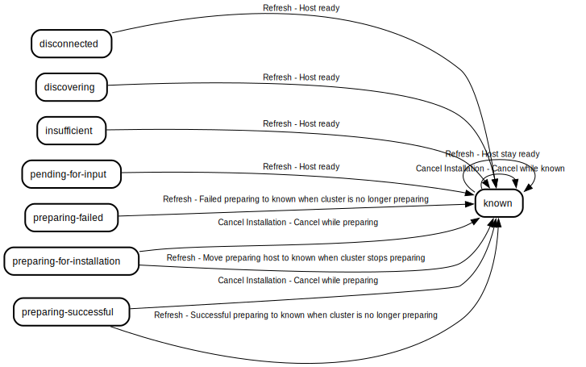

* [Cancel while known](#cancel-while-known)
* [Cancel while preparing](#cancel-while-preparing)
* [Failed preparing to known when cluster is no longer preparing](#failed-preparing-to-known-when-cluster-is-no-longer-preparing)
* [Host ready](#host-ready)
* [Host stay ready](#host-stay-ready)
* [Move preparing host to known when cluster stops preparing](#move-preparing-host-to-known-when-cluster-stops-preparing)
* [Successful preparing to known when cluster is no longer preparing](#successful-preparing-to-known-when-cluster-is-no-longer-preparing)

### Pending for Input
Similar to the 'Insufficient' state, except for validations which the user can resolve by providing some input, such as the machine CIDR for the cluster

#### Transition types where this is the source state
* [Media Disconnect](#media-disconnect)
* [Reclaim Host](#reclaim-host)
* [Refresh](#refresh)
* [Resetting, Pending User Action](#resetting-pending-user-action)
* [Unbind Host](#unbind-host)

#### Transition types where this is the destination state
* [Refresh](#refresh)

#### Transition rules where this is the source state

* [Host not ready](#host-not-ready)
* [Host pending input](#host-pending-input)
* [Host ready](#host-ready)
* [Move host to disconnected when connected times out](#move-host-to-disconnected-when-connected-times-out)
* [Move to disconnected when virtual media disconnects pre-installation](#move-to-disconnected-when-virtual-media-disconnects-pre-installation)
* [Reclaim pre-installation](#reclaim-pre-installation)
* [Reset pending user action all states](#reset-pending-user-action-all-states)
* [Unbind pre-installation](#unbind-pre-installation)

#### Transition rules where this is the destination state
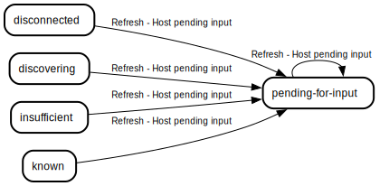

* [Host pending input](#host-pending-input)

### Preparing Failed
A state reached after the 'Preparing for Installation' state validations fail. This state is transient and the host automatically moves to and from it, it exists mostly to set the correct host status message to help the user understand what went wrong

#### Transition types where this is the source state
* [Media Disconnect](#media-disconnect)
* [Refresh](#refresh)
* [Resetting, Pending User Action](#resetting-pending-user-action)

#### Transition types where this is the destination state
* [Refresh](#refresh)

#### Transition rules where this is the source state
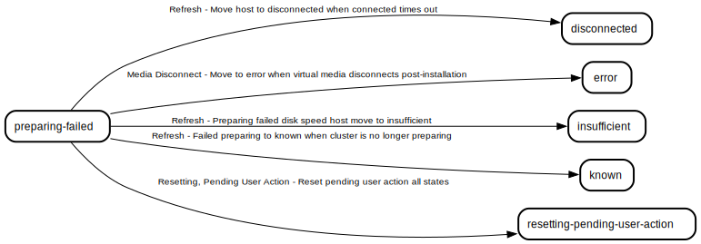

* [Failed preparing to known when cluster is no longer preparing](#failed-preparing-to-known-when-cluster-is-no-longer-preparing)
* [Move host to disconnected when connected times out](#move-host-to-disconnected-when-connected-times-out)
* [Move to error when virtual media disconnects post-installation](#move-to-error-when-virtual-media-disconnects-post-installation)
* [Preparing failed disk speed host move to insufficient](#preparing-failed-disk-speed-host-move-to-insufficient)
* [Reset pending user action all states](#reset-pending-user-action-all-states)

#### Transition rules where this is the destination state
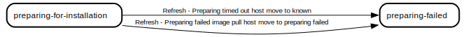

* [Preparing failed image pull host move to preparing failed](#preparing-failed-image-pull-host-move-to-preparing-failed)

### Preparing for Installation
A transient state which occurs after the user triggers installation and before installation actually begins. This state was made for performing destructive validations such as disk speed check. We don't perform those validations in prior states because before the user clicks install, we don't have their consent to perform disk writes. If those validations fail, we do not continue with the installation process

#### Transition types where this is the source state
* [Cancel Installation](#cancel-installation)
* [Media Disconnect](#media-disconnect)
* [Refresh](#refresh)
* [Register Host](#register-host)
* [Resetting, Pending User Action](#resetting-pending-user-action)

#### Transition types where this is the destination state
* [Refresh](#refresh)

#### Transition rules where this is the source state
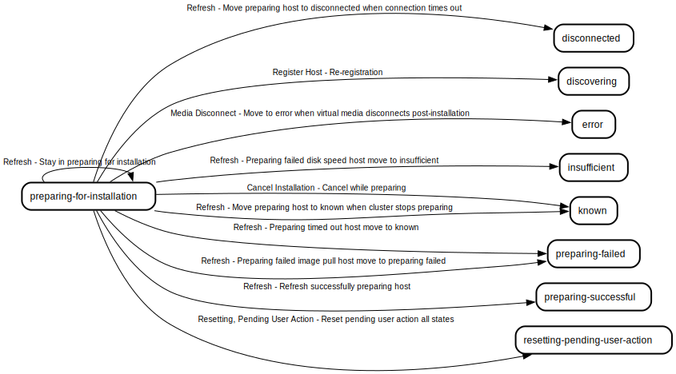

* [Cancel while preparing](#cancel-while-preparing)
* [Move preparing host to disconnected when connection times out](#move-preparing-host-to-disconnected-when-connection-times-out)
* [Move preparing host to known when cluster stops preparing](#move-preparing-host-to-known-when-cluster-stops-preparing)
* [Move to error when virtual media disconnects post-installation](#move-to-error-when-virtual-media-disconnects-post-installation)
* [Preparing failed disk speed host move to insufficient](#preparing-failed-disk-speed-host-move-to-insufficient)
* [Preparing failed image pull host move to preparing failed](#preparing-failed-image-pull-host-move-to-preparing-failed)
* [Re-registration](#re-registration)
* [Refresh successfully preparing host](#refresh-successfully-preparing-host)
* [Reset pending user action all states](#reset-pending-user-action-all-states)
* [Stay in preparing for installation](#stay-in-preparing-for-installation)

#### Transition rules where this is the destination state
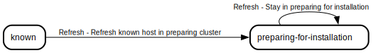

* [Refresh known host in preparing cluster](#refresh-known-host-in-preparing-cluster)
* [Stay in preparing for installation](#stay-in-preparing-for-installation)

### Preparing Successful
A state reached after the 'Preparing for Installation' state validations succeed. This state is transient and the host automatically moves to and from it, it exists mostly to set the correct host status message

#### Transition types where this is the source state
* [Cancel Installation](#cancel-installation)
* [Media Disconnect](#media-disconnect)
* [Refresh](#refresh)
* [Register Host](#register-host)
* [Resetting, Pending User Action](#resetting-pending-user-action)

#### Transition types where this is the destination state
* [Refresh](#refresh)

#### Transition rules where this is the source state
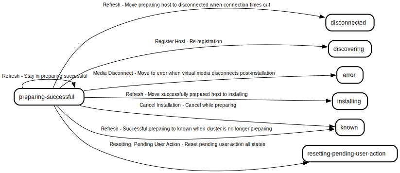

* [Cancel while preparing](#cancel-while-preparing)
* [Move preparing host to disconnected when connection times out](#move-preparing-host-to-disconnected-when-connection-times-out)
* [Move successfully prepared host to installing](#move-successfully-prepared-host-to-installing)
* [Move to error when virtual media disconnects post-installation](#move-to-error-when-virtual-media-disconnects-post-installation)
* [Re-registration](#re-registration)
* [Reset pending user action all states](#reset-pending-user-action-all-states)
* [Stay in preparing successful](#stay-in-preparing-successful)
* [Successful preparing to known when cluster is no longer preparing](#successful-preparing-to-known-when-cluster-is-no-longer-preparing)

#### Transition rules where this is the destination state
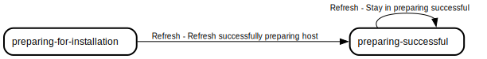

* [Refresh successfully preparing host](#refresh-successfully-preparing-host)
* [Stay in preparing successful](#stay-in-preparing-successful)

### Reclaiming
TODO: Describe this state

#### Transition types where this is the source state
* [Rebooting for Reclaim](#rebooting-for-reclaim)
* [Reclaim Failed](#reclaim-failed)
* [Refresh](#refresh)

#### Transition types where this is the destination state
* [Reclaim Host](#reclaim-host)
* [Refresh](#refresh)

#### Transition rules where this is the source state
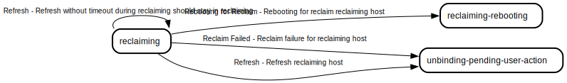

* [Rebooting for reclaim reclaiming host](#rebooting-for-reclaim-reclaiming-host)
* [Reclaim failure for reclaiming host](#reclaim-failure-for-reclaiming-host)
* [Refresh reclaiming host](#refresh-reclaiming-host)
* [Refresh without timeout during reclaiming should stay in reclaiming](#refresh-without-timeout-during-reclaiming-should-stay-in-reclaiming)

#### Transition rules where this is the destination state

* [Reclaim successful host](#reclaim-successful-host)
* [Refresh without timeout during reclaiming should stay in reclaiming](#refresh-without-timeout-during-reclaiming-should-stay-in-reclaiming)

### Reclaiming, Rebooting
TODO: Describe this state

#### Transition types where this is the source state
* [Reclaim Failed](#reclaim-failed)
* [Refresh](#refresh)

#### Transition types where this is the destination state
* [Rebooting for Reclaim](#rebooting-for-reclaim)
* [Refresh](#refresh)

#### Transition rules where this is the source state

* [Reclaim failure for reclaiming host](#reclaim-failure-for-reclaiming-host)
* [Refresh reclaiming host](#refresh-reclaiming-host)
* [Refresh without timeout during reclaiming-rebooting should stay in reclaiming-rebooting](#refresh-without-timeout-during-reclaiming-rebooting-should-stay-in-reclaiming-rebooting)

#### Transition rules where this is the destination state

* [Rebooting for reclaim reclaiming host](#rebooting-for-reclaim-reclaiming-host)
* [Refresh without timeout during reclaiming-rebooting should stay in reclaiming-rebooting](#refresh-without-timeout-during-reclaiming-rebooting-should-stay-in-reclaiming-rebooting)

### Resetting
Hosts reach this state when the user triggers a reset of the cluster installation. When ENABLE_AUTO_RESET is set to false (which it always is), this is a very short lived state and the host immediately proceeds to 'Resetting, Pending User Action' from it. This is a legacy state and it should eventually be merged with 'Resetting, Pending User Action'

#### Transition types where this is the source state
* [Refresh](#refresh)
* [Register Host](#register-host)
* [Resetting, Pending User Action](#resetting-pending-user-action)

#### Transition types where this is the destination state
* [Refresh](#refresh)
* [Register Host](#register-host)

#### Transition rules where this is the source state

* [Ignore register while rebooting host in resetting](#ignore-register-while-rebooting-host-in-resetting)
* [Refresh during resetting should stay in resetting](#refresh-during-resetting-should-stay-in-resetting)
* [Register non-rebooting host in resetting](#register-non-rebooting-host-in-resetting)
* [Reset pending user action all states](#reset-pending-user-action-all-states)

#### Transition rules where this is the destination state

* [Ignore register while rebooting host in resetting](#ignore-register-while-rebooting-host-in-resetting)
* [Refresh during resetting should stay in resetting](#refresh-during-resetting-should-stay-in-resetting)

### Resetting, Pending User Action
This is the true resetting state when ENABLE_AUTO_RESET is set to false (which it always is). In this state we wait for and tell the user to reboot the host into the live ISO in order to proceed

#### Transition types where this is the source state
* [Refresh](#refresh)
* [Register Host](#register-host)
* [Resetting, Pending User Action](#resetting-pending-user-action)

#### Transition types where this is the destination state
* [Refresh](#refresh)
* [Resetting, Pending User Action](#resetting-pending-user-action)

#### Transition rules where this is the source state
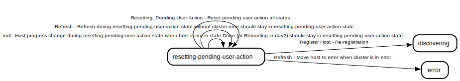

* [Move host to error when cluster is in error](#move-host-to-error-when-cluster-is-in-error)
* [Re-registration](#re-registration)
* [Refresh during resetting-pending-user-action state without cluster error should stay in resetting-pending-user-action state](#refresh-during-resetting-pending-user-action-state-without-cluster-error-should-stay-in-resetting-pending-user-action-state)
* [Reset pending user action all states](#reset-pending-user-action-all-states)

#### Transition rules where this is the destination state

* [Refresh during resetting-pending-user-action state without cluster error should stay in resetting-pending-user-action state](#refresh-during-resetting-pending-user-action-state-without-cluster-error-should-stay-in-resetting-pending-user-action-state)
* [Reset pending user action all states](#reset-pending-user-action-all-states)

### Unbinding
TODO: Describe this state

#### Transition types where this is the source state

#### Transition types where this is the destination state
* [Reclaim Host](#reclaim-host)
* [Unbind Host](#unbind-host)

#### Transition rules where this is the source state

#### Transition rules where this is the destination state
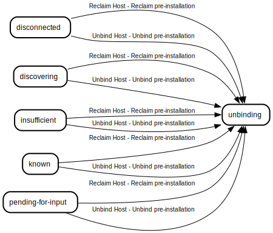

* [Reclaim pre-installation](#reclaim-pre-installation)
* [Unbind pre-installation](#unbind-pre-installation)

### Unbinding, Pending User Action
TODO: Describe this state

#### Transition types where this is the source state

#### Transition types where this is the destination state
* [Reclaim Host](#reclaim-host)
* [Reclaim Failed](#reclaim-failed)
* [Refresh](#refresh)
* [Unbind Host](#unbind-host)

#### Transition rules where this is the source state
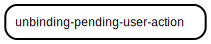

#### Transition rules where this is the destination state

* [Reclaim failed host](#reclaim-failed-host)
* [Reclaim failure for reclaiming host](#reclaim-failure-for-reclaiming-host)
* [Refresh reclaiming host](#refresh-reclaiming-host)
* [Unbind during or after installation](#unbind-during-or-after-installation)

## Transition Types
Transition types are the events that can cause a state transition

### Bind Host
Triggered when a previously unbound host is bound to a cluster

#### Source states where this transition type applies

#### Destination states where this transition type applies
#### Transition rules using this transition type

### Cancel Installation
Triggered on each host when the user cancels the cluster installation

#### Source states where this transition type applies
* [Error](#error)
* [Installed](#installed)
* [Installing](#installing)
* [Installing in Progress](#installing-in-progress)
* [Installing, Pending User Action](#installing-pending-user-action)
* [Known](#known)
* [Preparing for Installation](#preparing-for-installation)
* [Preparing Successful](#preparing-successful)

#### Destination states where this transition type applies
* [Cancelled](#cancelled)
* [Known](#known)
#### Transition rules using this transition type

* [Cancel while known](#cancel-while-known)
* [Cancel while preparing](#cancel-while-preparing)
* [Installation canceled while host is installing](#installation-canceled-while-host-is-installing)
### Installation Failed
TODO: Document this transition type

#### Source states where this transition type applies
* [Installing](#installing)
* [Installing in Progress](#installing-in-progress)

#### Destination states where this transition type applies
* [Error](#error)
#### Transition rules using this transition type
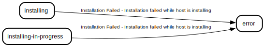

* [Installation failed while host is installing](#installation-failed-while-host-is-installing)
### Install Host
Triggered on each host when the user or Assisted kube-API controllers trigger cluster installation

#### Source states where this transition type applies
* [Known](#known)

#### Destination states where this transition type applies
* [Installing](#installing)
#### Transition rules using this transition type

* [Install known host](#install-known-host)
### Media Disconnect
Triggered when the a step response returned by the agent indicates that a virtual media disconnection has occurred

#### Source states where this transition type applies
* [Binding](#binding)
* [Disconnected](#disconnected)
* [Discovering](#discovering)
* [Error](#error)
* [Installing](#installing)
* [Installing in Progress](#installing-in-progress)
* [Insufficient](#insufficient)
* [Known](#known)
* [Pending for Input](#pending-for-input)
* [Preparing Failed](#preparing-failed)
* [Preparing for Installation](#preparing-for-installation)
* [Preparing Successful](#preparing-successful)

#### Destination states where this transition type applies
* [Disconnected](#disconnected)
* [Error](#error)
#### Transition rules using this transition type

* [Move to disconnected when virtual media disconnects pre-installation](#move-to-disconnected-when-virtual-media-disconnects-pre-installation)
* [Move to error when virtual media disconnects post-installation](#move-to-error-when-virtual-media-disconnects-post-installation)
### Rebooting for Reclaim
TODO: Document this transition type

#### Source states where this transition type applies
* [Reclaiming](#reclaiming)

#### Destination states where this transition type applies
* [Reclaiming, Rebooting](#reclaiming-rebooting)
#### Transition rules using this transition type

* [Rebooting for reclaim reclaiming host](#rebooting-for-reclaim-reclaiming-host)
### Reclaim Host
TODO: Document this transition

#### Source states where this transition type applies
* [Added to Existing Cluster](#added-to-existing-cluster)
* [Cancelled](#cancelled)
* [Disconnected](#disconnected)
* [Discovering](#discovering)
* [Error](#error)
* [Installed](#installed)
* [Insufficient](#insufficient)
* [Known](#known)
* [Pending for Input](#pending-for-input)

#### Destination states where this transition type applies
* [Reclaiming](#reclaiming)
* [Unbinding](#unbinding)
* [Unbinding, Pending User Action](#unbinding-pending-user-action)
#### Transition rules using this transition type

* [Reclaim failed host](#reclaim-failed-host)
* [Reclaim pre-installation](#reclaim-pre-installation)
* [Reclaim successful host](#reclaim-successful-host)
### Reclaim Failed
TODO: Document this transition type

#### Source states where this transition type applies
* [Reclaiming](#reclaiming)
* [Reclaiming, Rebooting](#reclaiming-rebooting)

#### Destination states where this transition type applies
* [Unbinding, Pending User Action](#unbinding-pending-user-action)
#### Transition rules using this transition type

* [Reclaim failure for reclaiming host](#reclaim-failure-for-reclaiming-host)
### Refresh
Triggered on some hosts periodically by the background host monitor goroutine that runs on the leader instance of the Assisted Service. Responsible for driving transitions between states that require re-evaluation of all the validation results and potential timeout conditions

#### Source states where this transition type applies
* [Added to Existing Cluster](#added-to-existing-cluster)
* [Cancelled](#cancelled)
* [Disconnected](#disconnected)
* [Discovering](#discovering)
* [Error](#error)
* [Installed](#installed)
* [Installing](#installing)
* [Installing in Progress](#installing-in-progress)
* [Installing, Pending User Action](#installing-pending-user-action)
* [Insufficient](#insufficient)
* [Known](#known)
* [Pending for Input](#pending-for-input)
* [Preparing Failed](#preparing-failed)
* [Preparing for Installation](#preparing-for-installation)
* [Preparing Successful](#preparing-successful)
* [Reclaiming](#reclaiming)
* [Reclaiming, Rebooting](#reclaiming-rebooting)
* [Resetting](#resetting)
* [Resetting, Pending User Action](#resetting-pending-user-action)

#### Destination states where this transition type applies
* [Added to Existing Cluster](#added-to-existing-cluster)
* [Cancelled](#cancelled)
* [Disconnected](#disconnected)
* [Discovering](#discovering)
* [Error](#error)
* [Installed](#installed)
* [Installing](#installing)
* [Installing in Progress](#installing-in-progress)
* [Installing, Pending User Action](#installing-pending-user-action)
* [Insufficient](#insufficient)
* [Known](#known)
* [Pending for Input](#pending-for-input)
* [Preparing Failed](#preparing-failed)
* [Preparing for Installation](#preparing-for-installation)
* [Preparing Successful](#preparing-successful)
* [Reclaiming](#reclaiming)
* [Reclaiming, Rebooting](#reclaiming-rebooting)
* [Resetting](#resetting)
* [Resetting, Pending User Action](#resetting-pending-user-action)
* [Unbinding, Pending User Action](#unbinding-pending-user-action)
#### Transition rules using this transition type

* [Day 2 hosts should stay in added state](#day-2-hosts-should-stay-in-added-state)
* [Failed preparing to known when cluster is no longer preparing](#failed-preparing-to-known-when-cluster-is-no-longer-preparing)
* [Host has insufficient hardware](#host-has-insufficient-hardware)
* [Host not ready](#host-not-ready)
* [Host pending input](#host-pending-input)
* [Host ready](#host-ready)
* [Host reconnected without inventory](#host-reconnected-without-inventory)
* [Host stay ready](#host-stay-ready)
* [Ignore timeout if host is in particular installation in progress stages](#ignore-timeout-if-host-is-in-particular-installation-in-progress-stages)
* [Log collection timed out during cancelled should stay in cancelled](#log-collection-timed-out-during-cancelled-should-stay-in-cancelled)
* [Log collection timed out during error should stay in error](#log-collection-timed-out-during-error-should-stay-in-error)
* [Move host to disconnected when connected times out](#move-host-to-disconnected-when-connected-times-out)
* [Move host to error when cluster is in error](#move-host-to-error-when-cluster-is-in-error)
* [Move host to error when installation times out](#move-host-to-error-when-installation-times-out)
* [Move installing host to error when connection times out](#move-installing-host-to-error-when-connection-times-out)
* [Move preparing host to disconnected when connection times out](#move-preparing-host-to-disconnected-when-connection-times-out)
* [Move preparing host to known when cluster stops preparing](#move-preparing-host-to-known-when-cluster-stops-preparing)
* [Move successfully prepared host to installing](#move-successfully-prepared-host-to-installing)
* [Move to error on timeout if host is in particular installation in progress stages](#move-to-error-on-timeout-if-host-is-in-particular-installation-in-progress-stages)
* [Preparing failed disk speed host move to insufficient](#preparing-failed-disk-speed-host-move-to-insufficient)
* [Preparing failed image pull host move to preparing failed](#preparing-failed-image-pull-host-move-to-preparing-failed)
* [Refresh during cancelled should stay in cancelled](#refresh-during-cancelled-should-stay-in-cancelled)
* [Refresh during error should stay in error](#refresh-during-error-should-stay-in-error)
* [Refresh during installed state without cluster error should stay in installed state](#refresh-during-installed-state-without-cluster-error-should-stay-in-installed-state)
* [Refresh during installing state without cluster error should stay in installing state](#refresh-during-installing-state-without-cluster-error-should-stay-in-installing-state)
* [Refresh during installing-in-progress state without cluster error should stay in installing-in-progress state](#refresh-during-installing-in-progress-state-without-cluster-error-should-stay-in-installing-in-progress-state)
* [Refresh during installing-pending-user-action state without cluster error should stay in installing-pending-user-action state](#refresh-during-installing-pending-user-action-state-without-cluster-error-should-stay-in-installing-pending-user-action-state)
* [Refresh during resetting should stay in resetting](#refresh-during-resetting-should-stay-in-resetting)
* [Refresh during resetting-pending-user-action state without cluster error should stay in resetting-pending-user-action state](#refresh-during-resetting-pending-user-action-state-without-cluster-error-should-stay-in-resetting-pending-user-action-state)
* [Refresh known host in preparing cluster](#refresh-known-host-in-preparing-cluster)
* [Refresh reclaiming host](#refresh-reclaiming-host)
* [Refresh successfully preparing host](#refresh-successfully-preparing-host)
* [Refresh without timeout during reclaiming should stay in reclaiming](#refresh-without-timeout-during-reclaiming-should-stay-in-reclaiming)
* [Refresh without timeout during reclaiming-rebooting should stay in reclaiming-rebooting](#refresh-without-timeout-during-reclaiming-rebooting-should-stay-in-reclaiming-rebooting)
* [Stay in preparing for installation](#stay-in-preparing-for-installation)
* [Stay in preparing successful](#stay-in-preparing-successful)
* [Successful preparing to known when cluster is no longer preparing](#successful-preparing-to-known-when-cluster-is-no-longer-preparing)
* [Tell user about boot order wen reboot takes too long](#tell-user-about-boot-order-wen-reboot-takes-too-long)
### Register Host
Triggered when a host boots the discovery ISO and calls the Register API

#### Source states where this transition type applies
* [Added to Existing Cluster](#added-to-existing-cluster)
* [Binding](#binding)
* [Disconnected](#disconnected)
* [Discovering](#discovering)
* [Error](#error)
* [Initial](#initial)
* [Installing](#installing)
* [Installing in Progress](#installing-in-progress)
* [Installing, Pending User Action](#installing-pending-user-action)
* [Insufficient](#insufficient)
* [Known](#known)
* [Preparing for Installation](#preparing-for-installation)
* [Preparing Successful](#preparing-successful)
* [Resetting](#resetting)
* [Resetting, Pending User Action](#resetting-pending-user-action)

#### Destination states where this transition type applies
* [Discovering](#discovering)
* [Error](#error)
* [Installing, Pending User Action](#installing-pending-user-action)
* [Resetting](#resetting)
#### Transition rules using this transition type
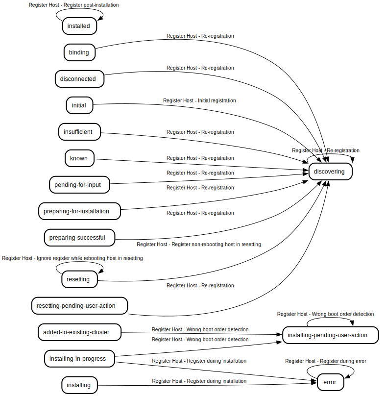

* [Ignore register while rebooting host in resetting](#ignore-register-while-rebooting-host-in-resetting)
* [Initial registration](#initial-registration)
* [Re-registration](#re-registration)
* [Register during error](#register-during-error)
* [Register during installation](#register-during-installation)
* [Register non-rebooting host in resetting](#register-non-rebooting-host-in-resetting)
* [Wrong boot order detection](#wrong-boot-order-detection)
### Resetting, Pending User Action
TODO: Document this transition type

#### Source states where this transition type applies
* [Added to Existing Cluster](#added-to-existing-cluster)
* [Cancelled](#cancelled)
* [Discovering](#discovering)
* [Error](#error)
* [Installed](#installed)
* [Installing](#installing)
* [Installing in Progress](#installing-in-progress)
* [Installing, Pending User Action](#installing-pending-user-action)
* [Known](#known)
* [Pending for Input](#pending-for-input)
* [Preparing Failed](#preparing-failed)
* [Preparing for Installation](#preparing-for-installation)
* [Preparing Successful](#preparing-successful)
* [Resetting](#resetting)
* [Resetting, Pending User Action](#resetting-pending-user-action)

#### Destination states where this transition type applies
* [Resetting, Pending User Action](#resetting-pending-user-action)
#### Transition rules using this transition type

* [Reset pending user action all states](#reset-pending-user-action-all-states)
### Unbind Host
TODO: Document this transition

#### Source states where this transition type applies
* [Added to Existing Cluster](#added-to-existing-cluster)
* [Cancelled](#cancelled)
* [Disconnected](#disconnected)
* [Discovering](#discovering)
* [Error](#error)
* [Installed](#installed)
* [Insufficient](#insufficient)
* [Known](#known)
* [Pending for Input](#pending-for-input)

#### Destination states where this transition type applies
* [Unbinding](#unbinding)
* [Unbinding, Pending User Action](#unbinding-pending-user-action)
#### Transition rules using this transition type
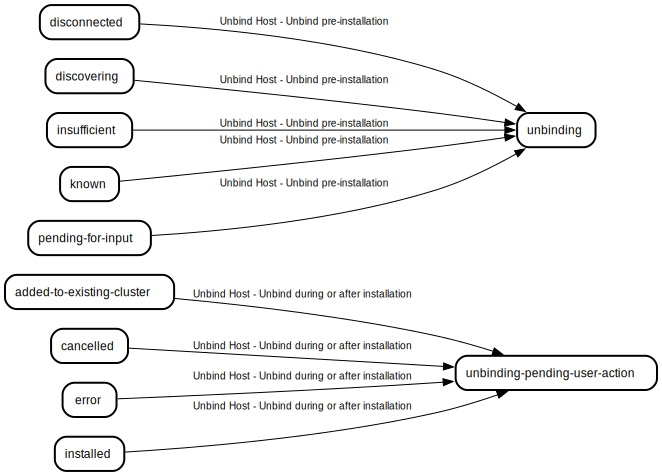

* [Unbind during or after installation](#unbind-during-or-after-installation)
* [Unbind pre-installation](#unbind-pre-installation)

## Transition Rules
Transition rules are the rules that define the required source states and conditions needed to move to a particular destination state when a particular transition type happens

### Installation canceled while host is installing
When the installation is canceled while the host is installing or finished installing, the host needs to move to the cancelled state

#### Source states
* [Installing, Pending User Action](#installing-pending-user-action)
* [Installing](#installing)
* [Installing in Progress](#installing-in-progress)
* [Installed](#installed)
* [Error](#error)

#### Destination state
[Cancelled](#cancelled)

### Cancel while preparing
TODO: Document this transition rule

#### Source states
* [Preparing for Installation](#preparing-for-installation)
* [Preparing Successful](#preparing-successful)

#### Destination state
[Known](#known)

### Cancel while known
TODO: Document this transition rule

#### Source states
* [Known](#known)

#### Destination state
[Known](#known)

### Installation failed while host is installing
When the installation fails while a host is installing, the host should be moved to the error state because it is no longer actually installing

#### Source states
* [Installing](#installing)
* [Installing in Progress](#installing-in-progress)

#### Destination state
[Error](#error)

### Install known host
TODO: Document this transition rule

#### Source states
* [Known](#known)

#### Destination state
[Installing](#installing)

### Move to disconnected when virtual media disconnects pre-installation
TODO: Document this transition rule.

#### Source states
* [Discovering](#discovering)
* [Insufficient](#insufficient)
* [Known](#known)
* [Pending for Input](#pending-for-input)
* [Disconnected](#disconnected)
* [Binding](#binding)

#### Destination state
[Disconnected](#disconnected)

### Move to error when virtual media disconnects post-installation
TODO: Document this transition rule.

#### Source states
* [Preparing for Installation](#preparing-for-installation)
* [Preparing Failed](#preparing-failed)
* [Preparing Successful](#preparing-successful)
* [Installing](#installing)
* [Installing in Progress](#installing-in-progress)
* [Error](#error)

#### Destination state
[Error](#error)

### Rebooting for reclaim reclaiming host
TODO: Document this transition rule

#### Source states
* [Reclaiming](#reclaiming)

#### Destination state
[Reclaiming, Rebooting](#reclaiming-rebooting)

### Reclaim successful host
TODO: Document this transition rule

#### Source states
* [Installed](#installed)
* [Added to Existing Cluster](#added-to-existing-cluster)

#### Destination state
[Reclaiming](#reclaiming)

### Reclaim pre-installation
TODO: Document this transition rule

#### Source states
* [Known](#known)
* [Discovering](#discovering)
* [Disconnected](#disconnected)
* [Insufficient](#insufficient)
* [Pending for Input](#pending-for-input)

#### Destination state
[Unbinding](#unbinding)

### Reclaim failed host
TODO: Document this transition rule

#### Source states
* [Error](#error)
* [Cancelled](#cancelled)

#### Destination state
[Unbinding, Pending User Action](#unbinding-pending-user-action)

### Reclaim failure for reclaiming host
TODO: Document this transition rule

#### Source states
* [Reclaiming](#reclaiming)
* [Reclaiming, Rebooting](#reclaiming-rebooting)

#### Destination state
[Unbinding, Pending User Action](#unbinding-pending-user-action)

### Refresh reclaiming host
TODO: Document this transition rule

#### Source states
* [Reclaiming](#reclaiming)
* [Reclaiming, Rebooting](#reclaiming-rebooting)

#### Destination state
[Unbinding, Pending User Action](#unbinding-pending-user-action)

### Refresh known host in preparing cluster
TODO: Document this transition rule

#### Source states
* [Known](#known)

#### Destination state
[Preparing for Installation](#preparing-for-installation)

### Refresh successfully preparing host
TODO: Document this transition rule

#### Source states
* [Preparing for Installation](#preparing-for-installation)

#### Destination state
[Preparing Successful](#preparing-successful)

### Stay in preparing successful
TODO: Document this transition rule

#### Source states
* [Preparing Successful](#preparing-successful)

#### Destination state
[Preparing Successful](#preparing-successful)

### Move successfully prepared host to installing
TODO: Document this transition rule

#### Source states
* [Preparing Successful](#preparing-successful)

#### Destination state
[Installing](#installing)

### Move preparing host to known when cluster stops preparing
TODO: Document this transition rule

#### Source states
* [Preparing for Installation](#preparing-for-installation)

#### Destination state
[Known](#known)

### Preparing failed disk speed host move to insufficient
TODO: Document this transition rule

#### Source states
* [Preparing for Installation](#preparing-for-installation)
* [Preparing Failed](#preparing-failed)
* [Known](#known)

#### Destination state
[Insufficient](#insufficient)

### Preparing failed image pull host move to preparing failed
TODO: Document this transition rule

#### Source states
* [Preparing for Installation](#preparing-for-installation)

#### Destination state
[Preparing Failed](#preparing-failed)

### Stay in preparing for installation
TODO: Document this transition rule

#### Source states
* [Preparing for Installation](#preparing-for-installation)

#### Destination state
[Preparing for Installation](#preparing-for-installation)

### Failed preparing to known when cluster is no longer preparing
TODO: Document this transition rule

#### Source states
* [Preparing Failed](#preparing-failed)

#### Destination state
[Known](#known)

### Successful preparing to known when cluster is no longer preparing
TODO: Document this transition rule. Why is ClusterInstalling relevant here?

#### Source states
* [Preparing Successful](#preparing-successful)

#### Destination state
[Known](#known)

### Move host to disconnected when connected times out
TODO: Document this transition rule.

#### Source states
* [Discovering](#discovering)
* [Insufficient](#insufficient)
* [Known](#known)
* [Pending for Input](#pending-for-input)
* [Disconnected](#disconnected)
* [Preparing Failed](#preparing-failed)

#### Destination state
[Disconnected](#disconnected)

### Move host to error when cluster is in error
TODO: Document this transition rule. Why not day 2?

#### Source states
* [Installing](#installing)
* [Installing in Progress](#installing-in-progress)
* [Installed](#installed)
* [Resetting, Pending User Action](#resetting-pending-user-action)
* [Installing, Pending User Action](#installing-pending-user-action)

#### Destination state
[Error](#error)

### Move host to error when installation times out
TODO: Document this transition rule.

#### Source states
* [Installing](#installing)

#### Destination state
[Error](#error)

### Move installing host to error when connection times out
TODO: Document this transition rule.

#### Source states
* [Installing](#installing)

#### Destination state
[Error](#error)

### Move preparing host to disconnected when connection times out
TODO: Document this transition rule.

#### Source states
* [Preparing for Installation](#preparing-for-installation)
* [Preparing Successful](#preparing-successful)

#### Destination state
[Disconnected](#disconnected)

### Move installing host to error when connection times out
TODO: Document this transition rule.

#### Source states
* [Installing](#installing)
* [Installing in Progress](#installing-in-progress)

#### Destination state
[Error](#error)

### Ignore timeout if host is in particular installation in progress stages
TODO: Document this transition rule.

#### Source states
* [Installing in Progress](#installing-in-progress)

#### Destination state
[Installing in Progress](#installing-in-progress)

### Move to error on timeout if host is in particular installation in progress stages
TODO: Document this transition rule.

#### Source states
* [Installing in Progress](#installing-in-progress)

#### Destination state
[Error](#error)

### Tell user about boot order wen reboot takes too long
TODO: Document this transition rule.

#### Source states
* [Installing in Progress](#installing-in-progress)

#### Destination state
[Installing, Pending User Action](#installing-pending-user-action)

### Refresh during installing state without cluster error should stay in installing state
TODO: Document this transition rule. Is this necessary?

#### Source states
* [Installing](#installing)

#### Destination state
[Installing](#installing)

### Refresh during installing-in-progress state without cluster error should stay in installing-in-progress state
TODO: Document this transition rule. Is this necessary?

#### Source states
* [Installing in Progress](#installing-in-progress)

#### Destination state
[Installing in Progress](#installing-in-progress)

### Refresh during installed state without cluster error should stay in installed state
TODO: Document this transition rule. Is this necessary?

#### Source states
* [Installed](#installed)

#### Destination state
[Installed](#installed)

### Refresh during installing-pending-user-action state without cluster error should stay in installing-pending-user-action state
TODO: Document this transition rule. Is this necessary?

#### Source states
* [Installing, Pending User Action](#installing-pending-user-action)

#### Destination state
[Installing, Pending User Action](#installing-pending-user-action)

### Refresh during resetting-pending-user-action state without cluster error should stay in resetting-pending-user-action state
TODO: Document this transition rule. Is this necessary?

#### Source states
* [Resetting, Pending User Action](#resetting-pending-user-action)

#### Destination state
[Resetting, Pending User Action](#resetting-pending-user-action)

### Host reconnected without inventory
TODO: Document this transition rule. Why is Discovering in the source states?

#### Source states
* [Disconnected](#disconnected)
* [Discovering](#discovering)

#### Destination state
[Discovering](#discovering)

### Host has insufficient hardware
In order for this transition to be fired at least one of the validations in minRequiredHardwareValidations must fail. This transition handles the case that a host does not pass minimum hardware requirements for any of the roles

#### Source states
* [Disconnected](#disconnected)
* [Discovering](#discovering)
* [Insufficient](#insufficient)
* [Known](#known)

#### Destination state
[Insufficient](#insufficient)

### Host pending input
In order for this transition to be fired at least one of the validations in sufficientInputValidations must fail. This transition handles the case that there is missing input that has to be provided from a user or other external means

#### Source states
* [Disconnected](#disconnected)
* [Discovering](#discovering)
* [Insufficient](#insufficient)
* [Known](#known)
* [Pending for Input](#pending-for-input)

#### Destination state
[Pending for Input](#pending-for-input)

### Host not ready
In order for this transition to be fired at least one of the validations in sufficientForInstallValidations must fail. This transition handles the case that one of the required validations that are required in order for the host to be in known state (ready for installation) has failed

#### Source states
* [Disconnected](#disconnected)
* [Insufficient](#insufficient)
* [Pending for Input](#pending-for-input)
* [Discovering](#discovering)
* [Known](#known)

#### Destination state
[Insufficient](#insufficient)

### Host ready
This transition is fired when all validations pass. TODO: Why is the vSphere validation given special treatment here?

#### Source states
* [Disconnected](#disconnected)
* [Insufficient](#insufficient)
* [Pending for Input](#pending-for-input)
* [Discovering](#discovering)

#### Destination state
[Known](#known)

### Host stay ready
TODO: Document this transition rule.

#### Source states
* [Known](#known)

#### Destination state
[Known](#known)

### Log collection timed out during error should stay in error
TODO: Document this transition rule.

#### Source states
* [Error](#error)

#### Destination state
[Error](#error)

### Log collection timed out during cancelled should stay in cancelled
TODO: Document this transition rule.

#### Source states
* [Cancelled](#cancelled)

#### Destination state
[Cancelled](#cancelled)

### Refresh during error should stay in error
TODO: Document this transition rule.

#### Source states
* [Error](#error)

#### Destination state
[Error](#error)

### Refresh during cancelled should stay in cancelled
TODO: Document this transition rule.

#### Source states
* [Cancelled](#cancelled)

#### Destination state
[Cancelled](#cancelled)

### Refresh during resetting should stay in resetting
TODO: Document this transition rule.

#### Source states
* [Resetting](#resetting)

#### Destination state
[Resetting](#resetting)

### Day 2 hosts should stay in added state
TODO: Document this transition rule.

#### Source states
* [Added to Existing Cluster](#added-to-existing-cluster)

#### Destination state
[Added to Existing Cluster](#added-to-existing-cluster)

### Refresh without timeout during reclaiming should stay in reclaiming
TODO: Document this transition rule.

#### Source states
* [Reclaiming](#reclaiming)

#### Destination state
[Reclaiming](#reclaiming)

### Refresh without timeout during reclaiming-rebooting should stay in reclaiming-rebooting
TODO: Document this transition rule.

#### Source states
* [Reclaiming, Rebooting](#reclaiming-rebooting)

#### Destination state
[Reclaiming, Rebooting](#reclaiming-rebooting)

### Initial registration
When new host is first registered. This transition is not executed on unbound hosts because <unknown, TODO>

#### Source states
* [Initial](#initial)

#### Destination state
[Discovering](#discovering)

### Re-registration
When the host attempts to register while it's in one of the non-installation states. We move the host back to the discovering state instead of keeping it in its current state because we consider it a new host with potentially different hardware. See PostRegisterHost function

#### Source states
* [Discovering](#discovering)
* [Known](#known)
* [Disconnected](#disconnected)
* [Insufficient](#insufficient)
* [Resetting, Pending User Action](#resetting-pending-user-action)
* [Preparing for Installation](#preparing-for-installation)
* [Preparing Successful](#preparing-successful)
* [Binding](#binding)

#### Destination state
[Discovering](#discovering)

### Ignore register while rebooting host in resetting
On such cases cluster monitor is responsible to set the host state to resetting-pending-user-action. There are some edge cases on installation where user tries to reset installation on the same time reboot is called. On some cases the agent will get to reset itself and register again just before the reboot and the cluster monitor will not get to set the status in resetting-pending-user-action on time. Created to prevent OCPBUGSM-13597

#### Source states
* [Resetting](#resetting)

#### Destination state
[Resetting](#resetting)

### Register non-rebooting host in resetting
The opposite of the 'Ignore register while rebooting host in resetting' transition rule, move host to discovering

#### Source states
* [Resetting](#resetting)

#### Destination state
[Discovering](#discovering)

### Wrong boot order detection
A day-1 host trying to register while it's in the rebooting stage or a day-2 host trying to register while it's in the done stage indicate that the host, after installing the operating system to disk and then rebooting, booted from the discovery ISO again instead of booting the installed operating system as it should've done (the first thing the discovery ISO live OS tries to do is register). This indicates that the user has a wrong boot order that they should fix. This transition makes sure to let the user know about what happened and what they should do to fix that

#### Source states
* [Installing in Progress](#installing-in-progress)
* [Installing, Pending User Action](#installing-pending-user-action)
* [Added to Existing Cluster](#added-to-existing-cluster)

#### Destination state
[Installing, Pending User Action](#installing-pending-user-action)

### Register during installation
Any host registering during installation but doesn't match the 'Wrong boot order detection' transition is performing an invalid operation and thus should move to the error state

#### Source states
* [Installing](#installing)
* [Installing in Progress](#installing-in-progress)

#### Destination state
[Error](#error)

### Register during error
Host in error should be able to register without changes. If the registration return conflict or error then we have infinite number of events. If the registration is blocked (403) it will break auto-reset feature. It can happen that user rebooted the host manually after installation failure without changes in the cluster. So the best option is just accept the registration without changes in the DB

#### Source states
* [Error](#error)

#### Destination state
[Error](#error)

### Reset pending user action all states
TODO: Document this transition rule

#### Source states
* [Resetting](#resetting)
* [Discovering](#discovering)
* [Known](#known)
* [Installing, Pending User Action](#installing-pending-user-action)
* [Installing](#installing)
* [Preparing for Installation](#preparing-for-installation)
* [Preparing Successful](#preparing-successful)
* [Preparing Failed](#preparing-failed)
* [Pending for Input](#pending-for-input)
* [Resetting, Pending User Action](#resetting-pending-user-action)
* [Installing in Progress](#installing-in-progress)
* [Installed](#installed)
* [Error](#error)
* [Cancelled](#cancelled)
* [Added to Existing Cluster](#added-to-existing-cluster)

#### Destination state
[Resetting, Pending User Action](#resetting-pending-user-action)

### Unbind pre-installation
TODO: Document this transition rule

#### Source states
* [Known](#known)
* [Discovering](#discovering)
* [Disconnected](#disconnected)
* [Insufficient](#insufficient)
* [Pending for Input](#pending-for-input)

#### Destination state
[Unbinding](#unbinding)

### Unbind during or after installation
TODO: Document this transition rule

#### Source states
* [Installed](#installed)
* [Added to Existing Cluster](#added-to-existing-cluster)
* [Error](#error)
* [Cancelled](#cancelled)

#### Destination state
[Unbinding, Pending User Action](#unbinding-pending-user-action)

