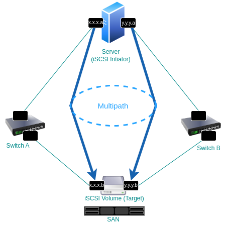

# Multipath + iSCSI
In this document, you will learn how to set up your environment with multipath and iSCSI as the installation disk, both for SNO and multi-node.

Before starting, here's a brief overview for those unfamiliar with multipath:

Multipath refers to a technique or technology that allows for redundant physical connections between a server (initiator) and its storage devices (targets). This redundancy helps enhance reliability and availability by providing multiple paths (connections) between the server and storage. If one path fails or becomes unreliable, data can still be accessed through an alternative path.

iSCSI is a protocol that allows for the transport of data over IP networks. It enables the creation of a storage area network (SAN) by linking data storage facilities via high-speed IP networks, making remote storage appear as if it were locally attached.

To achieve multipath, you will:

1. Set up an iSCSI target, which involves configuring a storage device that can be accessed over the network.
2. Set up a server (initiator) to connect to this target.
3. Ensure there are more than one network paths between the initiator and the target.



## SNO

### STEP-1 - Create iSCSI-VM
Create two routed networks, naming them `iscsi-net-1` and `iscsi-net-2`:
   ```
<network connections="1">
  <name>iscsi-net-1</name>
  <uuid>30c34b53-bf63-4dc9-a3b2-39d0d9d84053</uuid>
  <forward mode="route"/>
  <bridge name="virbr1" stp="on" delay="0"/>
  <mac address="52:54:00:93:ba:61"/>
  <domain name="iscsi-net-1"/>
  <ip address="192.168.101.1" netmask="255.255.255.0">
    <dhcp>
      <range start="192.168.101.128" end="192.168.101.254"/>
    </dhcp>
  </ip>
</network>
   ```

   ```
<network connections="1">
  <name>iscsi-net-2</name>
  <uuid>749cca16-57c5-4448-98b7-1391109cf719</uuid>
  <forward mode="route"/>
  <bridge name="virbr2" stp="on" delay="0"/>
  <mac address="52:54:00:2c:e7:ad"/>
  <domain name="iscsi-net-2"/>
  <ip address="192.168.102.1" netmask="255.255.255.0">
    <dhcp>
      <range start="192.168.102.128" end="192.168.102.254"/>
    </dhcp>
  </ip>
</network>
   ```

- Note: To enable internet access for the VM, configure NAT on the host. Identify the zone for your internet-facing interface and enable masquerading for it: `firewall-cmd --add-masquerade --zone=public` 
- Download an OS ISO in advance, such as Rocky Linux (which I personally used here). 
- Create an iSCSI VM. I used for my setup: 22,000 MB of memory, 120 GB of storage 
- Boot the VM using the previously downloaded ISO. 
- Create 2 interfaces using the networks created in point 1 and attach them to the iSCSI VM. 
- Run the following commands:
  - Install targetcli package:
    ```bash
    dnf install targetcli -y
    ```

  - Create a backstore using the previously created image. Sets up a backstore referencing the 30GB image created earlier. This makes a virtual disk available for use as an iSCSI LUN:
    ```bash
    targetcli backstores/fileio create name=disk0 size=30G file_or_dev=/home/disk0
    ```

  - Create an iSCSI target:
    ```bash
    targetcli /iscsi create iqn.2023-01.com.example:target01
    ```

  - Create a LUN. Attaches the backstore (disk0) to the target as a LUN, allowing initiators to access it:
    ```bash
    targetcli /iscsi/iqn.2023-01.com.example:target01/tpg1/luns create /backstores/fileio/disk0
    ```

  - Allow access to an iSCSI initiator:
    ```bash
    targetcli /iscsi/iqn.2023-01.com.example:target01/tpg1/acls create iqn.1994-05.com.redhat:e1c30923a3a
    ```

  - Save the targetcli configuration:
    ```bash
    targetcli / saveconfig
    ```

  - Disable the firewalld service to allow iSCSI traffic:
    ```bash
    systemctl stop firewalld
    ```

    
Later, we will download the ISO from Assisted and place it onto our virtual disk.

### STEP-2 - Create iPXE server

- Create a file with any name you prefer. I named it `ipxe_script.ipxe`, and add the following content:
  ```
  #!ipxe                                                                                                               
  set initiator-iqn iqn.1994-05.com.redhat:e1c30923a3a
  sanboot iscsi:192.168.101.164::::iqn.2023-01.com.example:target01 \                                                    
          iscsi:192.168.102.235::::iqn.2023-01.com.example:target01
  ```
- Run  the following command in the same directory where your PXE script is located:
  ```bash
  python -m http.server 8503
  ```
  You can select any port you prefer, but make sure to add the corresponding firewall rule:
  ```bash
  firewall-cmd --add-port=8503/tcp --zone=libvirt
  ```

### STEP-3 - Create SNO
I personally use [test-infra](https://github.com/openshift/assisted-test-infra) to deploy the VM, and then make some modifications afterward.
To deploy SNO, run:
```bash
make deploy_nodes MASTERS_COUNT=1
```
Shut down the VM.

Test-infra has already created two networks for you. The first one is for OCP, so you should use the second one as the data network.
On the secondary network (in my case, 192.168.145.0/24), remove the DHCP section so that we can configure it using `dhcpd`.

Edit the network and remove the DHCP section:
```bash
virsh net-edit <network-name>
```
After removing it, it should look something like this:
```
<network connections="1">
  <name>test-infra-secondary-network-cdf1a7d1</name>
  <uuid>c037968c-1b89-4a05-99c6-492d7de8cf67</uuid>
  <forward mode="nat">
    <nat>
      <port start="1024" end="65535"/>
    </nat>
  </forward>
  <bridge name="stt1" stp="on" delay="0"/>
  <mac address="52:54:00:c0:c5:e6"/>
  <dns enable="no"/>
  <ip family="ipv4" address="192.168.145.1" prefix="24">
  </ip>
</network>
```

Edit or create the `/etc/dhcp/dhcpd.conf` file:

```
# DHCP Server Configuration file.
# Refer to the example configuration at /usr/share/doc/dhcp-server/dhcpd.conf.example
# For detailed options, consult the dhcpd.conf(5) man page.

option rfc3442-classless-static-routes code 121 = array of integer 8;
allow bootp;

# To enable PXE booting from the 192.168.145.0/24 network, add the following:
if exists user-class and option user-class = "iPXE" {
    option routers 192.168.145.1;
}

# Configuration for the secondary network
subnet 192.168.145.0 netmask 255.255.255.0 {
    range 192.168.145.2 192.168.145.254;

    # Define static routes from the 192.168.145.0/24 network to the iscsi-net-1 and iscsi-net-2 networks
    option rfc3442-classless-static-routes 24, 192, 168, 101, 192, 168, 145, 1, 24, 192, 168, 102, 192, 168, 145, 1;

    # Provide the URL for the PXE server where the iPXE script and iSCSI configurations are hosted.
    # Replace 10.1.155.14 with your own PXE server IP address.
    filename "http://10.1.155.14:8503/ipxe_script.ipxe";
}
```

Run the following commands:
- Start the `DHCPD` service:
  ```bash
  systemctl enable --now dhcpd
  ```
- Restart to apply the changes:
  ```bash
  sudo systemctl restart dhcpd
  ```

Modify the boot order of your SNO VM to prioritize the interface of the secondary network (192.168.145.0/24).

### STEP-4 - Copy the ISO to the iSCSI-vm

Download the ISO by using the command:
```bash
curl -LO <ISO URL>.
```

Copy the contents of the ISO and write it to the disk image located at `/home/disk0`:
```bash
dd conv=notrunc if=minimal.iso of=/home/disk0 status=progress
```

### STEP-5 - Final step
Reboot your SNO. If everything is configured correctly and the SNO is up and running, you should see a multipath disk with two iSCSI paths in the SNO inventory. Select the multipath disk as your installation disk and begin the installation.

You can also, Run `multipath -ll` on your SNO to confirm that multipathing is active.
example output:
```
[root@sno ~]# multipath -ll
    mpatha (360000000000000000e00000000010001) dm-0 IET,VIRTUAL-DISK
    size=120G features='0' hwhandler='0' wp=rw
    |-+- policy='service-time 0' prio=1 status=active
    | `- 6:0:0:1 sda 8:0  active ready running
    `-+- policy='service-time 0' prio=1 status=enabled
    `- 7:0:0:1 sdb 8:16 active ready running
```

## Multiple Nodes

### STEP-1 - Create iSCSI-VM

Similar to SNO, but the commands should be as follows:
```bash
targetcli backstores/fileio create name=dm1 size=30G file_or_dev=/var/lib/iscsi_disks/dm1.img
```
```bash
targetcli backstores/fileio create name=dm2 size=30G file_or_dev=/var/lib/iscsi_disks/dm2.img
```
```bash
targetcli backstores/fileio create name=dm3 size=30G file_or_dev=/var/lib/iscsi_disks/dm3.img
```
```bash
targetcli /iscsi create iqn.2023-01.com.example:host1
```
```bash
targetcli /iscsi create iqn.2023-01.com.example:host2
```
```bash
targetcli /iscsi create iqn.2023-01.com.example:host3
```
```bash
targetcli /iscsi/iqn.2023-01.com.example:host1/tpg1/luns create /backstores/fileio/dm1
```
```bash
targetcli /iscsi/iqn.2023-01.com.example:host2/tpg1/luns create /backstores/fileio/dm2
```
```bash
targetcli /iscsi/iqn.2023-01.com.example:host3/tpg1/luns create /backstores/fileio/dm3
```
```bash
targetcli /iscsi/iqn.2023-01.com.example:host1/tpg1/acls create iqn.1994-05.com.redhat:host1
```
```bash
targetcli /iscsi/iqn.2023-01.com.example:host2/tpg1/acls create iqn.1994-05.com.redhat:host2
```
```bash
targetcli /iscsi/iqn.2023-01.com.example:host3/tpg1/acls create iqn.1994-05.com.redhat:host3
```

The following parameters were added to resolve potential timeout issues you might encounter:
```bash
targetcli /iscsi/iqn.2023-01.com.example:host1/tpg1/acls/iqn.1994-05.com.redhat:host1 set attribute dataout_timeout=60
```
```bash
targetcli /iscsi/iqn.2023-01.com.example:host2/tpg1/acls/iqn.1994-05.com.redhat:host2 set attribute dataout_timeout=60
```
```bash
targetcli /iscsi/iqn.2023-01.com.example:host3/tpg1/acls/iqn.1994-05.com.redhat:host3 set attribute dataout_timeout=60
```
```bash
targetcli /iscsi/iqn.2023-01.com.example:host1/tpg1/acls/iqn.1994-05.com.redhat:host1 set attribute dataout_timeout_retries=10
```
```bash
targetcli /iscsi/iqn.2023-01.com.example:host2/tpg1/acls/iqn.1994-05.com.redhat:host2 set attribute dataout_timeout_retries=10
```
```bash
targetcli /iscsi/iqn.2023-01.com.example:host3/tpg1/acls/iqn.1994-05.com.redhat:host3 set attribute dataout_timeout_retries=10
```
```bash
targetcli /iscsi/iqn.2023-01.com.example:host1/tpg1/acls/iqn.1994-05.com.redhat:host1 set attribute nopin_response_timeout=60
```
```bash
targetcli /iscsi/iqn.2023-01.com.example:host2/tpg1/acls/iqn.1994-05.com.redhat:host2 set attribute nopin_response_timeout=60
```
```bash
targetcli /iscsi/iqn.2023-01.com.example:host3/tpg1/acls/iqn.1994-05.com.redhat:host3 set attribute nopin_response_timeout=60
```
```bash
targetcli /iscsi/iqn.2023-01.com.example:host1/tpg1/acls/iqn.1994-05.com.redhat:host1 set attribute nopin_timeout=60
```
```bash
targetcli /iscsi/iqn.2023-01.com.example:host2/tpg1/acls/iqn.1994-05.com.redhat:host2 set attribute nopin_timeout=60
```
```bash
targetcli /iscsi/iqn.2023-01.com.example:host3/tpg1/acls/iqn.1994-05.com.redhat:host3 set attribute nopin_timeout=60
```

Save the targetcli configuration:
```bash
targetcli / saveconfig
```

Disable the firewalld service to allow iSCSI traffic:
```bash
systemctl stop firewalld
```

### STEP-2 - Create iPXE server

This time, the script will be more generic. As seen in the commands above, we specify a suitable initiator name for each target, making it easier to configure the PXE script. Later, in the DHCPD configuration, we will include the "host-name" parameter, which will assign the corresponding names: host1, host2, and host3.
```
#!ipxe                                                                                                               
set initiator-iqn iqn.1994-05.com.redhat:${hostname}
sanboot iscsi:192.168.101.164::::iqn.2023-01.com.example:${hostname} \                                                    
        iscsi:192.168.102.235::::iqn.2023-01.com.example:${hostname} 
```

### STEP-3 - Create The Nodes

I personally use test-infra to deploy the VMs, and then make some modifications afterward.

Run:
```bash
make deploy_nodes NUM_WORKERS=0 NUM_MASTERS=3
```

Shut down the VMs.

On the secondary network (in my case, 192.168.145.0/24), remove the DHCP section so that we can configure it using `dhcpd`.

Edit or create the `/etc/dhcp/dhcpd.conf` file:

```
# DHCP Server Configuration file.
#   see /usr/share/doc/dhcp-server/dhcpd.conf.example
#   see dhcpd.conf(5) man page

option rfc3442-classless-static-routes code 121 = array of integer 8;
allow bootp;

# To enable PXE booting from the 192.168.145.0/24 network, add the following:
if exists user-class and option user-class = "iPXE" {
        option routers 192.168.145.1;
}

# Configuration for the secondary network
subnet 192.168.145.0 netmask 255.255.255.0 {
    range 192.168.145.2 192.168.145.254;

# Define static routes from the 192.168.145.0/24 network to the iscsi-net-1 and iscsi-net-2 networks
    option rfc3442-classless-static-routes 24, 192, 168, 101, 192, 168, 145, 1, 24, 192, 168, 102, 192, 168, 145, 1;
     
    # Provide the URL for the PXE server where the iPXE script and iSCSI configurations are hosted.
    # Replace 10.1.155.14 with your own PXE server IP address.
    filename "http://10.1.155.14:8503/ipxe_script.ipxe";
    
 # For each VM, we specify the host-name parameter to make PXE script configuration easier, as mentioned above. Add the MAC-address of the interface, and you can configure a static IP.
    group {
      host m1 {
        option host-name "host1";
        hardware ethernet 02:00:00:71:f5:56;
        fixed-address 192.168.145.15;
      }
      host m2 {
        option host-name "host2";
        hardware ethernet 02:00:00:2e:16:a6;
        fixed-address 192.168.145.16;
      }
      host m3 {
        option host-name "host3";
        hardware ethernet 02:00:00:4a:0d:bf;
        fixed-address 192.168.145.17;
      }
    }
}
```

Run the following commands:
- Start the DHCPD service:
    ```bash
    systemctl enable --now dhcpd
    ```
- Restart to apply the changes:
    ```bash
    sudo systemctl restart dhcpd
    ```

Modify the boot order of your VMs to prioritize the interface of the secondary network (192.168.145.0/24).

### STEP-4 - Copy the ISO to the iSCSI-vm

Download the ISO by using the command:
```bash
curl -LO <ISO URL>
```

Copy the contents of the ISO and write it to the disks images:

```bash
dd conv=notrunc if=minimal.iso of=/var/lib/iscsi_disks/dm1.img status=progress
```
```bash
dd conv=notrunc if=minimal.iso of=/var/lib/iscsi_disks/dm2.img status=progress
```
```bash
dd conv=notrunc if=minimal.iso of=/var/lib/iscsi_disks/dm3.img status=progress
```

### STEP-5 - Final step

Reboot your VMs. If everything is configured correctly and the VMs are up and running, you should see a multipath disk with two iSCSI paths for each in the inventory. For each, select the multipath disk as your installation disk and begin the installation.