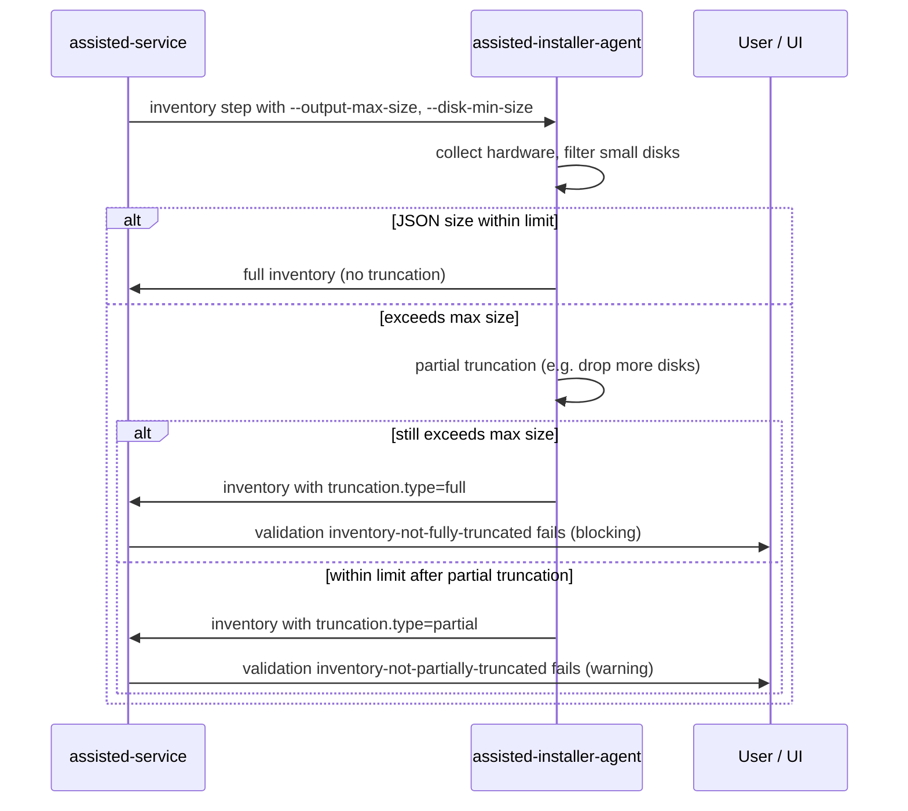

# Limit Agent Inventory Output

## Summary

Large host hardware inventories can overwhelm assisted-service: in production-like QE scenarios, hosts have been observed reporting on the order of 15,000 disks, most of them very small. The resulting JSON payloads act as a denial-of-service vector against the service (memory, database storage, API responses, validation work, and event publishing).

This enhancement introduces configurable limits on what the discovery agent collects and reports. Assisted-service passes sizing parameters to the agent during the inventory step. When limits are exceeded, the agent truncates the inventory and reports metadata describing what was truncated and why. Assisted-service surfaces this to users through host validations and API fields, blocking installation only when the inventory is fully truncated and therefore unusable.

Implementation spans assisted-service ([PR #10374](https://github.com/openshift/assisted-service/pull/10374)) and assisted-installer-agent ([PR #1474](https://github.com/openshift/assisted-installer-agent/pull/1474)). Jira: [MGMT-22787](https://redhat.atlassian.net/browse/MGMT-22787).

## Motivation

Host inventory is collected during discovery and sent to assisted-service on a recurring basis while the host remains in discovery-related states. Each report is stored and processed (validations, disk eligibility, UI rendering). When a host exposes an extremely large number of block devices—often small or virtual disks that would later be marked ineligible anyway—the payload size grows without bound.

Observed impact:

- Excessive memory and CPU use in assisted-service when unmarshalling and validating inventory
- Large database rows for host inventory
- Slow or failing API responses when listing or updating hosts
- **Poor UI experience**: rendering thousands of disks in the host inventory view degrades browser performance (slow loads, high memory use, unresponsive scrolling) and makes it impractical for users to find and select an installation disk
- **Event pipeline failures**: host-related events are published to Kafka, where broker and topic configurations impose a maximum message size (commonly on the order of 1 MiB by default, depending on deployment). An inventory embedded in or referenced by an event payload can exceed that limit, causing publish failures, dropped events, or downstream consumer errors—separate from but equally disruptive as in-process service load
- Operational incidents in QE environments that are difficult to recover from without manual intervention

Disk count is the primary field observed to cause this problem today. When hosts still reach full truncation, the design must still allow the team to improve filtering over time—but not by stuffing a full diagnostic into the inventory payload (see **Observability when inventory is fully truncated** below).

### Goals

- Allow operators to configure a maximum marshalled JSON size for agent inventory output (`AGENT_INVENTORY_MAX_SIZE`)
- Allow operators to configure a minimum disk size below which disks are omitted from inventory (`AGENT_INVENTORY_DISK_MIN_SIZE`), reducing noise before role-specific eligibility is known
- Have the agent report partial truncation as a **warning** (installation may proceed) with human-readable reasons
- Have the agent report full truncation as a **blocking** condition (installation must not proceed with unusable inventory)
- Expose truncation details on the inventory object in the REST and Kubernetes APIs
- On full truncation, surface a **blocking** validation and **high-level** summary in `truncation.reasons`; rely on **agent logs** and **metrics/alerts** (follow-up) to drive deeper analysis and new agent-side filters
- Preserve backward compatibility when limits are disabled (default `0` = no limit passed to the agent)
- Apply consistently across REST API and Kube-API modes, day-1 and day-2 discovery, and all cluster topologies (SNO, compact, standard, 3+1, etc.)

### Non-Goals

- Replacing role-based disk eligibility checks performed by assisted-service after inventory is received (minimum install disk size still depends on host role and cluster settings)
- Passing per-role minimum disk thresholds to the agent before inventory is reported (host role is not known at first inventory collection)
- Truncating or limiting inventory fields other than disks in the initial implementation (agent structure allows future extensions)
- Changing how often the agent sends inventory updates (see Open Questions)
- UI implementation in assisted-installer-ui (documented as a follow-up; API and validations provide the contract)
- Detailed step-by-step truncation diagnostics inside `truncation.reasons` for fully truncated hosts (payload too small; use agent logs instead)

## Proposal

### Overview



### Configuration

Assisted-service reads two environment variables (also exposed in `openshift/template.yaml`):

| Variable | Default | Description |
|----------|---------|-------------|
| `AGENT_INVENTORY_MAX_SIZE` | `0` | Maximum size in bytes of the marshalled inventory JSON the agent should produce. `0` disables the limit (no `--output-max-size` flag sent). |
| `AGENT_INVENTORY_DISK_MIN_SIZE` | `0` | Minimum disk size in bytes; disks smaller than this are omitted from inventory. `0` disables the filter (no `--disk-min-size` flag sent). |

When limits are enabled, assisted-service appends CLI arguments to the inventory step:

- `--output-max-size=<AGENT_INVENTORY_MAX_SIZE>`
- `--disk-min-size=<AGENT_INVENTORY_DISK_MIN_SIZE>`

Recommended operational values are deployment-specific. The disk minimum should be set low enough (on the order of ~5 GiB has been used in testing) to filter obvious noise without removing disks that could become eligible after role assignment.

### Agent behavior (assisted-installer-agent)

When `AGENT_INVENTORY_MAX_SIZE` is set:

1. The agent collects inventory and applies disk filtering:
   - Remove disks that are ineligible by agent-side rules (e.g. unsupported types)
   - Remove disks smaller than `AGENT_INVENTORY_DISK_MIN_SIZE` when configured
2. If the marshalled JSON exceeds the max size, the agent performs **partial truncation** (additional disk reduction and potentially other optimizations) and sets `inventory.truncation.type` to `partial` with `reasons` explaining what was removed.
3. If the payload is still too large after partial truncation, the agent performs **full truncation**: the inventory is empty or minimal except for truncation metadata, with `inventory.truncation.type` set to `full`.

The agent PR implements the truncation logic; assisted-service consumes the result.

**Observability when inventory is fully truncated**

Full truncation means the inventory **cannot be sent through the normal channel**: the agent only reports a minimal payload (truncation metadata, no usable disk/hardware list). Assisted-service, the database, the UI inventory view, and Kafka-backed events therefore **cannot** carry the information needed for a deep post-mortem—by design, since that data was too large to accept in the first place.

Observability is split across three layers:

| Layer | Role | Content |
|-------|------|---------|
| **API / validation** | Block install; inform user | `truncation.type=full`, validation `inventory-not-fully-truncated`, and **high-level** entries in `truncation.reasons` (e.g. configured size limit, approximate disk count before truncation, that partial truncation was not enough)—not a full trace of every filter step |
| **Agent logs** | Root-cause analysis | Detailed diagnostics written by the agent on the discovery host when truncation runs (filters applied, sizes at each step, what was dropped). This is the primary channel for engineers investigating a specific host |
| **Metrics / alerts** (follow-up) | Fleet-wide signal | Counters or alerts on full-truncation / `inventory-not-fully-truncated` failures so on-call or developers know when to collect agent logs and consider new filters |

**Partial vs full truncation:** For **partial** truncation, a reduced inventory still fits in the normal path; `truncation.reasons` can be more descriptive for the UI because the payload remains bounded. For **full** truncation, keep `reasons` intentionally short and do not aim for log-equivalent detail in the API.

**Improving filters over time:** alert or metric spike → inspect agent logs for affected hosts → add or tune collection-time filters in **assisted-installer-agent** → measure fewer full truncations. The assisted-service contract (env vars, truncation schema, validations) stays stable; agent filter logic evolves in later releases.

### API changes

**Inventory model** (`swagger.yaml`):

New optional field on `inventory`:

```yaml
truncation:
  type: object
  required:
    - type
  properties:
    type:
      type: string
      enum: ['partial', 'full']
    reasons:
      type: array
      description: Reasons for the truncation
      items:
        type: string
```

**Host validation IDs**:

| Validation ID | When it fails | Blocks installation? | Ignorable? |
|---------------|---------------|----------------------|------------|
| `inventory-not-partially-truncated` | `truncation.type == partial` | No (warning) | Yes |
| `inventory-not-fully-truncated` | `truncation.type == full` | Yes | No (listed in `NonIgnorableHostValidations`) |

Validation messages include the truncation type and joined reasons, e.g. `Inventory is truncated (partial): <reasons>`. For full truncation, the message reflects the high-level summary only; operators should not expect the validation text alone to replace agent logs.

### Assisted-service behavior

**Inventory command** (`internal/host/hostcommands/inventory_cmd.go`):

Passes sizing flags to the agent when configured values are positive.

**Validations** (`internal/host/validator.go`):

- `inventoryNotPartiallyTruncated`: fails on partial truncation; succeeds when not truncated or fully truncated (to avoid duplicate messaging with the full-truncation validation)
- `inventoryNotFullyTruncated`: fails on full truncation; succeeds on partial or no truncation

**Host state machine** (`internal/host/statemachine.go`, `pool_host_statemachine.go`):

Introduces composite condition `hasValidInventory = HasInventory AND InventoryNotFullyTruncated`:

- Hosts without valid inventory are routed back to `discovering` / insufficient states (same as missing inventory)
- Readiness transitions require valid (non-fully-truncated) inventory

Partial truncation does not prevent the host from progressing; it is visible only through validations.

### User Stories

#### Story 1: Operator protects the service from oversized inventories

As a platform operator running assisted-service, I configure `AGENT_INVENTORY_MAX_SIZE` and optionally `AGENT_INVENTORY_DISK_MIN_SIZE` so that discovery agents on hosts with thousands of small disks do not send payloads large enough to destabilize the service.

#### Story 2: User is warned when inventory was partially truncated

As a cluster administrator, when a host's inventory was partially truncated, I see a failed (warning-level) validation `inventory-not-partially-truncated` with reasons explaining what was omitted. I can still proceed with installation if the remaining inventory is sufficient for disk selection and hardware checks.

#### Story 3: User is blocked when inventory is unusable

As a cluster administrator, when a host's inventory was fully truncated because it could not be reduced below the size limit, I see a failed validation `inventory-not-fully-truncated` and the host cannot reach ready/installable state until the underlying hardware reporting issue is resolved or limits are adjusted.

#### Story 4: UI displays truncation in the inventory section

As a user of the Assisted Installer UI, when `inventory.truncation` is present, I see a clear indication in the host inventory area that data was truncated, the severity (partial vs full), and the reasons—without needing to parse raw JSON.

*(UI work is out of scope for the assisted-service PR; the API and validations are the contract for the UI team.)*

#### Story 5: Operator detects and investigates full truncation

As an operator, when full truncation occurs on a host, I see the blocking validation and a short summary in the API, an alert or metric that full truncation is happening in my environment, and I use discovery **agent logs** on the host to understand why filtering was insufficient—then I can work with engineering to improve agent-side filters in a future release.

### Implementation Details/Notes/Constraints

**Why a separate `AGENT_INVENTORY_DISK_MIN_SIZE` instead of role-based requirements?**

Assisted-service already enforces minimum disk size per host role via hardware requirements. That value is not known when the first inventory is collected. A conservative global floor filters noise (thousands of tiny disks) without requiring role information on the agent.

**Why not only `max_disks` or similar?**

Byte limits on the full JSON payload bound total service impact (disks, interfaces, and future fields). Disk count alone does not cap payload size if individual disk entries are large.

**Backward compatibility**

- `AGENT_INVENTORY_MAX_SIZE=0` and `AGENT_INVENTORY_DISK_MIN_SIZE=0` (defaults): behavior unchanged; no new CLI flags sent to the agent.
- New assisted-service with limits enabled + old agent without truncation support: **not compatible**; the agent will not understand `--output-max-size` / `--disk-min-size`. Deploy agent and service updates together when enabling limits.

**Cross-project changes**

| Project | Change |
|---------|--------|
| openshift/assisted-service | Config, inventory step args, API model, validations, state machine |
| openshift/assisted-installer-agent | CLI flags, collection filters, truncation logic, truncation metadata in JSON |
| openshift/assisted-installer-ui | Display truncation warnings in inventory section (follow-up) |

**Relevant scenarios**

| Scenario | Behavior |
|----------|----------|
| REST API / Kube-API | Same env vars and validations |
| Day-1 / Day-2 discovery | Inventory step used in both; validations run on refresh |
| SNO / multinode / compact / 3+1 | No topology-specific logic |
| Late-binding / bind-on-discovery | Unaffected; inventory collected before bind |
| Static / DHCP networking | Unaffected |
| Bare metal / vSphere / Nutanix / none | Applies to all platforms; disk explosion observed on bare metal |
| x86_64 / arm64 | Architecture-agnostic |
| Disconnected | Unaffected |
| Agent upgrade | Requires agent version with truncation support when limits enabled |

### Risks and Mitigations

| Risk | Mitigation |
|------|------------|
| Legitimate small disk needed for install is filtered by `AGENT_INVENTORY_DISK_MIN_SIZE` | Use a low threshold (~5 GiB); service still validates role-based disk requirements on received inventory |
| Partial truncation hides a disk the user would have selected | Warning validation + UI surfacing of `truncation.reasons`; user can adjust hardware or limits |
| Full truncation blocks clusters that could otherwise install | Intentional fail-safe; operator must fix host or increase `AGENT_INVENTORY_MAX_SIZE` |
| Engineers expect full diagnostic detail in `truncation.reasons` | Document that full truncation cannot use the normal inventory channel; high-level `reasons` + agent logs + alerts (follow-up) |
| Version skew between service and agent | Document joint rollout; defaults keep legacy behavior |
| Oversized inventory still breaks Kafka event publishing | Agent-side size limits keep event payloads within broker message size bounds; monitor publish failures if limits are disabled |

## Design Details

### Validation and installation blocking

```text
No truncation          → both validations success → normal discovery/install path
Partial truncation     → inventory-not-partially-truncated fails (warning)
                         → inventory-not-fully-truncated success
                         → installation NOT blocked by truncation
Full truncation        → inventory-not-partially-truncated success (no duplicate message)
                         → inventory-not-fully-truncated fails
                         → hasValidInventory false → host not ready, installation blocked
```

`inventory-not-fully-truncated` is included in `NonIgnorableHostValidations` and cannot be bypassed via the ignore-validations API.

### Open Questions

1. **Alerts and metrics for full truncation**: What metric labels and alert thresholds should fire when `inventory-not-fully-truncated` failures increase, so investigation (agent log collection) starts without relying on users reporting blocked hosts?
2. **Agent log format**: What fields should the agent log on full truncation so log analysis is consistent across versions (without duplicating that content in `truncation.reasons`)?

### UI Impact

UI changes are required for a complete user experience:

1. Show a warning in the host inventory section when `inventory.truncation.type == partial` and/or when validation `inventory-not-partially-truncated` is failing.
2. Show a blocking error when `inventory.truncation.type == full` and validation `inventory-not-fully-truncated` is failing (inventory section will be empty or minimal; rely on validation message and high-level `reasons`, not a full disk list).
3. Display `truncation.reasons` to the user; for full truncation, expect a short summary only.

No assisted-service UI code is in scope; `hosts.json` samples and validation docs are updated in the implementation PR.

### Test Plan

**Unit tests (assisted-service)** — implemented in PR #10374:

- `inventory_cmd`: conditional inclusion of `--output-max-size` and `--disk-min-size` based on config
- Host state machine transitions with full truncation (host moves to insufficient / discovery)
- Validator behavior for partial vs full truncation and missing inventory

**Manual / assisted-test-infra** — performed by PR author:

- Backward compatibility with limits disabled
- Partial truncation: installation can start
- Full truncation: installation blocked

**Subsystem / e2e** (recommended follow-up):

- Deploy service + agent with limits enabled; host with many small disks receives expected validations
- Verify API returns `inventory.truncation` on GET host

**Agent tests** — in assisted-installer-agent PR #1474:

- Truncation logic, size limits, disk filtering, reason strings

## Drawbacks

- Additional configuration surface for operators
- Risk of false negatives if `AGENT_INVENTORY_DISK_MIN_SIZE` is set too aggressively
- Two new validation IDs increase API and UI complexity
- Requires coordinated release of assisted-service and assisted-installer-agent when enabling limits
- Full truncation blocks installation; some reviewers may prefer a non-blocking degraded mode (rejected: unusable inventory cannot support install)

## Alternatives

1. **Service-side rejection only**: Reject oversized inventory in assisted-service without agent changes. Rejected: the damage (network, DB write, parse) already occurs before rejection; agent-side limiting prevents oversized payloads from being sent.

2. **Hard cap on disk count in the agent**: Simpler than byte limits but does not bound total JSON size and is harder to tune across heterogeneous hardware.

3. **Pass role-based min disk size to the agent**: More accurate filtering but requires role before first inventory, which is not available during initial discovery.

4. **Rate-limit or drop inventory updates server-side**: Mitigates steady-state load but does not fix oversized single payloads.

## Future improvements

The following items are out of scope for the initial implementation but are worth considering as follow-up work:

1. **Systematic payload size limits in assisted-service**: In addition to agent-side inventory caps, assisted-service could enforce maximum payload sizes systematically on inbound API requests (and related internal paths) before persistence or event emission. This would provide a defense-in-depth layer for inventory and any other large blobs. Adopting this would require a dedicated impact analysis: which endpoints and message types are affected, how errors are surfaced to callers, interaction with the events/Kafka pipeline, backward compatibility, and whether limits should differ per resource type. Not pursued in this enhancement pending that analysis. This limit can be implemented either by assisted-service container or by the envoy-proxy in front of it.

2. **Inventory change detection**: Confirm and document agent behavior when skipping unchanged inventory reports.

3. **Metrics and alerts for full truncation**: Fleet-level counters and alerts on `inventory-not-fully-truncated` / full truncation to trigger log-based investigation (initial PR may only expose validation status; alerting is explicit follow-up).

4. **Iterative agent filters**: After investigating agent logs from alerted hosts, add collection-time filters in the agent to reduce full-truncation rate without raising `AGENT_INVENTORY_MAX_SIZE`.

5. **NICs filtering**: Connectivity checks can be big as it is a Cartesian product. It would be interesting to investigate if we can limit the number of reported NICs too.

## References

- Implementation PR: https://github.com/openshift/assisted-service/pull/10374
- Agent PR: https://github.com/openshift/assisted-installer-agent/pull/1474
- Jira: https://redhat.atlassian.net/browse/MGMT-22787
