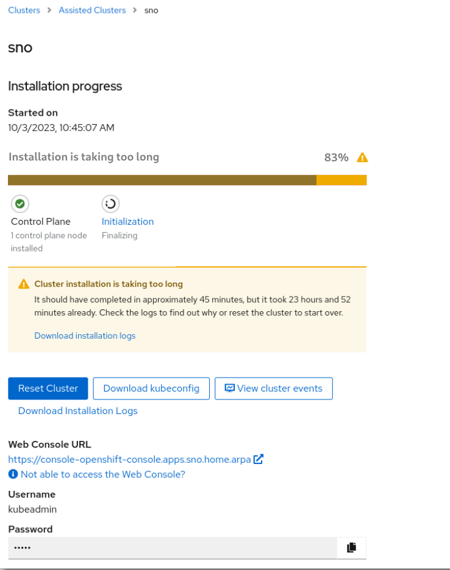

# Soft install timeout

## Summary

Currently we have an installation timeout of one hour. When that expires the
cluster is automatically moved to the error state. We want to change that to a
warning, so that users are informed that the installation is taking longer than
expected and the installation will continue.

## Motivation

This is important because users may be able to fix he issues that delay the
installation instead of having to start it over.

### Goals

### Non-Goals

It is not a goal to change the global installation timeout configured via the
`INSTALLATION_TIMEOUT` environment variable. That is set by default to `24h`
and at that point the assisted service stops monitoring the cluster.

## Proposal

### User Stories

#### Allow manually fixing a SasS installation

As a user I tried to create a SNO cluster in the SaaS environment. An issue
prevented one of the cluster operators from reporting success. After one hour
the timeout expired and the installation was marked as failed. When I found the
failed install, I was able to easily resolve the issue and get the cluster
operator to report success. But the service no longer cared; as far as it was
concerned, the installation failed and was permanently marked as such. It also
would not give me the kubeadmin password, which is an important feature of the
install experience and tricky to obtain otherwise. I would like the service
inform me about the exceeded timeout, but it should give me the kubeadmin
password (if available at that point) and after my fixes it should continue
and eventually mark the installation as successful.

#### Allow manually fixing a late binding installation

As a user I tried to install a cluster with late binding featured enabled
(deleting the cluster will return the hosts to infrastructure environment). The
installation timed out and the installation was marked as failed. I connected
to the cluster and manually fixed the issue. The service will still think that
there is an error in the cluster, and if I try to perform day 2 operations on
it they will fail. The only option is to delete the cluster and create another
one that is marked as installed, but that will cause the host to boot from
discovery ISO. I would like the service to inform me of the exceeded timeout,
but after my fixes it should continue and eventually mark the installation as
successful.

### Implementation Details/Notes/Constraints

To be done.

### Risks and Mitigations

To be done.

## Design Details

None, see the implementation details above.

### Open Questions

- Do we also soften the 24h `INSTALLATION_TIMEOUT` timeout?

- Should we collect must gather logs when the installation timeout expires, even
  if we don't mark it as failed?

### UI Impact

The UI will need to explicitly show to the user that the cluster installation
is taking longer than expected, and give suggestions on how to proceed. For
example, we could present a warning message with this text:

> Cluster installation is taking too long
>
> It should have completed in approximately 45 minutes, but it took 23 hours
> and 52 minutes already. Check the logs to find out why or reset the cluster
> to start over.

The progress bars and other UI elements used to indicate progress should also
explicitly indicate that the installation is taking longer than expected, for
example using warning icons or specific colors. For example:

### Test Plan

We will need the following test cases, for the preparation, installation and
finalizing phases:

- Prepare a cluster that exceeds the timeout and verify that fixing the issue
  manually allows the service to continue with the installation.

- Verify that the UI explicitly shows the information about the expired
  timeout, and that it recovers when the issue is eventually fixed and the
  service continues with the installation.

These tests may require introducing a mechanism to artificially delay the
installation in the agent or the installer.

## Drawbacks

Most of our cluster installation failures are due to these timeouts. If we just
disable them then we will have a large amount of installations that have failed
but will not be accounted as such.

## Alternatives

None.
