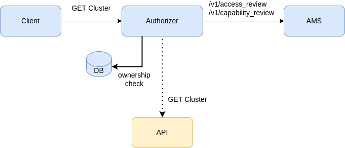

# Tenancy Based Authorization

## Summary

The current authorization scheme in the SaaS grants read and write access only to the cluster's owner.
To align with the OCM authorization scheme, we would like to allow the following:

- A tenancy-based read-only access to resources.
- Users should be allowed to grant editing capabilities to their resources to other users in their organization.

## Goals

The following tables detail the access permission rules for various resources:

For clusters and cluster-based resources (all APIs that starts with `/v2/clusters/{cluster_id}`):
| Action | Authorization Access |
|----------------|------------------------------------------------------------------------------------------------|
| List Cluster | Returns clusters owned by all members of the organization |
| Get Cluster | Allowed for all members of the organization |
| Edit Cluster | Allowed for the owner and for each user that has update access for this cluster's subscription |
| Delete Cluster | Allowed for the owner and for each user that has remove access for this cluster's subscription |

For InfraEnv and InfraEnv-based resources like hosts (all APIs that starts with `/v2/infra-envs/{infra_env_id`):
| Action | Authorization Access |
|----------------|------------------------------------------------------------------------------------------------|
| List InfraEnvs | Returns bound InfraEnvs belonging to the organization and unbound InfraEnvs owned by the caller |
| Get InfraEnv| For bound InfraEnv, allowed for all members of the organization<br>For unbound InfraEnv allowed for the owner |
| Edit InfraEnv | For bound InfraEnv, allowed for the owner and for each user that has update access<br>for the bound cluster's subscription. For unbound InfraEnv, allowed for the owner |
| Delete InfraEnv| For bound InfraEnv, allowed for the owner and for each user that has remove access<br>for the bound cluster's subscription. For unbound InfraEnv, allowed for the owner |

For day2 cluster operations:
| Action | Authorization Access |
|----------------|------------------------------------------------------------------------------------------------|
| Add Host | Allowed for every user who has update access for the day1's cluster subscription |

Filtering for you own clusters:
The list-clusters API shall have an additional query parameter that filters the clusters by owners only:
`GET /v2/clusters?owneronly=true`

## Current Authorization Flow



Following is a brief overview of the authorization layer of the assisted installer.

As seen in the above diagram, there are three actors in the flow:

- An authenticated client (User or Agent) carrying an access token that identifies it. (Explaining the authentication system of assisted service is beyond the scope of this document)
- Assisted Service security middleware, acting as a reverse proxy, which receives a request to access a resource and works together with AMS (Account Management Service) to establish the right of the client to access it.
- Account Management Service (AMS) that holds the OCM authorization details for users.

The flow itself will remain unchanged after this enhancement. Only some implementation details will change
as detailed in the next chapter.

### Step 1: Establishing static roles

Upon receiving a request from a client, the authorization middleware issues `access_review` and `capability_review` requests to AMS to establish the user/agent's static role:

| Role          | Description                                | Criteria (AMS)                                     |
| ------------- | ------------------------------------------ | -------------------------------------------------- |
| ReadOnlyAdmin | Customer support personas                  | Has bare_metal_installer_admin capability          |
| User          | Users/Agents allowed to create AI clusters | Has create permission on BareMetalCluster resource |

After the static roles are established, the authorization layer verifies that the requested API is allowed for that particular role. For example, A support user (with AdminReadOnly role) can only view a cluster and download its logs but not modify it.

### Step 2: Verifying ownership over the resource

If a call is issued by a `User` there is an additional authorization phase where the middleware consults the assisted service database and verifies that the user has ownership over the requested resource.

In the current implementation, `ownership` means that the user created the resource (cluster or infraEnv). The enhancement suggests a more elaborate way to establish ownership, taking into account tenancy as well as dynamic roles.
Please consult the next chapter for more details.

## AMS / Assisted Service Integration

AMS (Account Management Service) authorization API is based upon rules that govern the access rights of users to subscriptions. `Subscriptions` bear a close connection with OCP clusters.

Assisted-Service, on the other hand, identifies resources by their local identifiers. There are two kinds of resources in Assisted Service:

- A resource belonging to a Cluster. (For example: The cluster itself, cluster level logs, manifests)
- A resource belonging to an InfraEnv. (For example: The InfraEnv itself, hosts, host level logs)

The association between those two systems is done on a cluster level. A cluster record in assisted service keeps track of its corresponding subscription ID in AMS.

InfraEnv has no parallel association.Therefore, when applying the enhancement, any integration with AMS security API for InfraEnv resources should be either done via the bound cluster's subscription id or fall back to verifying ownership by comparing the user to the InfraEnv's owner as recorded in the assisted service database.

## Suggested Changes

To establish a tenancy-based authorization, some changes should apply to the "ownership"" part of the flow (Step 2):

- 'Ownership' is now defined on an organization level (a user is allowed access if they belong to the same organization as the resource's creator).

- For Update and Delete of cluster-related APIs, the authorizer shall issue an additional query to AMS to check if the user is allowed to change the resource. This change supports the 'Cluster Editor' role assignment.

- For Update and Delete of a cluster-bound InfraEnv or one of its dependent resources such as hosts, the access permission is established by the bound cluster as described above.

- For Update and Delete of a a non-bound InfraEnv (or one of its dependant resources), ownership for reading access is established on the organization level. Update and Delete operations are allowed only to the resource creator.

- On the API level we offer an extension to `ListClusters` API as described above to allow filtering by owner.

The entire change will be included in a feature flag to allow a fallback to the current behavior.

## UI Considerations

There will be no changes to the existing UI. Unauthorized actions will result in an error, but no graying-out elements are required.

OCM UI already allows granting Cluster Editor role for other users, so no further development is needed there.

## AMS API Reference

AMS API is documented [here](https://api.openshift.com/?urls.primaryName=Accounts%20management%20service).

Let's look at an example for the AMS call to verify a user has a `Cluster Editor` role. In this example the user "Bob" requested access to modify a cluster with a subscription id "alice-cluster" created by "Alice". The call returns an affirmative response if Alice granted Bob a Cluster Editor role using the UI beforehand.

```
POST /v1/authorizations/access_review
{
  account_id: 'Bob',
  organization_id: 'Red-Hat',
  resource_id: <alice-cluster-subscription-id>,
  resource_type: 'Subscription',
  action: update
}
```
