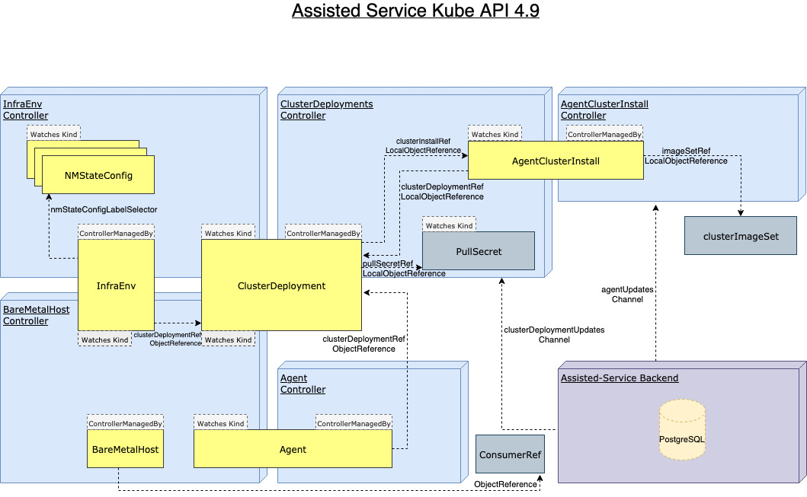

# Hive Integration

The goal of the Hive integration is to enable Assisted Installer capabilities on-premise in users' "Hub" clusters by installing clusters via Multi-cluster management, such as through [Hive](https://github.com/openshift/hive/) and [RHACM](https://github.com/open-cluster-management) (Red Hat Advanced Cluster Management).

A full description of the enhancement is available [here](https://github.com/openshift/enhancements/blob/master/enhancements/installer/agent-based-installation-in-hive.md).

For this integration, the Assisted Installer APIs are available via [CRDs](https://kubernetes.io/docs/tasks/extend-kubernetes/custom-resources/custom-resource-definitions/)

## CRD Types



### [ClusterDeployment](https://github.com/openshift/hive/blob/master/apis/hive/v1/clusterdeployment_types.go)
The ClusterDeployment CRD is an API provided by Hive.

See Hive documentation [here](https://github.com/openshift/hive/blob/master/docs/using-hive.md#cluster-provisioning).

The ClusterDeployment must have a reference to an AgentClusterInstall (`Spec.ClusterInstallRef`) that defines the required parameters of the Cluster.

Deletion of ClusterDeployment will trigger the `clusterdeployments.agent-install.openshift.io/ai-deprovision` finalizer pre-deletion logic, which will delete the referenced AgentClusterInstall.

The CluterDeployment's `spec.platform` should be ignored except for `spec.platform.agentBareMetal`. With the Assisted Installer, the actual platform will be set in the AgentClusterInstall CR.

### [AgentClusterInstall](../../api/hiveextension/v1beta1/agentclusterinstall_types.go)
In the AgentClusterInstall, the user can specify requirements like networking, platform, number of Control Plane and Worker nodes and more.

The installation will start automatically if the required number of hosts is available, the hosts are ready to be installed and the Agents are approved.

Once the installation started, changes to the AgentClusterInstall Spec will be revoked.

Selecting a specific OCP release version is done using a ClusterImageSet, see documentation [here](kube-api-select-ocp-versions.md).

The AgentClusterInstall reflects the Cluster/Installation status through Conditions.

Deletion of AgentClusterInstall will trigger the `agentclusterinstall
.agent-install.openshift.io/ai-deprovision` finalizer pre-deletion logic, which will deregister the backend cluster and delete all the related Agent CRs.

Here an example how to print AgentClusterInstall conditions:

```sh
$ kubectl get agentclusterinstalls.extensions.hive.openshift.io -n mynamespace -o=jsonpath='{range .items[*]}{"\n"}{.metadata.name}{"\n"}{range .status.conditions[*]}{.type}{"\t"}{.message}{"\n"}{end}'
```
```sh
test-infra-agent-cluster-install
SpecSynced	The Spec has been successfully applied
Validated	The cluster's validations are passing
RequirementsMet	The cluster installation stopped
Completed	The installation has completed: Cluster is installed
Failed	The installation has not failed
Stopped	The installation has stopped because it completed successfully
```

More details on conditions is available [here](kube-api-conditions.md)

#### Debug Information

The `DebugInfo` field under `Status` provides additional information for debugging installation process:
- `EventsURL` specifies an HTTP/S URL that contains events occured during cluster installation process


### [InfraEnv](../../api/v1beta1/infraenv_types.go)
The InfraEnv CRD represents the configuration needed to create the discovery ISO.
The user can specify proxy settings, ignition overrides and specify NMState labels.

When the ISO is ready, an URL will be available in the CR.

If booting hosts using [iPXE](https://github.com/openshift/assisted-service/blob/5d4d836747862f43fa2ec882e5871648bd12c780/docs/enhancements/ipxe-host-boot.md#ipxe-host-boot), the download URLs will be available in the CR.

The InfraEnv reflects the image creation status through Conditions.

More details on conditions is available [here](kube-api-conditions.md)

The InfraEnv can be created without a Cluster Deployment reference for late binding flow. More information is available [here](./late-binding.md).


### [NMStateConfig](../../api/v1beta1/nmstate_config_types.go)
The NMStateConfig contains network configuration that will applied on the hosts. See NMState repository [here](https://github.com/nmstate/nmstate).

To link between an InfraEnv to NMState (either one or more):

- InfraEnv CR: add a label to nmStateConfigLabelSelector with a user defined name and value.
- NMState CR: Specify the same label + value in Object metadata.

Upon InfraEnv creation, the InfraEnv controller will search by label+value for matching NMState resources and construct a config to be sent as StaticNetworkConfig as a part of ImageCreateParams. The backend does all validations, and currently, there is no handling of configuration conflicts (e.g., two nmstate resources using the same MAC address).

The InfraEnv controller will watch for NMState config creation/changes and search for corresponding InfraEnv resources to reconcile since we need to regenerate the image for those.

:stop_sign: Note that due to the ignition content length limit (`256Ki`), there is a limit to the amount of NMStateConfigs that can be included with a single InfraEnv. With a config sample such as [this one](./crds/nmstate.yaml), the limit per each InfraEnv is 3960 configurations.

:warning: **It is advised to create all NMStateConfigs resources before their corresponding InfraEnv.
The reason is that InfraEnv doesn't have a way to know how many NMStateConfigs to expect; therefore, it re-creates its ISO when new NMStateConfigs are found.
The new ISO automatically propagates to any agents that haven't yet started installing.**

### [Agent](../../api/v1beta1/agent_types.go)
The Agent CRD represents a Host that boot from an ISO and registered to a cluster.
It will be created by Assisted Service when a host registers.
In the Agent, the user can specify the hostname, role, installation disk and more.
Also, the host hardware inventory and statuses are available.

Note that if the Agent is not Approved, it will not be part of the installation.

Here how to approve an Agent:

```sh
$ kubectl -n mynamespace patch agents.agent-install.openshift.io 120af504-d88e-46bd-bec2-b8b261db3b01 -p '{"spec":{"approved":true}}' --type merge
```

The Agent reflects the Host status through Conditions.

More details on conditions is available [here](kube-api-conditions.md)

Here an example how to print Agent conditions:

```sh
$ kubectl get agents.agent-install.openshift.io -n mynamespace  -o=jsonpath='{range .items[*]}{"\n"}{.spec.clusterDeploymentName.name}{"\n"}{.status.inventory.hostname}{"\n"}{range .status.conditions[*]}{.type}{"\t"}{.message}{"\n"}{end}'
```

```sh
test-infra-cluster-assisted-installer
test-infra-cluster-assisted-installer-master-2
SpecSynced	The Spec has been successfully applied
Connected	The agent's connection to the installation service is unimpaired
RequirementsMet	Installation already started and is in progress
Validated	The agent's validations are passing
Installed	The installation is in progress: Configuring

test-infra-cluster-assisted-installer
test-infra-cluster-assisted-installer-master-0
SpecSynced	The Spec has been successfully applied
Connected	The agent's connection to the installation service is unimpaired
RequirementsMet	Installation already started and is in progress
Validated	The agent's validations are passing
Installed	The installation is in progress: Configuring

test-infra-cluster-assisted-installer
test-infra-cluster-assisted-installer-master-1
SpecSynced	The Spec has been successfully applied
Connected	The agent's connection to the installation service is unimpaired
RequirementsMet	Installation already started and is in progress
Validated	The agent's validations are passing
Installed	The installation is in progress: Waiting for control plane
```

Once the cluster is installed, the ClusterDeployment is set to Installed and secrets for kubeconfig and credentials are created and referenced in the AgentClusterInstall.

## Day 2 worker

In case of none SNO deployment, after that the cluster is installed, the original cluster is transformed into a Day 2 cluster in the Assisted Service database.

Additional nodes can be added by booting from the same generated ISO. Each additional host will start installation once the Agent is Approved and the Host is in known state.

Note that the user needs to approved the additional nodes in the installed cluster.

It is possible to import an existing installed OpenShift in order to be able to add more workers to it. See instructions [here](./import-installed-cluster.md).

## Bare Metal Operator Integration

In case that the Bare Metal Operator is installed, the Baremetal Agent Controller will sync between the Agent CR and the matching BareMetalHost CR:

- Find the right pairs of BMH/Agent using their MAC addresses
- Set the Image.URL in the BMH copying it from the InfraEnv's status.
- Reconcile the Agent's spec by copying the following attributes from the BMH's annotations:
    - Role: master/worker
    - Hostname (optional for user to set)
    - MachineConfigPool (optional for user to set)
- Reconcile the BareMetalHost hardware details by copying the Agent's inventory data to the BMH's `hardwaredetails` annotation.
- Disable ironic inspection


See BMAC documentation [here](./baremetal-agent-controller.md).

## Bare Metal Operator Integration using the converged flow
See reference [here](https://github.com/openshift/enhancements/blob/master/enhancements/baremetal/ztp-metal3.md)

In case the Bare Metal Operator on the HUB cluster version is 4.11 or higher, the integration between the BMO and the assisted-service is slightly different.
The assisted-service will run a Preprovisioning Image Controller that reconciles PreprovisioningImages and:
- Annotates the InfraEnv for the BareMetalHost with `infraenv.agent-install.openshift.io/enable-ironic-agent="true"`
- Adds the ironic agent config to the discovery ignition embedded in the InfraEnv ISO
- Copies the InfraEnv ISODownloadURL to the PreprovisioningImage ImageUrl, which allows the host to register with metal3 and let metal3 reconcile the BareMetalHost hardware details.
**NOTE**
In case the InfraEnv is annotated with `infraenv.agent-install.openshift.io/enable-ironic-agent="true"`
The ISO generated for this InfraEnv requires metal3 for registration and will not work for boot-it-yourself flow!

The Baremetal Agent Controller will stop explicitly disabling *inspection* on `BareMetalHost`s it manages
and will no longer update the BareMetalHost with detached annotation.
It will continue to:
- Find the right pairs of BMH/Agent using their MAC addresses
- Reconcile the Agent's spec by copying the following attributes from the BMH's annotations:
  - Role: master/worker
  - Hostname (optional for user to set)
  - MachineConfigPool (optional for user to set)
- Set the  BareMetalHost CustomDeploy Method to `start_assisted_install` - this custom deploy method will be added to start
  the assisted agent when BMO requests deployment.

The assisted agent will not reboot the machine at the end of the installation, instead it will stop
the assisted agent service and let the ironic agent to manage the machine power state

The converged flow is disalbed by default, you can enable the converged flow by setting the `ALLOW_CONVERGED_FLOW` env to true [here](../operator.md##specifying-environmental-variables-via-configmap)
To set a different default ironicAgent image you can override the following env vars:
The environment var for the ironicAgent image to be used on X86_64 CPU architecture:
`IRONIC_AGENT_IMAGE`
The environment var for the ironicAgent image to be used on arm64 CPU architecture:
`IRONIC_AGENT_IMAGE_ARM`

## Working with mirror registry
In case all of your images are in mirror registries, the service, discovery ISO, and installed nodes must be configured with the proper registries.conf and authentication certificate.  To do so, see the Mirror Registry Configuration section [here](../operator.md#mirror-registry-configuration).

## Assisted Installer Kube API CR examples

[docs/hive-integration/crds](crds) stores working examples of various resources we spawn via kube-api in assisted-installer, for Hive integration.
Those examples are here for reference.

You will likely need to adapt those for your own needs.

* [InfraEnv](crds/infraEnv.yaml)
* [InfraEnv Late Binding](crds/infraEnvLateBinding.yaml)
* [NMState Config](crds/nmstate.yaml)
* [Hive PullSecret Secret](crds/pullsecret.yaml)
* [Hive ClusterDeployment](crds/clusterDeployment.yaml)
* [AgentClusterInstall](crds/agentClusterInstall.yaml)
* [AgentClusterInstall SNO](crds/agentClusterInstall-SNO.yaml)
* [ClusterImageSet](crds/clusterImageSet.yaml)


### Creating InstallConfig overrides

In order to alter the default install config yaml used when running `openshift-install create` commands.
More information about install-config overrides is available [here](../user-guide/install-customization.md#install-config)
In case of failure to apply the overrides the agentclusterinstall conditions will reflect the error and show the relevant error message.

Add an annotation with the desired options, the clusterdeployment controller will update the install config yaml with the annotation value.
Note that this configuration must be applied prior to starting the installation
```sh
$ kubectl annotate agentclusterinstalls.extensions.hive.openshift.io test-cluster -n mynamespace agent-install.openshift.io/install-config-overrides="{\"networking\":{\"networkType\": \"OVNKubernetes\"},\"fips\":true}"
agentclusterinstalls.extensions.hive.openshift.io/test-cluster annotated
```

```sh
$ kubectl get agentclusterinstalls.extensions.hive.openshift.io test-cluster -n mynamespace -o yaml
```
```yaml
apiVersion: extensions.hive.openshift.io/v1beta1
kind: AgentClusterInstall
metadata:
  annotations:
    agent-install.openshift.io/install-config-overrides: '{"networking":{"networkType": "OVNKubernetes"},"fips":true}'
  creationTimestamp: "2021-04-01T07:04:49Z"
  generation: 1
  name: test-cluster
  namespace: mynamespace
  resourceVersion: "183201"
...
```

### Creating host installer args overrides

In order to alter the default coreos-installer arguments used when running `coreos-installer`openshift-install create command.
List of supported args can be found [here](https://github.com/openshift/assisted-service/blob/38a9d0398b96e81ef494029277e362a7256df44e/internal/host/hostutil/host_utils.go#L150)
In case of failure to apply the overrides the agent conditions will reflect the error and show the relevant error message.

Add an annotation with the desired options, the bmac controller will update the agent spec with the annotation value.
Then agent controller will forward it to host configuration.
Note that this configuration must be applied prior to starting the installation
```sh
$ kubectl annotate bmh openshift-worker-0 -n mynamespace bmac.agent-install.openshift.io/installer-args="[\"--append-karg\", \"ip=192.0.2.2::192.0.2.254:255.255.255.0:core0.example.com:enp1s0:none\", \"--save-partindex\", \"1\", \"-n\"]"
baremetalhost.metal3.io/openshift-worker-0 annotated
```

```sh
$ oc get bmh openshift-worker-0 -n mynamespace -o yaml
```
```yaml
apiVersion: metal3.io/v1alpha1
kind: BareMetalHost
metadata:
  annotations:
    bmac.agent-install.openshift.io/installer-args: '["--append-karg", "ip=192.0.2.2::192.0.2.254:255.255.255.0:core0.example.com:enp1s0:none", "--save-partindex", "1", "-n"]'
  creationTimestamp: "2021-04-13T10:46:57Z"
  generation: 1
  name: openshift-worker-0
  namespace: mynamespace
spec:
```

### Creating host ignition config overrides

In case of failure to apply the overrides, the agent conditions will reflect the error and show the relevant error message.

Add an annotation with the desired options, the bmac controller will update the agent spec with the annotation value.
Then agent controller will forward it to host configuration.
Note that this configuration must be applied prior to starting the installation
```sh
$ kubectl annotate bmh openshift-worker-0 -n mynamespace bmac.agent-install.openshift.io/ignition-config-overrides="{\"ignition\": {\"version\": \"3.1.0\"}, \"storage\": {\"files\": [{\"path\": \"/tmp/example\", \"contents\": {\"source\": \"data:text/plain;base64,aGVscGltdHJhcHBlZGluYXN3YWdnZXJzcGVj\"}}]}}"
baremetalhost.metal3.io/openshift-worker-0 annotated
```

```sh
$ oc get bmh openshift-worker-0 -n mynamespace -o yaml
```
```yaml
apiVersion: metal3.io/v1alpha1
kind: BareMetalHost
metadata:
  annotations:
    bmac.agent-install.openshift.io/ignition-config-overrides: '{"ignition": {"version": "3.1.0"}, "storage": {"files": [{"path": "/tmp/example", "contents": {"source": "data:text/plain;base64,aGVscGltdHJhcHBlZGluYXN3YWdnZXJzcGVj"}}]}}'
  creationTimestamp: "2021-04-14T10:46:57Z"
  generation: 1
  name: openshift-worker-0
  namespace: mynamespace
spec:
```

### Creating Additional manifests

In order to add custom manifests that will be added to the installation manifests generated by `openshift-install create` command,
user will need to create configmap with valid manifests:
```yaml
kind: ConfigMap
apiVersion: v1
metadata:
  name: my-baremetal-cluster-install-manifests
  namespace: mynamespace
data:
  99_master_kernel_arg.yaml: |
    apiVersion: machineconfiguration.openshift.io/v1
    kind: MachineConfig
    metadata:
      labels:
        machineconfiguration.openshift.io/role: master
      name: 99-openshift-machineconfig-master-kargs
    spec:
      kernelArguments:
        - 'loglevel=7'`
```

Create/update AgentClusterInstall with field manifestsConfigMapRefs:
```yaml
apiVersion: extensions.hive.openshift.io/v1beta1
kind: AgentClusterInstall
metadata:
  name: my-baremetal-cluster
  namespace: mynamespace
spec:
    manifestsConfigMapRefs:
    - name: manifests-config-map-1
    - name: manifests-config-map-2
```
manifestsConfigMapRefs is an array of references to user-provided manifests ConfigMaps.
This field should be used instead of the deprecated manifestsConfigMapRef.

[Deprecated] Create/update AgentClusterInstall with field manifestsConfigMapRef:
```yaml
apiVersion: extensions.hive.openshift.io/v1beta1
kind: AgentClusterInstall
metadata:
  name: my-baremetal-cluster
  namespace: mynamespace
spec:
    manifestsConfigMapRef:
      name: my-baremetal-cluster-install-manifests
```
If manifests provided in configmap data section will be in bad format or configmap will not exists but will be referenced
we will set error in Sync condition only if cluster will be ready for installation. Changing configmap should fix the issue.
Note: this field is ignored when ManifestsConfigMapRefs is set.

## Teardown procedure

Deleting the ClusterDeployment will automatically trigger the deletion of its referenced AgentClusterInstall and the deletion of all the Agents connected to it (Unless late binding was used, see [here](./late-binding.md)).

Note that the installed OCP cluster, if exists, will not be affected by the deletion of the ClusterDeployment.

Deleting only the AgentClusterInstall will delete the Agents connected to it (Unless late binding was used), but the ClusterDeployment will remain.

BareMetalHost, InfraEnv, ClusterImageSet and NMStateConfig deletion will not trigger deletion of other resources.


In case that the assisted-service is not available, the deletion of ClusterDeployment, AgentClusterInstall and Agents resources will be blocked due to finalizers that are set on them.

Here an example on how to remove finalizers on a resource:

```bash
kubectl -n mynamespace patch agentclusterinstalls.extensions.hive.openshift.io my-aci -p '{"metadata":{"finalizers":null}}' --type=merge
```

## Development

### CRD update

Changes in CRDs should be made in the CRDs Go files located [here](../../api).
After the changes are done, the YAML files need to be generated by running:
```bash
skipper make generate
```
