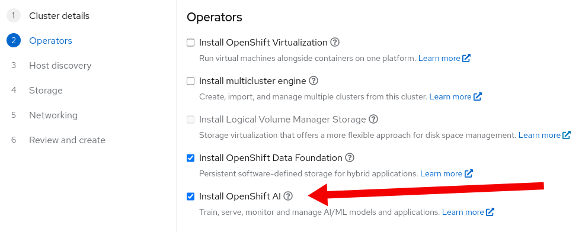

# Additional OLM operator notes

## OpenShift Virtualization (CNV)
- When deploying CNV on Single Node OpenShift (SNO), [hostpath-provisioner](https://github.com/kubevirt/hostpath-provisioner) (part of the CNV product) storage is automatically opted in and set up to use, to enable persisting VM disks.  
This is done with the thought in mind that most virtualization use cases require persistence.  
The hostpath-provisioner is set up to utilize an LSO PV as the backing storage for provisioning dynamic hostPath volumes on.

## Multi-Cluster Engine (MCE)

- When deploying MCE together with a storage operator (ODF or LVM) Infrastructure Operator will be automatically
enabled. This will require extra disk space availability requirements for the storage operator.
When selecting MCE with both ODF and LVM, ODF will have priority and its storage class will be selected to provision Infrastructure Operator's PVCs.

## OpenShift AI

The [OpenShift AI](https://www.redhat.com/en/technologies/cloud-computing/openshift/openshift-ai)
operator deploys and manages the components that allow allows users to train, serve, monitor and
manage AI/ML models and applications.

It can be installed during cluster creation by selecting the _Install OpenShift AI_ check-box in the
operators page of the cluster creation wizard:



If you want to use the API instead, then it is necessary to add `openshift-ai` to the
`olm_operators` field of the cluster definition:

```json
{
  "name": "my-cluster",
  "olm_operators": [
    {
      "name": "openshift-ai"
    }
  ],
  ...
}
```

For example, this Python script creates a complete cluster enabling the the _OpenShift AI_ operator:

```python
#!/usr/bin/env python3
# -*- coding: utf-8 -*-

import json
import requests
import subprocess

# Details of the cluster:
name = "my-cluster"
base_url = "https://api.openshift.com"
base_dns_domain = "example.com"
openshift_version = "4.16"
cpu_architecture = "x86_64"

# Use the `ocm` command line tool to obtain the access token. To install the `ocm` command line tool
# visit this page:
#
# https://github.com/openshift-online/ocm-cli
#
# Then run `ocm login --use-auth-code` to login.
token = subprocess.check_output(["ocm", "token"]).decode("utf-8").strip()

# Read the pull secret. To obtain your pull secret visit this page:
#
# https://console.redhat.com/openshift/install/pull-secret
#
# Then save the result to a `pull.txt` file.
with open("pull.txt", "r") as file:
    pull_secret = file.read().strip()

# Create the cluster:
response = requests.post(
    f"{base_url}/api/assisted-install/v2/clusters",
    headers={
        "Authorization": f"Bearer {token}",
    },
    json={
        "name": name,
        "openshift_version": openshift_version,
        "base_dns_domain": base_dns_domain,
        "cpu_architecture": cpu_architecture,
        "pull_secret": pull_secret,
        "olm_operators": [
            {
                "name": "openshift-ai",
            },
        ],
    },
)
if response.status_code != 201:
    raise Exception(f"Failed to create cluster: {response.status_code}")
cluster = response.json()
cluster_id = cluster["id"]
print(f"cluster_id: {cluster_id}")

# Create the infrastructure environment:
response = requests.post(
    f"{base_url}/api/assisted-install/v2/infra-envs",
    headers={
        "Authorization": f"Bearer {token}",
    },
    json={
        "name": name,
        "cluster_id": cluster_id,
        "openshift_version": openshift_version,
        "cpu_architecture": cpu_architecture,
        "pull_secret": pull_secret,
        "image_type": "full-iso",
    },
)
if response.status_code != 201:
    raise Exception(f"Failed to create infrastructure environment: {response.status_code}")
infra_env = response.json()
infra_env_id = infra_env["id"]
print(f"infra_env_id: {infra_env_id}")
```

Once the cluster and the _OpenShift API_ operator are installed you will need to enable the
components that you want to use as explained in the [installation
guide](https://docs.redhat.com/en/documentation/red_hat_openshift_ai_self-managed/2.13/html/installing_and_uninstalling_openshift_ai_self-managed/installing-and-deploying-openshift-ai_install#installing-and-managing-openshift-ai-components_component-install).
