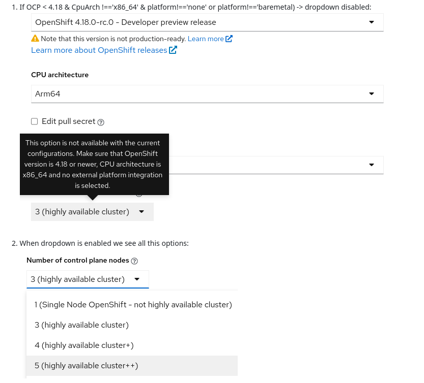

# Configuring the number of nodes for highly available control planes

Starting with OpenShift Container Platform (OCP) 4.18, you can now install highly available clusters with 3 to 5 control plane nodes (masters). Previously, the only valid configuration was a fixed number of 3 control plane nodes.

**Requiremnts**:
  - Control plane nodes must use CPU architecture `x86_64`.
  - The OCP platform should be `baremetal` or `none`.

To enable these flexible configurations, a new cluster registration parameter, control_plane_count, has been introduced. This parameter allows you to specify the desired number of control plane nodes during Day 1 cluster configuration. You can find this option in the SaaS UI:

### Installation Failure Behavior

It is important to note that the Assisted Service does not tolerate installation failures for control plane nodes. For example, if a user requests 4 control plane nodes but only 3 are successfully installed, the Assisted Service will classify the installation as a failure.
