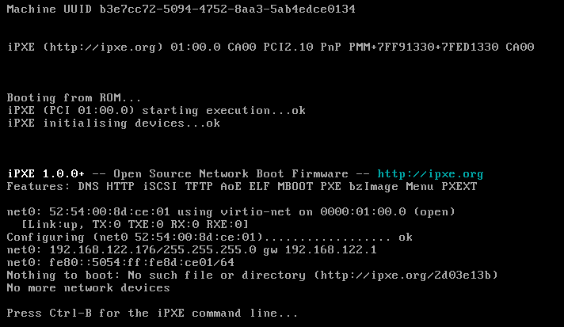
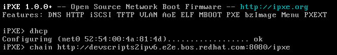

# Openshift deployment with OAS - On Bare Metal

This guide contains all the sections regarding Bare Metal deployment method, like iPXE/PXE, VirtualMedia, etc... let's get started

## General

This section is generic for the most of the cases:

- DHCP/DNS running on the network you wanna deploy the OCP cluster.
- Assisted Installer up & running (It's ok if you're working with cloud version).
- Typical DNS entries for API VIP and Ingress VIP.
- Pull Secret to reach the OCP Container Images.
- SSH Key pair.

_*Note*: This method could be used also in Virtual environment_

- With that we could start, first step is create the cluster
- Fill the Cluster name and Pull Secret fields, also select the version you wanna deploy:


- Now fill the Base Domain field and the SSH Host Public Key


- Click on _Download Discovery ISO_


- Fill again the SSH public key and click on _Generate Discovery ISO_


- Wait for ISO generation to finish and you will reach this checkpoint


## iPXE

_NOTE_: We use a sample URL, please change to fit your use case accordingly

### Accessing the iPXE boot script and artifacts

The service serves an iPXE boot script for each infra-env
The script can be downloaded using:

```
GET /api/assisted-install/v2/infra-envs/{infra_env_id}/downloads/files?file_name=ipxe-script
```

This URL can either be used directly or the script can be downloaded and hosted separately.

```
#!ipxe
initrd --name initrd http://assisted.example.com:8888/images/a7acfb01-d89f-40c8-82d7-02b20cf00173/pxe-initrd?arch=x86_64&version=4.9
kernel http://assisted.example.com:8888/boot-artifacts/kernel?arch=x86_64&version=4.9 initrd=initrd coreos.live.rootfs_url=http://assisted.example.com:8888/boot-artifacts/rootfs?arch=x86_64&version=4.9 random.trust_cpu=on rd.luks.options=discard ignition.firstboot ignition.platform.id=metal console=tty1 console=ttyS1,115200n8 coreos.inst.persistent-kargs="console=tty1 console=ttyS1,115200n8"
boot
```

A presigned URL for the script URL can be retrieved using:
`GET /api/assisted-install/v2/infra-envs/{infra_env_id}/downloads/files-presigned?file_name=ipxe-script`

#### Boot Control

In order to complete installation using iPXE, iPXE script cannot always be served. After the
disk image has been completely written to the disk and the node went to reboot, the node should
boot from the disk. To enable this, the following boot order has to be set: `[hd, network]`
(hd first). This causes the node to attempt booting first from hard disk. If it fails to boot from
hd, it defaults to the network (iPXE).

When using iPXE, it is more desirable to put the network first. Also, even if the image has been
written to the disk and the installation has failed, the node should boot from network. To enable this
the boot order should be reversed to `[network, hd]`, and the assisted service manages this flow.

To enable this flow, additional optional parameter `ipxe_script_type` has to be added to the iPXE download URL.
The script download URL has this form:

```
GET /api/assisted-install/v2/infra-envs/{infra_env_id}/downloads/files?file_name=ipxe-script&ipxe_script_type=boot-order-control
```

The assisted service returns a script having the following format:

```
#!ipxe
chain http://assisted.example.com/api/assisted-install/v2/infra-envs/{infra_env_id}/downloads/files?mac=${net0/mac}
```

This script is actually a redirect script. It indicates to IPXE to call again with the provided
URL which contains the mac address. The iPXE infrastructure replaces the macro ${net0/mac} to the
mac address. The mac address is used to recognize the host. The assisted service will skip serving
the boot script in case it is in stage that requires booting from hd.

To get a presigned URL with boot_control enabled, the boot_control parameter can be added to the
presigning URL request:

`GET /api/assisted-install/v2/infra-envs/{infra_env_id}/downloads/files-presigned?file_name=ipxe-script&ipxe_script_type=boot-order-control`

##### Boot Control with Kube API

When working with Kube API, the iPXE script URL is part of the infra-env status section - `ipxeScript` field.
There is a field in infra-env spec section `ipxeScriptType` which can be used to set the boot control behavior. There are 2 possible values to this field:

- `DiscoveryImageAlways` (the default): Return a script that boots the discovery ISO from the network.
- `BootOrderControl`: Return a redirect script.

If this field is not set `DiscoveryImageAlways` is assumed.

### Booting the nodes from iPXE

- First step, we need to set up the boot mode on the iDrac's as `boot once` for iPXE, this will depend on the steps on every Bare Metal Manufacturer/Version/Hardware.
- When you are booting the nodes, stay tuned to press `crtl-b` when the prompt say that:



- Now we need to get a correct IP and point to the right iPXE file url from above
- And we just need to wait until the boot was finished, and the nodes start appearing on the Assisted Service interface




- Then we will modify the nodename to use a right name for Openshift


- Create another 2 more nodes and repeat this step


- Now fill the _API Virtual IP_ and _Ingress Virtual IP_ fields


- Now you just need to click on _Install Cluster_ button and wait for the installation to finish.
