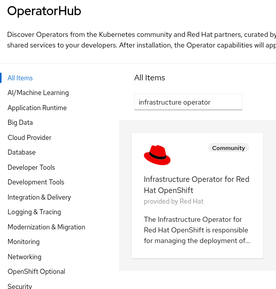
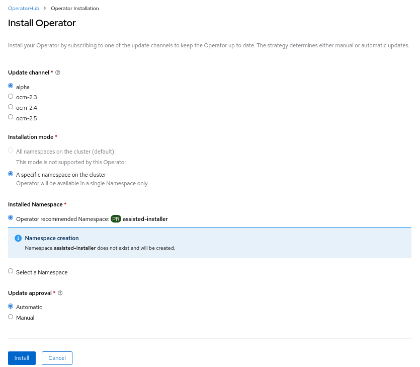
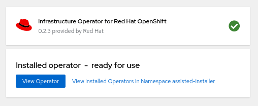
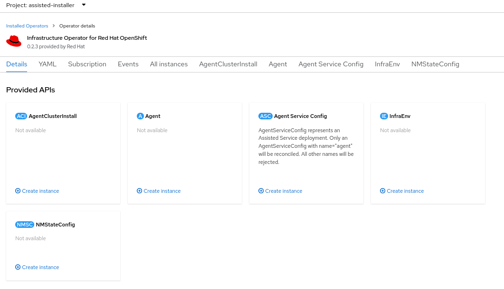
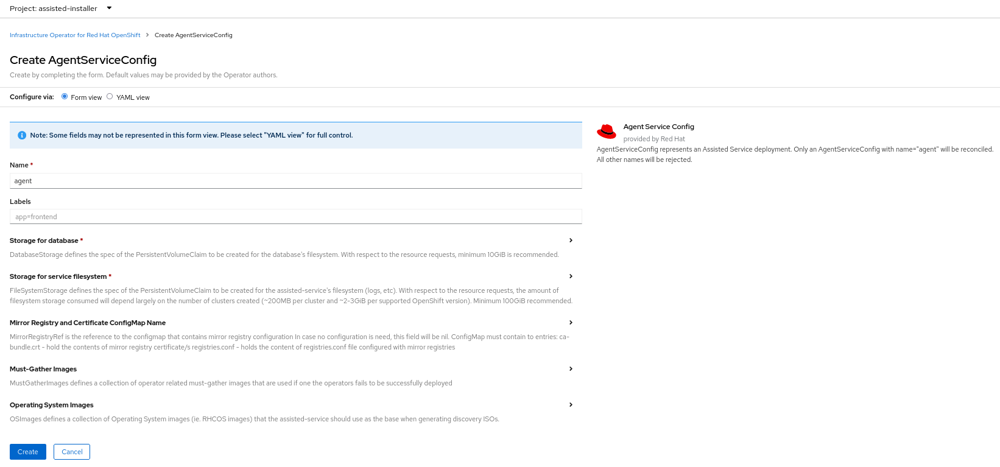

# Infrastructure Operator

## Hive CRDs

As a prerequisite, [Hive](https://github.com/openshift/hive) operator needs to be installed, or just apply the following CRDs:

```shell
oc apply -f https://raw.githubusercontent.com/openshift/hive/ocm-2.4/config/crds/hive.openshift.io_clusterdeployments.yaml
oc apply -f https://raw.githubusercontent.com/openshift/hive/ocm-2.4/config/crds/hive.openshift.io_clusterimagesets.yaml
```

## Install Infrastructure Operator

!!! note
Infrastructure Operator requires persistent storage.

1. Go to the Operator Hub and search for "Infrastructure Operator".

   

2. Click and go to `Install`. Select `alpha` in `Update channel`, and leave the defaults for other options.

   

3. Wait for the installation to finish.

   

4. Go to `Operator Details` of `Infrastructure Operator` in `assisted-installer` namespace. Click on `Create an instance` of `Agent Service Config`:

   

5. Use `agent` as the name for the CR. If needed, edit the PVCs configuration, and click on `Create`:

   
