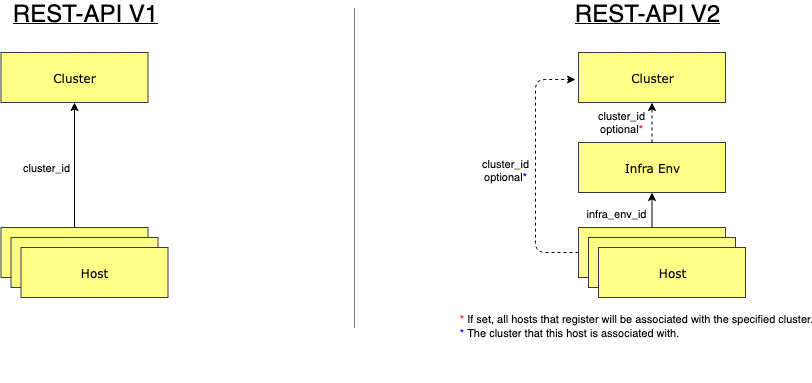

# REST-API V1 V2 - Transition Guide

## What Changed

Assisted service is now using a V2 API, which introduces a new resource type called `infra_env`.
`infra_env` represents the configuration needed to create the discovery ISO.
Hosts will now register to `infra_env`, unlike in V1 API, where hosts registered directly to a `cluster`.

This change comes to support more advanced use-cases, such as late-binding, in which:

1. Hosts are first registered to an `infra_env` and then bound to a `cluster` at a later time.
2. Adding a `cluster_id` in the `infra_env` can cause hosts to automatically be bound upon registration.

You can read more about late binding [here](../hive-integration/late-binding.md).

## Resource Types and Relationships

## API Versions Comparison

### Events

| Operation ID | V1                                   | V2             | Notes                                                                                                                      |
| ------------ | ------------------------------------ | -------------- | -------------------------------------------------------------------------------------------------------------------------- |
| ListEvents   | GET /v1/clusters/{cluster_id}/events | GET /v2/events | V2 events may be filtered by, `cluster_id`, `infra_env_id`, `host_id`. [Example](rest-api-getting-started.md#Check-Status) |

### Operators

| Operation ID           | V1                                          | V2                                          | Notes |
| ---------------------- | ------------------------------------------- | ------------------------------------------- | ----- |
| ListSupportedOperators | GET /v1/supported-operators                 | GET /v2/supported-operators                 |
| ListOperatorProperties | GET /v1/supported-operators/{operator_name} | GET /v2/supported-operators/{operator_name} |

### Cluster

#### Cluster CRUD

| Operation ID      | V1                               | V2                               | Notes                                                                                      |
| ----------------- | -------------------------------- | -------------------------------- | ------------------------------------------------------------------------------------------ |
| ListClusters      | GET /v1/clusters                 | GET /v2/clusters                 |
| RegisterCluster   | POST /v1/clusters                | POST /v2/clusters                | [Example](rest-api-getting-started.md#Register-A-Cluster)                                  |
| GetCluster        | GET /v1/clusters/{cluster_id}    | GET /v2/clusters/{cluster_id}    | [Example](rest-api-getting-started.md#Inspect-Cluster-Status)                              |
| UpdateCluster     | PATCH /v1/clusters/{cluster_id}  | PATCH /v2/clusters/{cluster_id}  | [Example](rest-api-getting-started.md#Patch-Cluster) ; Modify hosts via new UpdateHost API |
| DeregisterCluster | DELETE /v1/clusters/{cluster_id} | DELETE /v2/clusters/{cluster_id} |

#### Misc Cluster APIs

| Operation ID                      | V1                                                      | V2                                                            | Notes                                                                                                                                      |
| --------------------------------- | ------------------------------------------------------- | ------------------------------------------------------------- | ------------------------------------------------------------------------------------------------------------------------------------------ |
| DownloadClusterFiles              | GET /v1/clusters/{cluster_id}/downloads/files           | GET /v2/clusters/{cluster_id}/downloads/files                 | Get discovery.ign via `DownloadInfraEnvFiles`; Get kubeadmin-password, kubeconfig, kubeconfig-noingress via Download `ClusterCredentials`. |
| GetPresignedForClusterFiles       | GET /v1/clusters/{cluster_id}/downloads/files-presigned | GET /v2/clusters/{cluster_id}/downloads/files-presigned       | Get discovery.ign file via `GetPresignedForInfraEnvFiles`                                                                                  |
| DownloadClusterCredentials        | N/A                                                     | GET /v2/clusters/{cluster_id}/downloads/credentials           | New V2 API - Get kubeadmin-password, kubeconfig, kubeconfig-noingress (only user, not admin/ro-admin)                                      |
| GetPresignedForClusterCredentials | N/A                                                     | GET /v2/clusters/{cluster_id}/downloads/credentials-presigned | New V2 API - Get kubeadmin-password, kubeconfig, kubeconfig-noingress (only user, not admin/ro-admin)                                      |
| DownloadClusterKubeconfig         | GET /v1/clusters/{cluster_id}/downloads/kubeconfig      | N/A                                                           | Deprecated in favor of `DownloadClusterCredentials`                                                                                        |
| GetCredentials                    | GET /v1/clusters/{cluster_id}/credentials               | GET /v2/clusters/{cluster_id}/credentials                     |
| GetClusterSupportedPlatforms      | N/A                                                     | GET /v2/clusters/{cluster_id}/supported-platforms             |
| GetClusterDefaultConfig           | GET /v1/clusters/default-config                         | GET /v2/clusters/default-config                               |
| GetClusterInstallConfig           | GET /v1/clusters/{cluster_id}/install-config            | GET /v2/clusters/{cluster_id}/install-config                  |
| UpdateClusterInstallConfig        | PATCH /v1/clusters/{cluster_id}/install-config          | PUT /v2/clusters/{cluster_id}/install-config                  |
| GetDiscoveryIgnition              | GET /v1/clusters/{cluster_id}/discovery-ignition        | N/A                                                           | Deprecated in favor of `V2DownloadInfraEnvFiles`                                                                                           |
| UpdateDiscoveryIgnition           | PATCH /v1/clusters/{cluster_id}/discovery-ignition      | N/A                                                           | Deprecated in favor of `UpdateInfraEnv`                                                                                                    |
| InstallCluster                    | POST /v1/clusters/{cluster_id}/actions/install          | POST /v2/clusters/{cluster_id}/actions/install                | [Example](rest-api-getting-started.md#start-Installation)                                                                                  |
| CancelInstallation                | POST /v1/clusters/{cluster_id}/actions/cancel           | POST /v2/clusters/{cluster_id}/actions/cancel                 |
| InstallHosts                      | POST /v1/clusters/{cluster_id}/actions/install_hosts    | N/A                                                           | Deprecated in favor of `InstallHost`                                                                                                       |
| ResetCluster                      | POST /v1/clusters/{cluster_id}/actions/reset            | POST /v2/clusters/{cluster_id}/actions/reset                  |
| DownloadClusterLogs               | GET /v1/clusters/{cluster_id}/logs                      | GET /v2/clusters/{cluster_id}/logs                            |
| GetFreeAddresses                  | GET /v1/clusters/{cluster_id}/free_addresses            | N/A                                                           |
| GetClusterHostRequirements        | GET /v1/clusters/{cluster_id}/host-requirements         | N/A                                                           | Deprecated in favor of `GetPreflightRequirements`                                                                                          |
| GetPreflightRequirements          | GET /v1/clusters/{cluster_id}/preflight-requirements    | GET /v2/clusters/{cluster_id}/preflight-requirements          |
| UploadLogs                        | POST /v1/clusters/{cluster_id}/logs                     | POST /v2/clusters/{cluster_id}/logs                           |
| UploadClusterIngressCert          | POST /v1/clusters/{cluster_id}/uploads/ingress-cert     | POST /v2/clusters/{cluster_id}/uploads/ingress-cert           |
| ListOfClusterOperators            | GET /v1/clusters/{cluster_id}/monitored_operators       | GET /v2/clusters/{cluster_id}/monitored-operators             |
| ReportMonitoredOperatorStatus     | PUT /v1/clusters/{cluster_id}/monitored_operators       | PUT /v2/clusters/{cluster_id}/monitored-operators             |

#### Cluster Manifests

| Operation ID            | V1                                            | V2                                            | Notes |
| ----------------------- | --------------------------------------------- | --------------------------------------------- | ----- |
| ListClusterManifests    | GET /v1/clusters/{cluster_id}/manifests       | GET /v2/clusters/{cluster_id}/manifests       |
| CreateClusterManifest   | POST /v1/clusters/{cluster_id}/manifests      | POST /v2/clusters/{cluster_id}/manifests      |
| DeleteClusterManifest   | DELETE /v1/clusters/{cluster_id}/manifests    | DELETE /v2/clusters/{cluster_id}/manifests    |
| DownloadClusterManifest | GET /v1/clusters/{cluster_id}/manifests/files | GET /v2/clusters/{cluster_id}/manifests/files |

#### Cluster APIs used by Agent / Controller

| Operation ID            | V1                                                           | V2                                                              | Notes |
| ----------------------- | ------------------------------------------------------------ | --------------------------------------------------------------- | ----- |
| ListClusterManifests    | GET /v1/clusters/{cluster_id}/manifests                      | GET /v2/clusters/{cluster_id}/manifests                         |
| CreateClusterManifest   | POST /v1/clusters/{cluster_id}/manifests                     | POST /v2/clusters/{cluster_id}/manifests                        |
| DeleteClusterManifest   | DELETE /v1/clusters/{cluster_id}/manifests                   | DELETE /v2/clusters/{cluster_id}/manifests                      |
| DownloadClusterManifest | GET /v1/clusters/{cluster_id}/manifests/files                | GET /v2/clusters/{cluster_id}/manifests/files                   |
| CompleteInstallation    | POST /v1/clusters/{cluster_id}/actions/complete_installation | POST /v2/clusters/{cluster_id}/actions/complete-installation    |
| UpdateHostLogsProgress  | PUT /v1/clusters/{cluster_id}/hosts/{host_id}/logs_progress  | PUT /v2/infra-envs/{infra_env_id}/hosts/{host_id}/logs-progress |

### InfraEnv

#### InfraEnv CRUD

| Operation ID       | V1  | V2                                   | Notes                              |
| ------------------ | --- | ------------------------------------ | ---------------------------------- |
| ListInfraEnvs      | N/A | GET /v2/infra-envs                   |
| RegisterInfraEnv   | N/A | POST /v2/infra-envs                  |
| GetInfraEnv        | N/A | GET /v2/infra-envs/{infra_env_id}    |
| UpdateInfraEnv     | N/A | PATCH /v2/infra-envs/{infra_env_id}  | Includes ignition config overrides |
| DeregisterInfraEnv | N/A | DELETE /v2/infra-envs/{infra_env_id} |

#### InfraEnv Downloads

| Operation ID                   | V1                                            | V2                                                         | Notes                          |
| ------------------------------ | --------------------------------------------- | ---------------------------------------------------------- | ------------------------------ |
| DownloadInfraEnvDiscoveryImage | GET /v1/clusters/{cluster_id}/downloads/image | GET /v2/infra-envs/{infra_env_id}/downloads/image          | Moved from Cluster to InfraEnv |
| DownloadMinimalInitrd          | N/A                                           | GET /v2/infra-envs/{infra_env_id}/downloads/minimal-initrd |
| v2DownloadInfraEnvFiles        | N/A                                           | GET /v2/infra-envs/{infra_env_id}/downloads/files          | Download discovery.ign         |

### Host

#### Host CRUD

| Operation ID   | V1                                               | V2                                                   | Notes                          |
| -------------- | ------------------------------------------------ | ---------------------------------------------------- | ------------------------------ |
| ListHosts      | GET /v1/clusters/{cluster_id}/hosts              | GET /v2/infra-envs/{infra_env_id}/hosts              | Moved from Cluster to InfraEnv |
| GetHost        | GET /v1/clusters/{cluster_id}/hosts/{host_id}    | GET /v2/infra-envs/{infra_env_id}/hosts/{host_id}    | Moved from Cluster to InfraEnv |
| UpdateHost     | N/A                                              | PATCH /v2/infra-envs/{infra_env_id}/hosts/{host_id}  |
| DeregisterHost | DELETE /v1/clusters/{cluster_id}/hosts/{host_id} | DELETE /v2/infra-envs/{infra_env_id}/hosts/{host_id} | Noved from Cluster to InfraEnv |

#### Misc Host APIs

| Operation ID                   | V1                                                                                       | V2                                                                                           | Notes                                        |
| ------------------------------ | ---------------------------------------------------------------------------------------- | -------------------------------------------------------------------------------------------- | -------------------------------------------- |
| UpdateHostInstallerArgs        | PATCH /v1/clusters/{cluster_id}/hosts/{host_id}/installer-args                           | PATCH /v2/infra-envs/{infra_env_id}/hosts/{host_id}/installer-args                           | Moved from Cluster to InfraEnv               |
| EnableHost                     | POST /v1/clusters/{cluster_id}/hosts/{host_id}/actions/enable                            | N/A                                                                                          | Deprecated in favor of `BindHost`            |
| DisableHost                    | DELETE /v1/clusters/{cluster_id}/hosts/{host_id}/actions/enable                          | N/A                                                                                          | Deprecated in favor of `UnbindHost`          |
| InstallHost                    | POST /v1/clusters/{cluster_id}/hosts/{host_id}/actions/install                           | POST /v2/infra-envs/{infra_env_id}/hosts/{host_id}/actions/install                           | Moved from Cluster to InfraEnv               |
| ResetHost                      | POST /v1/clusters/{cluster_id}/hosts/{host_id}/actions/reset                             | POST /v2/infra-envs/{infra_env_id}/hosts/{host_id}/actions/reset                             | Moved from Cluster to InfraEnv               |
| ResetHostValidation            | PATCH /v1/clusters/{cluster_id}/hosts/{host_id}/actions/reset-validation/{validation_id} | PATCH /v2/infra-envs/{infra_env_id}/hosts/{host_id}/actions/reset-validation/{validation_id} |
| UpdateHostIgnition             | PATCH /v1/clusters/{cluster_id}/hosts/{host_id}/ignition                                 | PATCH /v2/infra-envs/{infra_env_id}/hosts/{host_id}/ignition                                 | Moved from Cluster to InfraEnv               |
| GetHostIgnition                | GET /v1/clusters/{cluster_id}/hosts/{host_id}/ignition                                   | GET /v2/infra-envs/{infra_env_id}/hosts/{host_id}/ignition                                   | Moved from Cluster to InfraEnv               |
| BindHost                       | N/A                                                                                      | POST /v2/infra-envs/{infra_env_id}/hosts/{host_id}/actions/bind                              |
| UnbindHost                     | N/A                                                                                      | POST /v2/infra-envs/{infra_env_id}/hosts/{host_id}/actions/unbind                            |
| ListManagedDomains             | GET /v1/domains                                                                          | GET /v2/domains                                                                              |
| ListComponentVersions          | GET /v1/component-versions                                                               | GET /v2/component-versions                                                                   |
| ListSupportedOpenshiftVersions | GET /v1/openshift_versions                                                               | GET /v2/openshift-versions                                                                   |
| DownloadHostLogs               | GET /v1/clusters/{cluster_id}/hosts/{host_id}/logs                                       | N/A                                                                                          | Deprecated in favor of `DownloadClusterLogs` |
| UploadHostLogs                 | POST /v1/clusters/{cluster_id}/hosts/{host_id}/logs                                      | N/A                                                                                          | Deprecated in favor of `UploadLogs`          |
